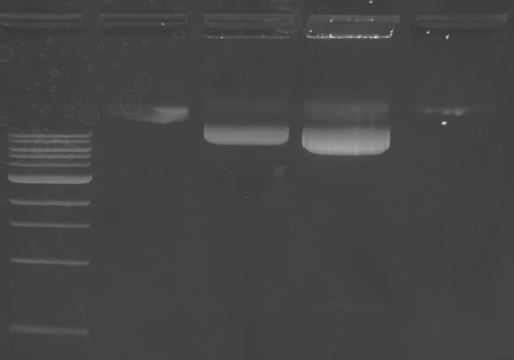

22.02.2024
=========
- Зйомка з іонофорезом NMDA нейронів трансфікованих __GluA1-SEP__ з тестом ppH та трансфекцією без заміни середовища (NB-)

---

## Neurons
### Imaging (11:20)
Зйомка з іонофорезом NMDA нейронів (культура від 8.02.2024, посадка Лени на MEM+ із ростом на MEM+ або NB-) трансфікованих __GluA1-SEP__ (1 ug, трансфекція від 20.02.2023).

_Note: спроба скоротити час роботи з клітинами до ~2 h._

Позаклітинний розчин:

- HBS low Mg (prep. 20.02.2024, pH 7.30,  295 mOsmol)
- 5 mM Gluc. (add solid, 9 mg per 10 ml of HBS)
- 10 um Gly. (20 mM stock solution, prep. 4.02.2013, 5 ul per 10 ml of HBS)
- 1 um TTX (5 mM stock solution, 2 ul per 10 ml of HBS)

Розчин для theta:

- MBS -Mg  (prep. 29.01.2024, pH 6.01, 290 mOsmol)
- 10 um Gly. (20 mM stock solution, prep. 4.02.2013, 5 ul per 10 ml of HBS)
- 1 um TTX (5 mM stock solution, 2 ul per 10 ml of HBS)

Переведення осмолярності за стандартним протоколом в HBS із усіма добавками в термостаті 37ºC, до початку переведення прямо в боксі в культуральне середовище (~ 1 ml) додано 0.5 ul APV (сток 80 mM, prep. 2.05.2024, fin C ~40 uM).

- __Клітини з NB- переведено о 11:58__
- __Клітини з MEM+ переведено о 13:30__

#### Theta

Тета-піпетка із діаметром кінчика ~160 um, висота над склом 50-75 um, постійний відсос із перекриванням втоку. Zero H - 14.

#### Imaging

Об'єктив 60x 1.4,  кубік 69008.

#### Ionophotesis

Іонофоретичне прикладання 100 mM NMDA pH 7.3, заповнення ~10 ul, програма 49 404, опір 125-140 MOhm. Запираючи струм +5 nA, прикладання -100 nA. Електрод в центральній області поля зору 7-10 um над клітинами.

#### Samples

Room T 18-20ºC. 

__Cкельце з NB- змонтовано у камеру о 12:13__. Придатних трасфікованих клітин не виявлено, лише якісь вакуолізовані деформовані клітини.

__Скельце з MEM+ змонтовано в камеру о 13:33__. Знайдено лише дві трансфіковані клітини з адекватною морфологією, але з надзвичайно низькою інтенсивністю (450-500 a.u. в найяскравіших місцях за 498 nm 500 ms).

_Note:  можливо проблема в деградованості плазмід 12 річної давнини і GluA1-SEP деградував навіть більше за GluA2-SEP, треба електрофорез._

## Plasmids
### Electrophoresis (16:47)
Елктрофорез GluA1-SEP та GluA2-SEP для оцінки фрагментації старючих плазмід.

100 ml 1% агарози в TBE (10x TBE pH 8.4 prep. 3.08.2023) + 30 ul EtBr (розчин Болдирева ніби то 1:10k), залишок на зберіганні RT 135 загорнутим у фольгу.

Зразки розведені до 6 ul з використанням NEB 6x LS Purple та ddH20 (0.22 filt). 

80 mA 40'

|1|2|3|4|5|
|-|-|-|-|-|
|2 ul NEB 1 kb Ladder|3 ul HPCA(WT)-EYFP (290 ng/ul, cl. 6.03.2021)|3 ul GluA2-SEP (292 ng/ul, cl. 4.12.2012)|3 ul GluA1-SEP (292 ng/ul, cl. 4.12.2012)|2 ul HPCA(WT)-EYFP (290 ng/ul, cl. 6.03.2021)|

__NB: чомусь внесення HPCA(WT)-EYFP пройшло коряво, схоже не потрапив у лунки через погане освітелення робочого місця__

Стан GluA2-SEP та GluA1-SEP добрий, очікуваний розмір ~9 kb із яскривим широким бендом більш мобільної суперспералізованої форми і тьмяним бендом релаксованої форми ледь помітною смужкою із фрагментами.

Спостерігається перевантаження лунки GluA1-SEP. Тоді лишається відкритим питання причини надзвичайно низького рівня трансфекції та інтенсиності, можливо здох Lipofectamine 2000 (exp. 10.2019).
