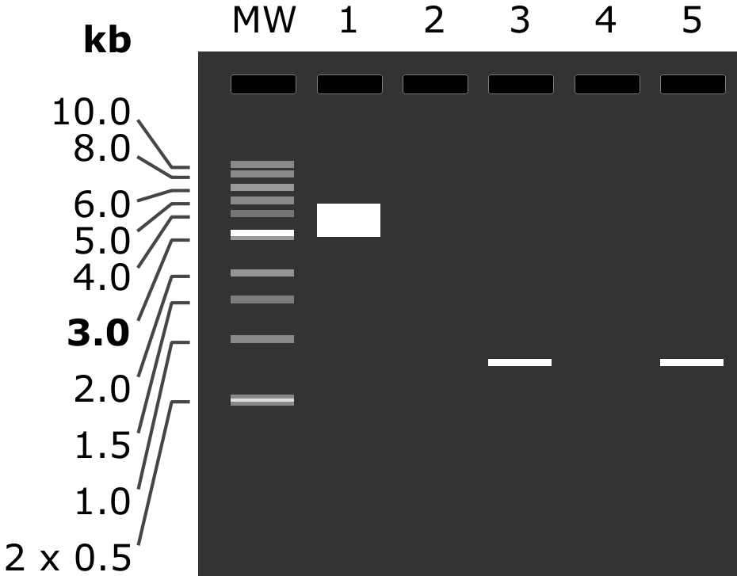
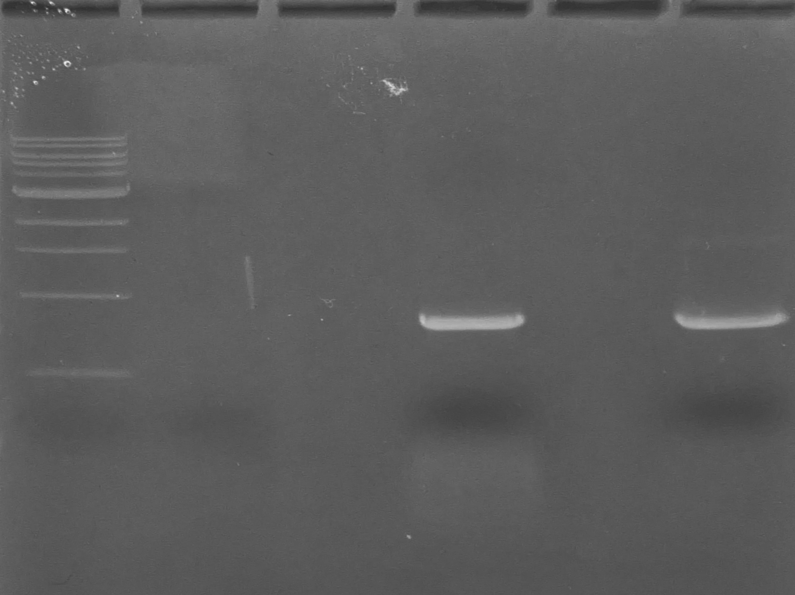

22.04.2024
========
- ПЛР __pLSSmOrange-N1__ із праймерами для __46forv__ та __62forv__
- Електрофорез та очистка ампліконів
- Вимірювання концентрації ампліконів
- Посадка трансформантів __pX333-46forv__ та __pX333-62forv__

---
## Plasmids
_Виконано разом з Лізой_
### PCR (12:05)
ПЛР __pLSSmOrange-N1__ із праймерами для __46forv__ та __62forv__.

Реакційна суміш:

| Position                                | Amount    |
| --------------------------------------- | --------- |
| FOR primer 10 uM                        | 1.3 ul    |
| REV primer 10 uM                        | 1.3 ul    |
| pLSSmOrange-N1 5 ng/ul                  | 1 ul      |
| Q5 Hot Start 2x Master Mix (NEB M0494A) | 12.5 ul   |
| H2O (Sigma W4502)                       | 9 ul      |
| __Total__                               | __25 ul__ |

Обидві пари праймерів ставились одночано на програмі LSSQ5:

|   #   | Step   | Duration |
| :---: | ------ | -------- |
|   1   | 98°C   | 30"      |
| __2__ | 98°C   | 10"      |
| __3__ | 72°C   | 25"      |
| __4__ | 72°C   | 30"      |
| __5__ | GOTO 2 | 35x      |
|   6   | 72°C   | 3'       |
|   7   | 4°C    | Hold     |

_Note: стріпи не деформувало, одже в минулий раз прблема була в зелених пробірках._

### Electrophoresis (15:45)
Елктрофорез ампліконів.

Використано залишок гелю від 22.02.2024: 1% агарози в TBE (10x TBE pH 8.4 prep. 3.08.2023) + 30 ul EtBr (розчин Болдирева ніби то 1:10k).

На форез пішов весь об'єм реакціної суміші 25 ul + 4 ul NEB 6x LD Purple.

Об'єм решти 6 ul з використанням NEB 6x LD Purple та ddH20 (0.22 filt). 

80 mA 40'

|MV|1|2|3|4|5|
|-|-|-|-|-|-|
|2 ul NEB 1 kb Ladder|5 ul  pLSSmOrange-N1 5 ng/ul (4723 bp)|-|__46forv__ (792 bp)|-|__62forv__ (790 bp)|

| Prediction |   |
| ---------- | --------------------------------------------------: |
| __Gel__    |  |

Картина фрашментів відповідає очікуванням, для обох пар праймерів є помітний бенд на ~0.8 kb і незначана неспицифіка нижче ти вище. Однак дивно що не видно контрольного бенда pLSSmOrange-N1 хоча внесено його було 25 ng.

### Amplicones purification (16:40)
Очистка апліконів з використанням набору NEB Gel Extraction Kit (NEB T1020S).

- Фрагменти гелю по ширині бенду і довжиною 2.5-3 mm вирізані під візуальним контролем з увімкненим UV і переміщені в окремі epp. 2 ml
- Внесено по 500 ul Gel Dissolving Buffer
- Інкубація 50°C 5', приблизно посередині інкубації перемішано на вортексі 5-10"
- Весь об'єм (~700-850 ul) перенесено в окремі колонки
- CF 14k RPM 1'
- Двічі промито 200 ul Washing Buffer з CF 14k RPM 2'
- На мембрани нанесено 5 ul Elution Buffer, інкубація 5' RT
- CF 14k RPM 3'

### Nanodrop (17:05)
Вимірювання концентрації елюйованих з гелю ампліконів.

Концентрація є середнім від трьох послідовних вимірювань на одній краплі й ul , занулення по чистому NEB Elution Buffer.

Амплікони на зберіганні в коробці Лізи -20 410a.

|Sample|260/280|260/230|C raw|C|
|-|-|-|-|-|
|LSS-46forv|1.85, 1.90, 1.84|1.35, 1.39, 1.35|55.3, 51.6, 51.0| 52.6 ng/ul |
| LSS-62forv |1.91, 1.89, 1.91|0.42, 0.40, 0.39|58.2, 58.2, 58.7| 58.4 ng/ul |

_Note: схоже погане співвідногення 260/230 через забруднення продуктами розпаду агарози, треба почитати рекомендацію до набору._

Загальний вихід по масі для обох ампліконів більше 500 ng що зважаючи на вхід у 5 ng плазмідної ДНК вельми непогано.

### Transormants plating (17:55)
Посадка моноклонів __pX333-46forv__ та __pX333-62forv__.

По чотири індивідуальних клони кожної конструкції (посадка від 19.04.2024) дали хороший ріст, для свіжої нічної культури клони 1 та 2 кожної плазміди посаджені на різні половинки окремих чашок LB+Amp.
