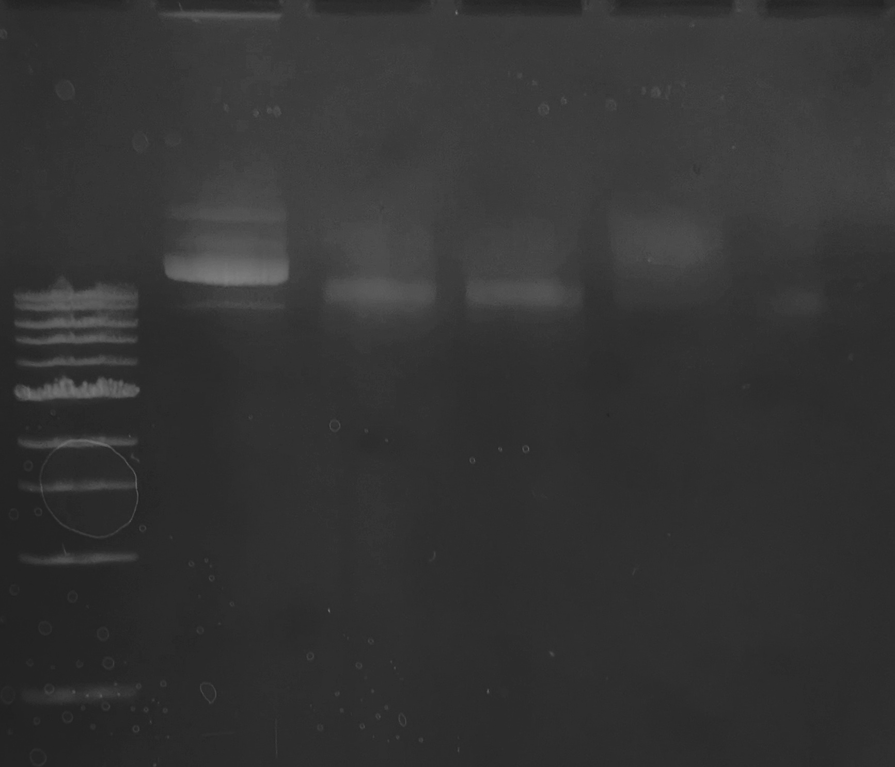

26.04.2024
========
- ПЛР аналіз __pORANGE-LSSmOr-rClta-KI_cl1__ та __pORANGE-LSSmOr-rHpca-KO-20rev_cl1__

---
## Plasmids
### PCR (14:10)
ПЛР аналіз __pORANGE-LSSmOr-rClta-KI_cl1__ та __pORANGE-LSSmOr-rHpca-KO-20rev_cl1__. Нативна pX333 використана в якості контроля.

Розведення плазмідної ДНК для ПЛР до кінцевої концентрації __5 ng/ul__:

|                   | pX333     | rClta cl1 | 20rev cl1 |
| ----------------- | --------- | --------- | --------- |
| Plasmid C         | 134 ng/ul | 169 ng/ul | 78 ng/ul  |
| Plasmid V         | 0.5       | 0.5       | 0.5       |
| H2O (Sigma W4502) | 13.5      | 17.0      | 8.0       |

Реакційна суміш:

| Position                              | Amount    |
| ------------------------------------- | --------- |
| Plasmid DNA 5 ng/ul                   | 1 ul      |
| FOR primer 10 uM                      | 0.5 ul    |
| REV primer 10 uM                      | 0.5 ul    |
| OneTaq Hot Start 2x M.M. (NEB M0484S) | 12.5 ul   |
| H2O (Sigma W4502)                     | 10.5 ul   |
| __Total__                             | __25 ul__ |

Зразки:

| #    | Plasmid   | FOR primers                                | REV primers                       |
| ---- | --------- | ------------------------------------------ | --------------------------------- |
| 1    | pX333     | rClta_ORANGE_SENSE                         | rClta_ORANGE_ANTISENSE            |
| 2    | rClta cl1 | rClta_ORANGE_SENSE                         | rClta_ORANGE_ANTISENSE            |
| 3    | rClta cl1 | rHpca_N-KO_20rev_ORANGE_SENSE              | rHpca_N-KO_20rev_ORANGE_ANTISENSE |
| 4    | 20rev cl1 | rHpca_N-KO_20rev_ORANGE_SENSE              | rHpca_N-KO_20rev_ORANGE_ANTISENSE |
| 5    | 20rev cl1 | rClta_ORANGE_SENSE, rClta_ORANGE_ANTISENSE | rClta_ORANGE_ANTISENSE            |

Програма T-100 __TAQ_GRNA__:

|   #   | Step   | Duration |
| :---: | ------ | -------- |
|   1   | 95°C   | 30"      |
| __2__ | 95°C   | 30"      |
| __3__ | 54°C   | 30"      |
| __4__ | 68°C   | 10'      |
| __5__ | GOTO 2 | 40x      |
|   6   | 68°C   | 15'      |
|   7   | 4°C    | Hold     |

### Electrophoresis (16:00)

Елетрофорез продуктів рестрикції.

Приготовано свіжий гель: 1% агарози в TBE (10x TBE pH 8.4 prep. 3.08.2023) + 30 ul EtBr (розчин Болдирева ніби то 1:10k).

На форез пішов весь об'єм реакціної суміші 20 ul + 2 ul NEB 6x LD Purple.

Об'єм решти 6 ul з використанням NEB 6x LD Purple та ddH20 (0.22 filt). 

В якості контролю 4 ul нативної pX333 (134 ng/ul).

80 mA 40'

|MW|1|2|3|4|5|6|7|8|
|-|-|-|-|-|-|-|-|-|
|2 ul NEB 1 kb Ladder|pX333|pX333 digested|-|46.1 digested|46.2 digested|-|61.1 digested|62.2 digested|
|N3232S|9.0 kb|8.5 kb, 0.4 kb, 30 bp, 22 bp||9.0 kb, 30 bp|9.0 kb, 30 bp||9.0 kb, 32 bp|9.0 kb, 32 bp|

| Prediction |   |
| ---------- | --------------------------------------------------: |
| __Gel__    |  |

Чиста pX333 чудово порізалась, фрагменти менше 0.4 kb не видно. Однак всі клони дали просто мазню на всю доріжку, можливо не було ніякої плазмідної ДНК в зразку і це лише забрудення фрагментами геномної ДНК.

### 2nd Electrophoresis (17:45)
Повторний електрофорез виділених клонів без рестрикції щоб перевірити на наявність плазмідної ДНК.

Всі клони почищені набором NEB взяті по 10 ul + 3 ul NEB 6xLS Purple.

В якості контролю 4 ul нативної pX333 (134 ng/ul).

100 mA 30'

|MW|1|2|3|4|5|
|-|-|-|-|-|-|
|2 ul NEB 1 kb Ladder|pX333|46.1|46.2|61.1|61.2|
|N3232S|9.0 kb|9.0 kb|9.0 kb|9.0 kb|9.0 kb|

Якась дива мазня, проглядаються по декілька бендів як мало би бути у плазмідної ДНК, але щось дивне з рухомістю основної плями у клонів __46forv__. Можливо плазмідна ДНК сильно фрагментована що знизило вихід чи насправді здої ампицилін і не відбувалася адекватна селекція та в культурі мала кількість клітин несе плазміду.

Із можливих рішень приготування новго стоку Amp, поміщення культури на лід впродовж осадження і ресуспендування, збільшення OD 600.

### Plating (18:40)

Для перевірки стоку Amp на чашку LB+Amp посаджені DH10B WT та клони 46.1, 46.2, 61.1.