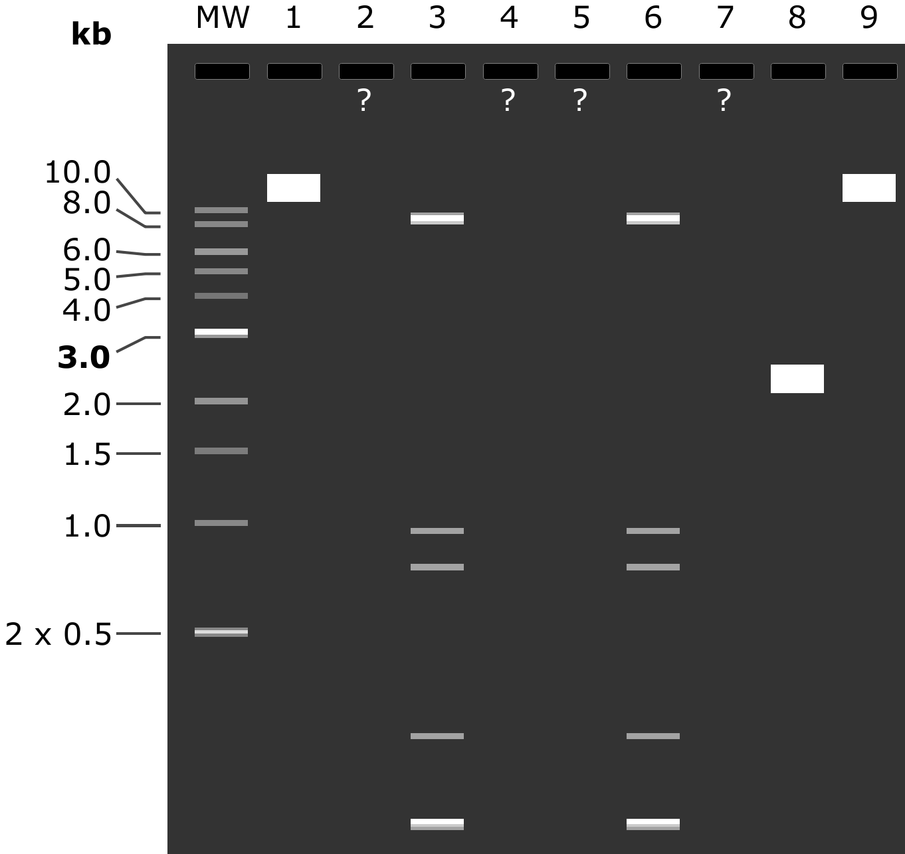
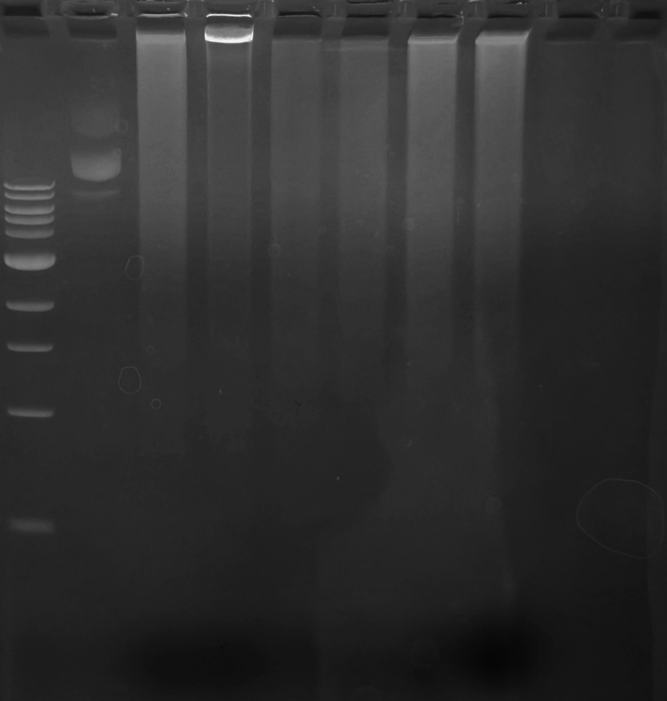

29.04.2024
========
- Електрофорез продуктів ПЛР від 26.04.2024
- Транформація DH10B __pORANGE-LSSmOr-rClta-KI_cl1__ та __pORANGE-LSSmOr-rHpca-KO-20rev_cl1__
- Трансформація DH10B продуктами лігування __pX333-46forv__ та __pX333-62forv__
- Посів стоку трансформантів Addgene

---
## Plasmids
### Electrophoresis (10:35)
Елетрофорез продуктів ПЛР від 26.04.2024 із ssDNA gRNA оліго в якості праймерів.

Приготовано свіжий гель: 1% агарози в TBE (10x TBE pH 8.4 prep. 3.08.2023) + 30 ul EtBr (розчин Болдирева ніби то 1:10k).

На форез пішов весь об'єм  ПЛР-суміші 25 ul + 4 ul NEB 6x LD Purple.

Об'єм решти 6 ul з використанням NEB 6x LD Purple та ddH20 (0.22 filt). 

В якості контролю 3 ul нативної pX333 (134 ng/ul).

Також перевірені старі підозрілі клони __T003__ (pMiniT2.0-LSSmOr-rHPCA-cl1, 98.2 ng/ul) та __T006__ (pX333-1-152-rHPCA-cl2, 28.7 ng/ul) від 29.02.2024, по 5 ul.

_Note: вносячи rClta cl1 + 20rev схоже проткнув влунку і вміст потрапив в луни 4 та 5_

__80 mA 50' + 30'__

_Note: спочатку прогнав 50', помітив що погано розділилось важке і лунках та дігнав ще 30'_

|MW|1|2|3|4|5|6|7|8|9|
|-|-|-|-|-|-|-|-|-|-|
|NEB 1 kb Ladder|pX333|pX333 + rClta|rClta cl1 + rClta|rClta cl1 + 20rev|rClta cl1 + 20rev|20rev cl1 + 20rev|20rev cl1 + rClta|T003|T006|
|2 ul N3232S|9.0 kb|-|9.1 kb, 8.6 kb, 0.9 kb, 0.8 kb, 0.2 kb, 27 bp|-|-|9.1 kb, 8.6 kb, 0.9 kb, 0.8 kb, 0.2 kb, 28 bp|-|3.3 kb|9.0 kb|

| Prediction |   |
| ---------- | --------------------------------------------------: |
| __Gel__    |  |

Ну, вітаю. Адекватно виглядає виключно контрольна лунка з нативною pX333 T_T

Можливо яскравий бенд в лунці 3 є ознакою чогось хорошого, але не певен.

### Transformation (16:40)

Транформація DH10B __pORANGE-LSSmOr-rClta-KI_cl1__, __pORANGE-LSSmOr-rHpca-KO-20rev_cl1__ та продуктами лігування __pX333-46forv__ та __pX333-62forv__ від 17.04.2024.

Використані компетентні DH10B від 19.04.2024.

- Аліквота 200 ul компетентних клітин розморожена на 4°C

- Суспензію клітиин розлито по 50 ul в 4x epp. 1.5 ml

- В суспензію кітин внесено наступні конструкції:

  | pX333-46forv              | pX333-46forv              | ORANGE rClta cl1 | ORANGE 20rev cl1 |
  | ------------------------- | ------------------------- | ---------------- | ---------------- |
  | 5 ul of ligation products | 5 ul of ligation products | 15 ng            | 15 ng            |

  _Note: використано по 3 ul розведення 5 ng/ul pORANGE-LSSmOr-rClta-KI_cl1 та pORANGE-LSSmOr-rHpca-KO-20rev_cl1 від 26.04.2024, були на збріганні +4 135_

- Інкубація ~70' 4°C
- В кожну аліквоту внсено по 450 ul підігрітого LB

_Note: свіжий LB, автоклавував 121°C 20', не варто використовувати режим 132°C 20' для поживних середовищ бо навіть помітна зміна кольру_

- Інкубація 45' 220 RPM 37°C
- Посів газоном на дві половики чашок LB 2.5% agar приготованих із свіжим стоком антибіотиків (о 18:50):

| pX333-46forv        | pX333-46forv        | ORANGE rClta cl1    | ORANGE 20rev cl1                          |
| ------------------- | ------------------- | ------------------- | ----------------------------------------- |
| Amp: 20 ul \| 60 ul | Amp: 20 ul \| 60 ul | Amp: 20 ul \| 50 ul | Kan: 20 ul \| 50 ul, Amp: 50 ul \| 150 ul |

_Note:  посів на Kan в якості негативного контролю_

### Addgene stock plating (17:40)

Посів стоку трансформатнів DH5alpha з конструкціями з Addgene штрихом на чашки із свіжим LB 2.5% agar:

- __pN1-pHlu__ (#129315, KanR): LB+Kan
- __PSD-95-pTagRFP__ (#52671, KanR): LB+Kan
- __pCI-SEP-GluR1__ (#24000, AmpR): LB+Amp
- __pCI-SEP-GluR2(R)__ (#24001, AmpR): LB+Amp та LB+Kan 
- __pCI-SEP-GluR2(Q)__ (#24002, AmpR): LB+Amp

Сток на зберіганні +4 135.