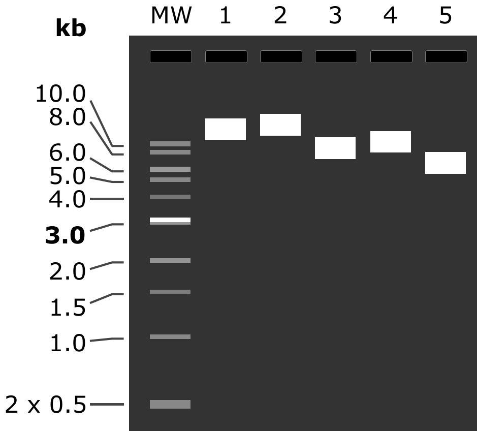

24.04.2024
========
- Виділення з нічної культури DH10B __pORANGE-LSSmOr-rHpca-KO-20rev_cl1__
- Виділення з нічної культури DH5alpha конструкцій з Addgene

---
## Plasmids
### Transformation and plating report 
Транформація DH10B __pORANGE-LSSmOr-rClta-KI_cl1__, __pORANGE-LSSmOr-rHpca-KO-20rev_cl1__ та продуктами лігування __pX333-46forv__ та __pX333-62forv__, від 29.04.2024, результати:

- Є лише три колонії на Amp __pORANGE-LSSmOr-rHpca-KO-20rev_cl1__, решта трансформантів ріст не дала

_Note: схоже 15 ng плазмідної ДНК це критично мало, тільки на 150 ul посіву були колонії. Треба збільшувати ДНК для трансформації._

Трансформанти з Addgene посаджені 29.04.2024 дали хороший ріст, контроль резистентності Amp посаджених на Kan ріст не дали. Хороший результат.

### Miniprep (11:37)
Виділення з нічної культури:
- __pORANGE-LSSmOr-rHpca-KO-20rev_cl1__ (AmpR)
- __pN1-pHlu__ (#129315, KanR)
- __PSD-95-pTagRFP__ (#52671, KanR)
- __pCI-SEP-GluR1__ (#24000, AmpR)
- __pCI-SEP-GluR2(R)__ (#24001, AmpR)
- __pCI-SEP-GluR2(Q)__ (#24002, AmpR)

Посадка 30.04.2024 о 19:40 в 10 ml, 37°C 220 RPM.

Для PSD-95-pTagRFP  __OD600 1.48__ проти чистого LB.

Виділення набором NEB Monarch (T1010S) за протоколом виробника.

На кожну конструкцію по 2x колонки, на кожну колонку по 4 ml культури, початок виділення о 12:00.

_Note: центрифугування 14.5k RPM_

- CF 60" - осадження клітин
- Лізис 1'
- Нейтралізація 2'
- CF 5'
- Перша промивка CF 1'
- Друга промивка CF 2'
- Елюювання NEB 40 ul, інкубація 2' в термоблоку 35°C
- CF 2'

### Nanodrop (13:55)
Вимірювання концентрації виділених плазмід.

Концентрація є середнім від трьох послідовних вимірювань на одній краплі й 1.5 ul , занулення по NEB Elution Buffer.

На зберіганні в коробці Лізи -20 410a.

|Sample|260/280|260/230|C raw|C|
|-|-|-|-|-|
|pORANGE-LSSmOr-rHpca-KO-20rev_cl1 #1|>1.9|>2.2|308.2, 301.9, 301.3| 303.8 |
| pORANGE-LSSmOr-rHpca-KO-20rev_cl1 #2 |>1.9|>2.2|324.6, 326.7, 325.6| 325.6 |
| pN1-pHlu #1 |>1.9|>2.2|313.0, 318.2, 312.4| 314.7 |
| pN1-pHlu #2 |>1.9|>2.2|296.2, 294.7, 294.4| 295.1 |
| PSD-95-pTagRFP #1 |>1.9|>2.2|292.8, 291.2, 290.3| 291.4 |
| PSD-95-pTagRFP #2 |>1.9|>2.1|258.1, 257.4, 255.4| 257.0 |
| pCI-SEP-GluR1 #1 |>1.9|>2.1|212.3, 208.3, 209.1| 209.9 |
| pCI-SEP-GluR1 #2 |>1.9|>2.1|183.3, 181.9, 181.0| 182.1 |
| pORANGE-LSSmOr-rHpca-KO-20rev_cl1 #1 |>1.9|>2.2|318.1, 315.7, 316.6| 316.8 |
| pCI-SEP-GluR2(R) #1 |>1.7|>0.9|156.4, 122.8, 129.7| - |
| pCI-SEP-GluR2(R) #1 |>1.9|>2.0|98.7, 99.1, 97.6| 98.5 |
| pCI-SEP-GluR2(R) #2 |>1.9|>2.0|98.9, 97.8, 96.0| 97.6 |
| pCI-SEP-GluR2(Q) #1 |>1.85|>2.2|198.3, 195.2, 192.6| 195.4 |
| pCI-SEP-GluR2(Q) #2 |>1.9|>2.2|189.0, 189.8, 190.3| 189.7 |

Друге вимірювання _20rev_ провів бо подумав що NanoDrop просто дрейфує вниз, схоже це не правда. Перше вимірювання _GluR2(R) #1_ запоролося через сміття, я думаю.

### Electrophoresis (???)
Елетрофорез плазмідної ДНК.

Використано гель від 29.04.2024: 1% агарози в TBE (10x TBE pH 8.4 prep. 3.08.2023) + 30 ul EtBr.

Об'єм зразків 6 ul з використанням NEB 6x LD Purple та ddH20 (0.22 filt). 

80 mA 40'

|MW|1|2|3|4|5|
|-|-|-|-|-|-|
|NEB 1 kb Ladder|pX333|20rev_cl1 #1|pCI-SEP-GluR1 #1|pCI-SEP-GluR2(R) #1|PSD-95-pTagRFP #1|
|2 ul|134 ng/ul, 2 ul|317 ng/ul, 1 ul|210 ng/ul, 1 ul|99 ng/ul, 1 ul|291 ng/ul, 1 ul|
|N3232S|9.0 kb|||||

| Prediction |   |
| ---------- | -------------------------------------------------: |
| __Gel__    |  |
