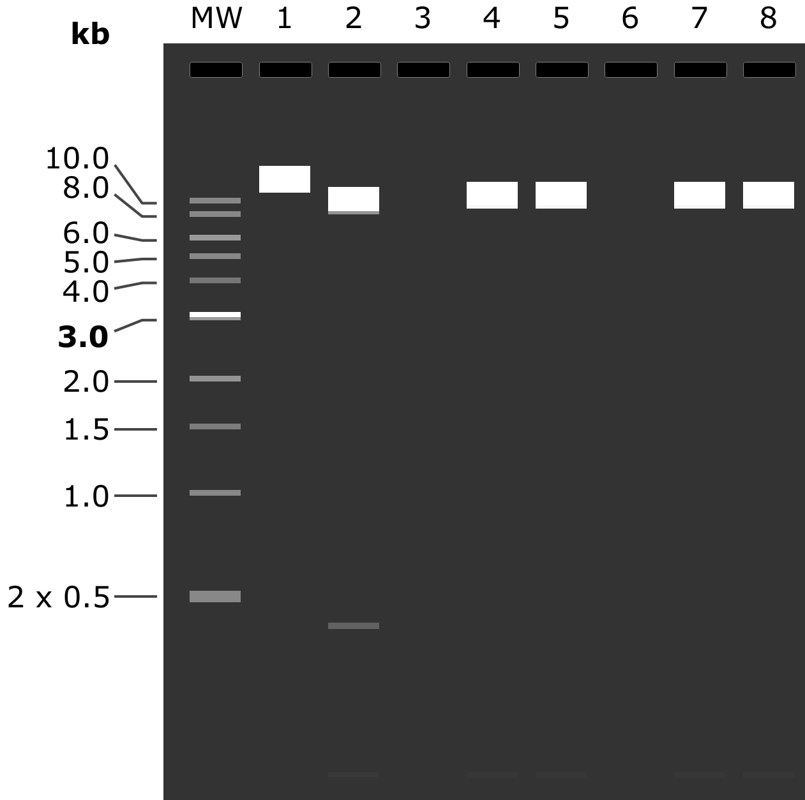
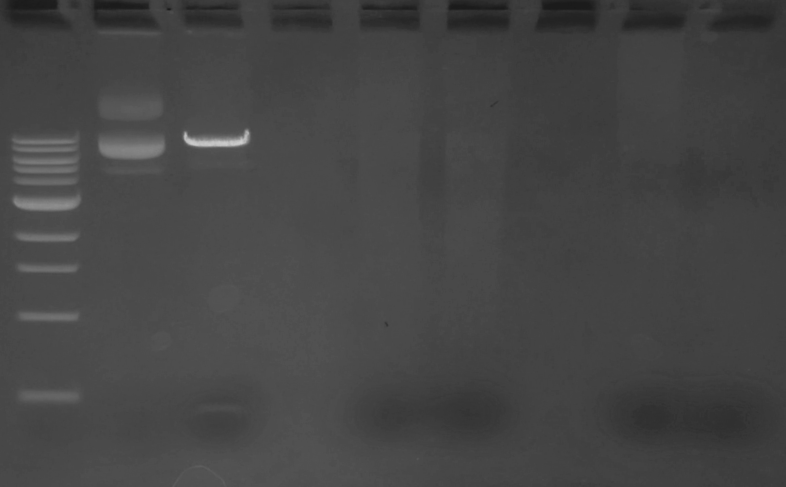

24.04.2024
========
- Виділення з нічної культури __pX333-46forv.1__, __pX333-46forv.2__ та __pX333-62forv.1__, __pX333-62forv.2__
- Вимірювання концентрації та рестрикціний аналіз клонів

---
## Plasmids
_Виконано разом з Лізой_
### Miniprep (10:55)
Виділення з нічної культури __pX333-46forv.1__, __pX333-46forv.2__ та __pX333-62forv.1__, __pX333-62forv.2__ (посадка о 19:40 в 5 ml, 37°C 220 RPM).

Для порівняння ефективності наборів TF GenJET (4368814) та NEB Monarch (T1010S) кожна з чотирьох плазмід виділялися паралельно обома наборами (_NEB взяла Ліза_). Всі об'єми відповідно рекомендаціям виробника, час інкубації та центрифугування для обох наборів співпадають. 

_Note: центрифугування 14.4k RPM._

- CF 45" - осадження клітин
- Лізис 1'
- Нейтралізація 2'
- CF 5'
- Обидві промивки CF 1'
- Елюювання TF 50 ul, інкубація 5' RT, CF 2'
- Елюювання NEB 30 ul, інкубація 7' RT, CF 2'

### Nanodrop (12:20)
Вимірювання концентрації виділених плазмід

Концентрація є середнім від трьох послідовних вимірювань на одній краплі й ul , занулення по відповідному Elution Buffer.

На зберіганні в коробці Лізи -20 410a.

|Sample|260/280|260/230|C raw|C|
|-|-|-|-|-|
|46.1 NEB|1.79, 1.72, 1.78|1.19, 1.22, 1.17|52.0, 51.7, 52.8| 52.2 ng/ul |
| 45.2 NEB |1.85, 1.85, 1.81|1.20, 1.15, 1.17|40.4, 39.4, 38.8| 39.5 ng/ul |
| 62.1 NEB |2.02, 2.13, 2.01|1.98, 2.04, 1.99|42.5, 41.7, 41.6| 41.9 ng/ul |
| 62.2 NEB |1.71, 1.66, 1.78|1.00, 1.02, 1.01|50.5, 49.5, 47.8| 49.3 ng/ul |
| 46.1 TF |1.94, 1.51, 1.90|1.34, 1.29, 1.31|28.6, 31.4, 30.0| 30.0 ng/ul |
| 46.2 TF |1.64, 1.84, 1.74|1.14, 1.06, 1.05|16.9, 17.3, 16.9| 17.0 ng/ul |
| 62.1 TF |1.83|1.32|22.8| 22.8 ng/ul |
| 62.2 TF |1.81, 1.50, 2.03|1.06, 1.01, 1.0|15.4, 17.1, 15.8| 16.1 ng/ul |

_Note: вихід NEB ~1.3 ug, вихід TF  ~1 ug. Виходи співставні, можливо невелика перевага NEB через довшу інкубацію елюювання._ 

Катастрофічно низький вихід, низьке значення 260/230. Культура росла ~15 h, має бути достатньо, можливо старий LB. Залишки кожної з чотирьої культур злито в кювету і проведено вимірювання на OD 600 проти чистого LB на КФК-3-01.

__OD 600 1.42__ (1.424, 1.425, 1.411), недоросла культура.

Рекомендована OD 600 3-5, необхідно приготувати свіжий LB та або подовжити культивування, або вносити додаткову глюкозу.

_Note: культури в кюветі було десь 2/3 висоти, можливе джерело похибки._

### Double digest (14:15)

Подвійна рестрикція 500 ng клонів очищених набором NEB. В якості контролю використана нативна pX333 (134 ng/ul).

Об'єм розчину плазмідної ДНК та води  для реакції:

|                   | pX333 | 46.1 | 46.2 | 62.1 | 61.1 |
| ----------------- | ----- | ---- | ---- | ---- | ---- |
| Plasmid           | 3.8   | 9.6  | 12.5 | 12.2 | 10   |
| H2O (Sigma W4502) | 13.2  | 7.4  | 4.5  | 4.8  | 7    |

Реакційна суміш:

| Position             | Amount                |
| -------------------- | --------------------- |
| DNA 500 ng           | according table above |
| BbsI-HF              | 0.5 ul                |
| BsaI-HV v2           | 0.5 ul                |
| 10x rCutSmart Buffer | 2 ul                  |
| __Total__            | __20 ul__             |

Інкубація 37°C 40' у T100.

### Electrophoresis (16:00)
Елетрофорез продуктів рестрикції.

Приготовано свіжий гель: 1% агарози в TBE (10x TBE pH 8.4 prep. 3.08.2023) + 30 ul EtBr (розчин Болдирева ніби то 1:10k).

На форез пішов весь об'єм реакціної суміші 20 ul + 2 ul NEB 6x LD Purple.

Об'єм решти 6 ul з використанням NEB 6x LD Purple та ddH20 (0.22 filt). 

В якості контролю 4 ul нативної pX333 (134 ng/ul).

80 mA 40'

|MW|1|2|3|4|5|6|7|8|
|-|-|-|-|-|-|-|-|-|
|2 ul NEB 1 kb Ladder|pX333|pX333 digested|-|46.1 digested|46.2 digested|-|61.1 digested|62.2 digested|
|N3232S|9.0 kb|8.5 kb, 0.4 kb, 30 bp, 22 bp||9.0 kb, 30 bp|9.0 kb, 30 bp||9.0 kb, 32 bp|9.0 kb, 32 bp|

| Prediction |   |
| ---------- | --------------------------------------------------: |
| __Gel__    |  |

Чиста pX333 чудово порізалась, фрагменти менше 0.4 kb не видно. Однак всі клони дали просто мазню на всю доріжку, можливо не було ніякої плазмідної ДНК в зразку і це лише забрудення фрагментами геномної ДНК.

### 2nd Electrophoresis (17:45)
Повторний електрофорез виділених клонів без рестрикції щоб перевірити на наявність плазмідної ДНК.

Всі клони почищені набором NEB взяті по 10 ul + 3 ul NEB 6xLS Purple.

В якості контролю 4 ul нативної pX333 (134 ng/ul).

100 mA 30'

|MW|1|2|3|4|5|
|-|-|-|-|-|-|
|2 ul NEB 1 kb Ladder|pX333|46.1|46.2|61.1|61.2|
|N3232S|9.0 kb|9.0 kb|9.0 kb|9.0 kb|9.0 kb|

Якась дива мазня, проглядаються по декілька бендів як мало би бути у плазмідної ДНК, але щось дивне з рухомістю основної плями у клонів __46forv__. Можливо плазмідна ДНК сильно фрагментована що знизило вихід чи насправді здої ампицилін і не відбувалася адекватна селекція та в культурі мала кількість клітин несе плазміду.

Із можливих рішень приготування новго стоку Amp, поміщення культури на лід впродовж осадження і ресуспендування, збільшення OD 600.

### Plating (18:40)

Для перевірки стоку Amp на чашку LB+Amp посаджені DH10B WT та клони 46.1, 46.2, 61.1.