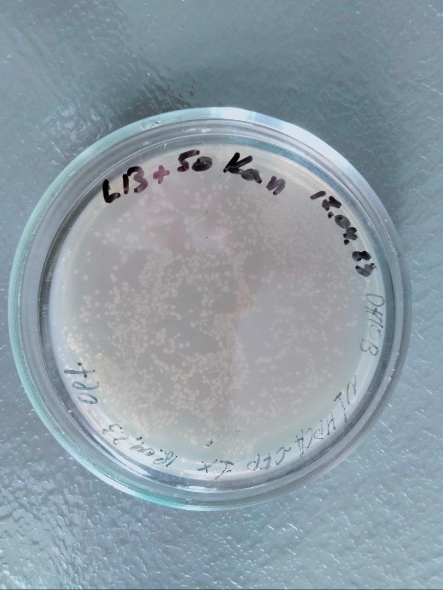
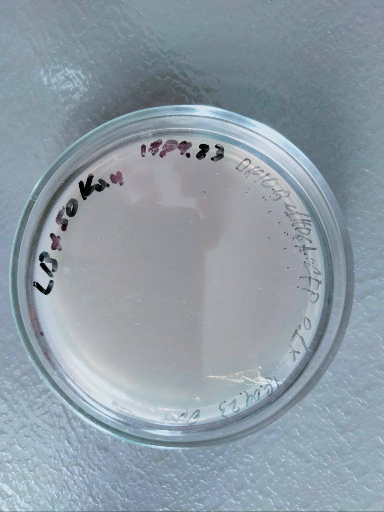
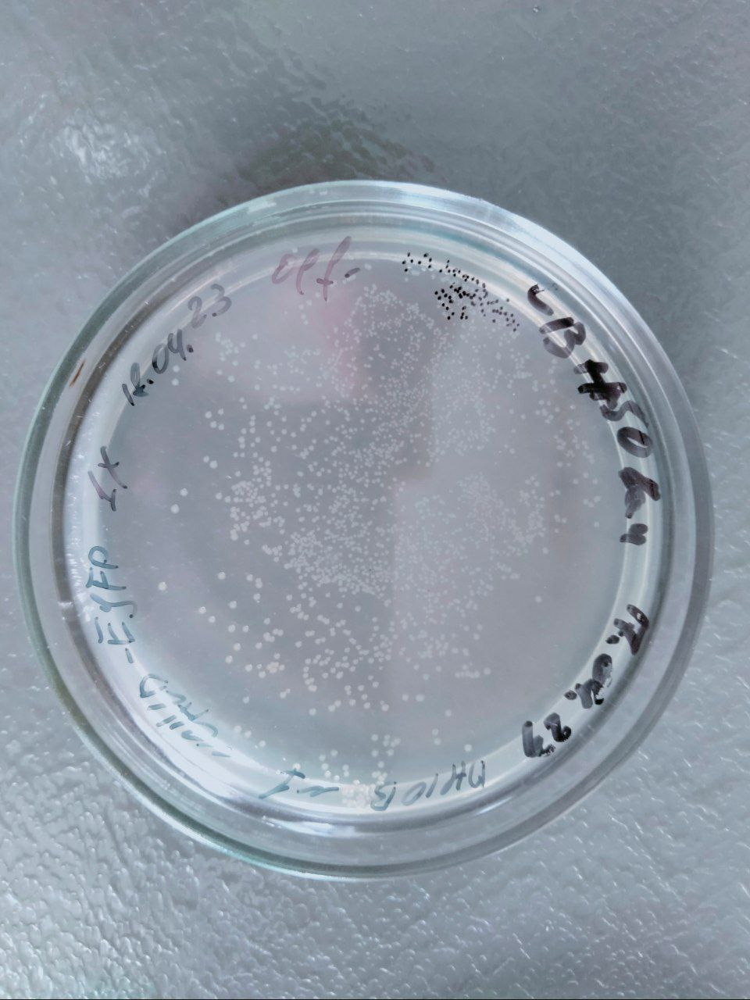
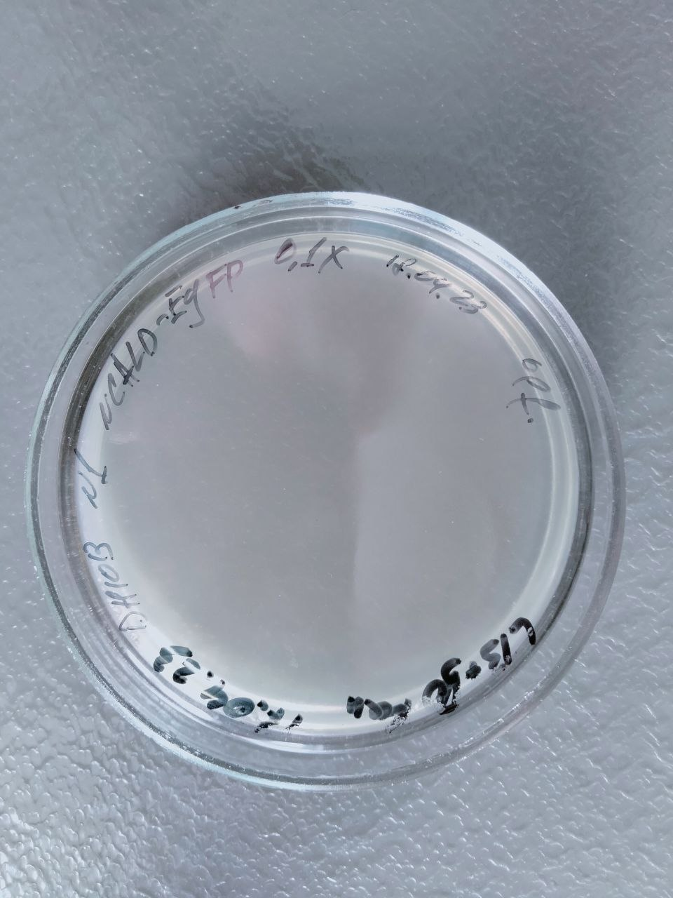

Plasmids cloning
===============
*2.03.2023-??.??.2023*

# Preparing
## Design
Cloning vector N1, selective marker *KanR/NeoR* (Kanamicin 50 ug/ml).

Bacterial strain E. coli DH5α.

Plasmid prep kit thermo scientific GeneJET Plasmid Miniprep Kit (#K0502).

Tranformation protocol *e_coli_mini_transformation.md*.

## Shopping list
| Name            | ID                 | Source |
| --------------- | ------------------ | ------ |
| Yeast Extract   | Sigma Y1625-250G   | Алси   |
| Peptone special | Sigma 68971-500G-F | Алси   |

## Selected plasmids
*measured 2.03.2022, 2023_c_raw.csv*

__NB: transformation volume per 200 ul of competent E. coli suspension__

**High priority**
Plasmid        |C (ng/ul)|260/280|260/230|Approx. volume|Trans. volume
---------------|---------|-------|-------|--------------|-
NCALD-EYFP      |603.2   |1.9    |2.2   |10 ul|1 ul
HPCA-CFP       |1807.3   |1.9   |2.15   |10 ul|0.5 ul
PHD-CFP        |125.9    |2.0   |1.9   |20 ul|3 ul

**Low priority**
Plasmid        |C (ng/ul)|260/280|260/230|Approx. volume|Trans. volume
---------------|---------|-------|-------|--------------|-
EYFP-Mem       |217.0   |2.0   |1.1   |25 ul|2 ul
GluR1-SEP      |391.9   |1.9   |2.2   |30 ul|2 ul       
GluR2-SEP      |353.5   |1.9   |2.2   |15 ul|2 ul
HPCA-G2A-EYFP  |473.0   |1.9   |2.0   |15 ul|1.5 ul

## Miniprep notes
*for #K0502 only*

Maximal column capacity __~20 ug__ of dsDNA - __~5 ml__ of overnight E. coli culture for high-copy plasmids.

Experiment requirements approx. __50-80 ug__ of plasmid DNA - __4x columns per plasmid__ (20 ml of culture).

# Cloning
## N1 HPCA-CFP
### Transformation
*18-19.04.2023*

Transformation volume - \~5-10 ul (\~12-15 mg).

  |  
 :-------------------------------------------: | :--------------------------------------------: 
 x1 (>500 colonies)               |               0.1x (27 colonies)               

### Clonig
_in progress_
**Cfin = ???**

## N1 NCALD-EYFP
### Transformation
*18-19.04.2023*

Transformation volume - \~5-10 ul (\~4-6 ng).

  |  
 :-------------------------------------------: | :--------------------------------------------: 
 x1 (>500 colonies)               |               0.1x (0 colonies)               

### Clonig
_in progress_
**Cfin = ???**