R. norvegicus _Hpca_ KO with TKIT approach
=============
*Borys Olifirov, 9.05.2023*

## Overview
### Gene
 _Hpca_ hippocalcin [Rattus norvegicus]

- Gene ID: 29177
- mRatBN7.2 location: Chromosome 5 -NC_051340.1 (141455616..141466252, complement) 

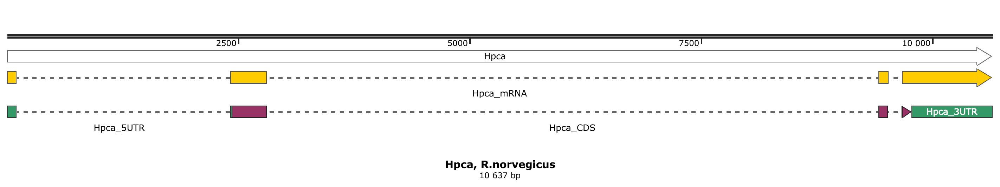

__Alignment__
| Name         | Query cover | Identity |
| ------------ | ----------- | -------- |
| Mus musculus | 90%         | 85%      |
| Homo sapiens | 22%         | 92%      |

### Transcript

- Largest mRNA RefSeq: XM_006238921.4
- RGD:620060
- 1611 bp

__Alignment__
| Name         | Query cover | Identity |
| ------------ | ----------- | -------- |
| Mus musculus | 100%         | 96.39%  |
| Homo sapiens | 100%         | 92.96%  |

### Protein

- NCBI RefSeq: XP_006238983.1
- Uniprot: P84076 HPCA_RAT
- 193 aa (22.43 kDa)
- Sequence: MGKQNSKLRPEMLQDLRENTEFSELELQEWYKGFLKDCPTGILNVDEFKKIYANFFPYGDASKFAEHVFRTFDTNSDGTIDFREFIIALSVTSRGRLEQKLMWAFSMYDLDGNGYISREEMLEIVQAIYKMVSSVMKMPEDESTPEKRTEKIFRQMDTNNDGKLSLEEFIRGAKSDPSIVRLLQCDPSSASQF

__PROSITE profiles__
| Name                     | Position | Raw-score | Seq.   | Profile |
| ------------------------ | -------- | --------- | ------ | ------- |
| EF_HAND_2 EF-hand domain | 60-95    | 280       | DASKFAEHVFRTFDTNSDGTIDFREFIIALSVTSRG | 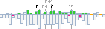 |
| EF_HAND_2 EF-hand domain | 96-131   | 331       | RLEQKLMWAFSMYDLDGNGYISREEMLEIVQAIYKM | 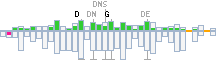 |
| EF_HAND_2 EF-hand domain | 144-179  | 287       | TPEKRTEKIFRQMDTNNDGKLSLEEFIRGAKSDPSI | 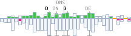 |

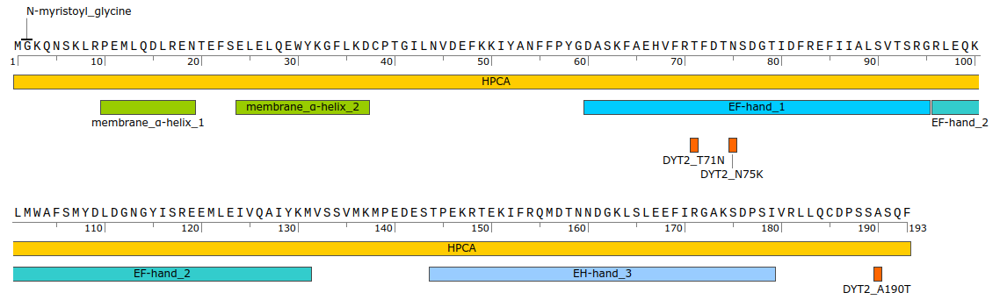

__Alignment__
| Name         | Query cover | Identity |
| ------------ | ----------- | -------- |
| Mus musculus | 100%         | 100%    |
| Homo sapiens | 100%         | 100%    |

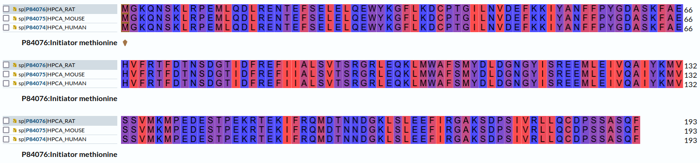
_colors represent hydrophobicity_

## TKIT design

Targeted Knock-In with Two (TKIT) guides approach utilizes two guide RNAs that cut the genomic DNA flanking the coding region of interest and includes a replacement donor DNA fragment encoding the excised coding sequence with the addition of a fluorescent protein tag (Fang et al., 2021, DOI: https://doi.org/10.7554/eLife.65202).

### gRNAs

__Selected gRNAs__
| ID   | Loc.   | Seq.               | PAM |MIT-Spec.|Off-targets      |
| ---- | ------ | ------------------ | --- | ------- | --------------- |
| 1rev | 5' UTR |agtcggtgtctcggcgttgc| tgg | 98      |18 (4 mismatch)  |
|152rev| 3' UTR |gatctcccaggattccaact| ggg | 80      |136 (>4 mismatch)|

__gRNAs position__
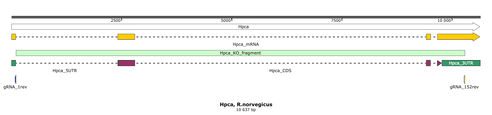

### Cas9

pX333 vector (addgene #64073) for tandem expression of two sgRNAs from two independent U6 promoters. Cas9 is expressed by Cbh promoter. 

__gRNAs double-stranded oligos__
| ID   |Restriction sites|Length| Seq. (sense strand only, upper case represent restriction sites)|
| ---- | --------------- |------| ----------------------- |
| Hpca_5UTR_gRNA_1rev | BbsI |50 bp            |attGAAGACaacaccagtcggtgtctcggcgttgcgtttaaGTCTTCtat|
|Hpca_3UTR_gRNA_152rev| BsaI | 48 bp             |attGGTCTCacaccgatctcccaggattccaactgtttaGAGACCtat  |

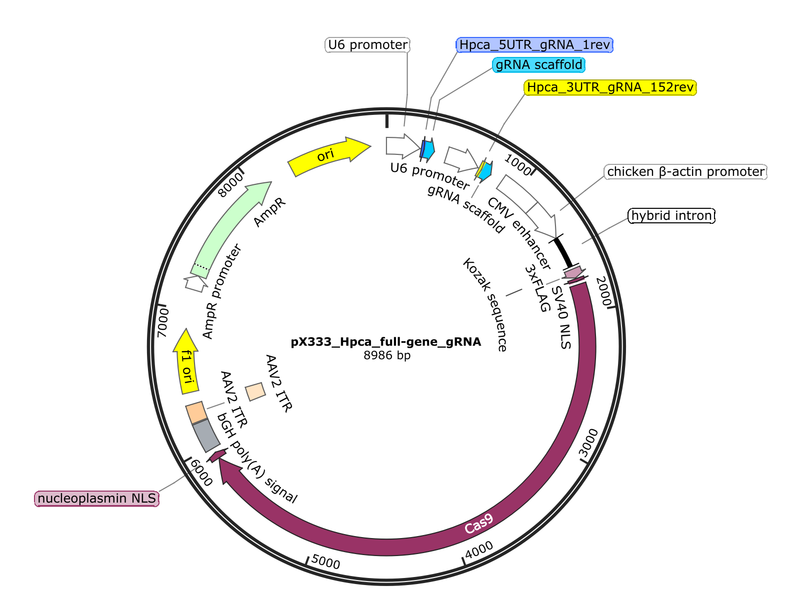

### LSSmOrange donor

Fluorescent protein sequence source - pLSSmOrange-N1 (addgene #37130).
_Note: this vector contains LSSmOrange under mammalian promoter control and it will allow neurons transfection for control measurements_

__Primers with gRNAs seq. for LSSmOrange extraction __
|Primer | ID |Restriction sites|Length| Tm |Seq. (upper case represent restriction sites) |
| ----- | -- | --------------- | ---- |--- | --- |
| FOR   | primer_FOR_LSSmOrange_donor_gRNA | EcoRI           | 46 bp|60oC|ggGAATTCcccagttggaatcctgggagatcgccaccatggtgagc|
| REV   | primer_REV_LSSmOrange_donor_gRNA | EcoRI           | 50 bp|55oC|ggGAATTCagtcggtgtctcggcgttgctggcttacttgtacagctcgtc|

__pLSSmOrange-N1 forvard primer region __
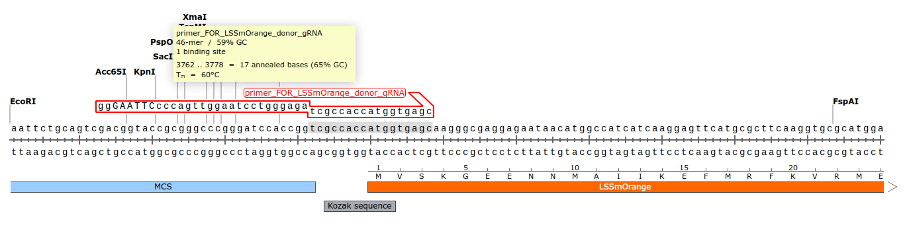
__pLSSmOrange-N1 reverse primer region __
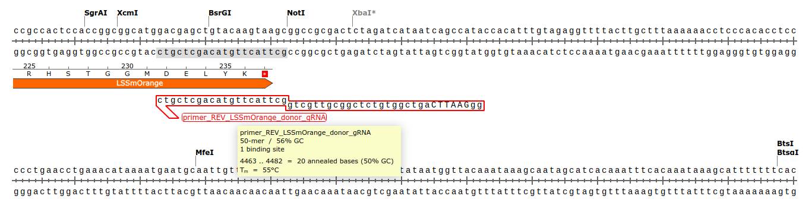

Amplicon will assemble into an EcoRI linearized cloning vector backbone (pMiniT 2.0 etc.).
_Note: restriction sites could be changed according to available cloning vector_

__Assembled pMiniT 2.0 donor vector __
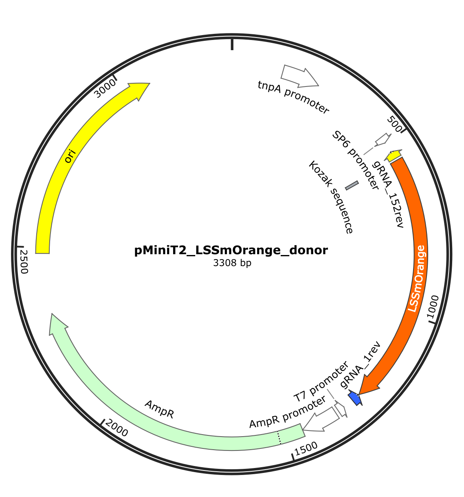

## Necessary materials

- pX333 (addgene #64073)
- pLSSmOrange-N1 (addgene #37130)
- Cloning vector with EcoRI sites
- Restriction enzymes: BbsI, BsaI, EcoRI
- Double-stranded oligo with gRNA for 5'UTR (50-mer): attGAAGACaacaccagtcggtgtctcggcgttgcgtttaaGTCTTCtat
- Double-stranded oligo with gRNA for 3'UTR (48-mer): attGGTCTCacaccgatctcccaggattccaactgtttaGAGACCtat
- Primer FOR  (46-mer): ggGAATTCcccagttggaatcctgggagatcgccaccatggtgagc
- Primer REV  (50-mer): ggGAATTCagtcggtgtctcggcgttgctggcttacttgtacagctcgtc

