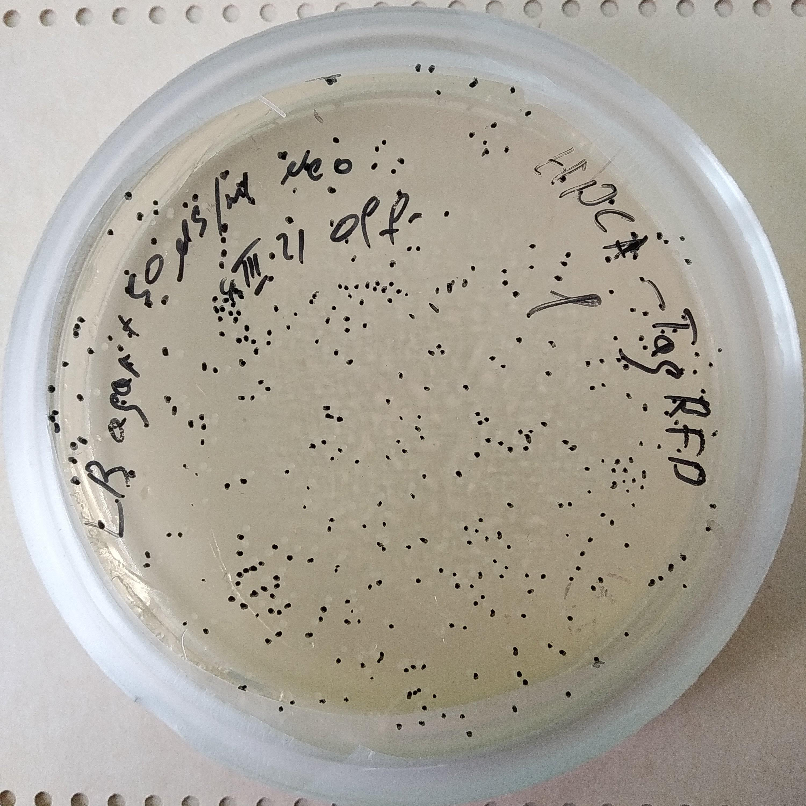
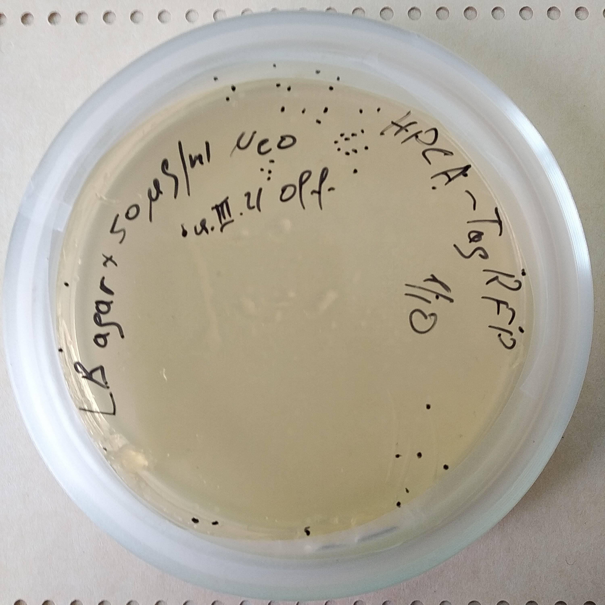
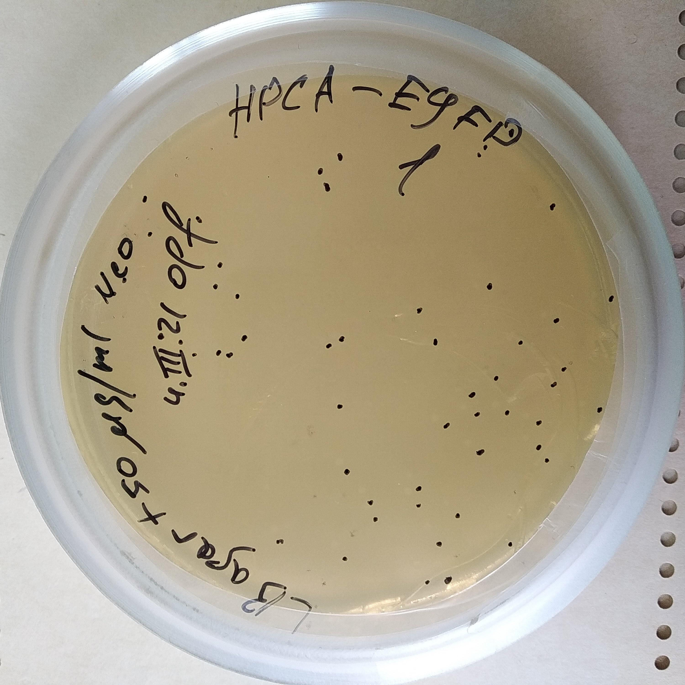
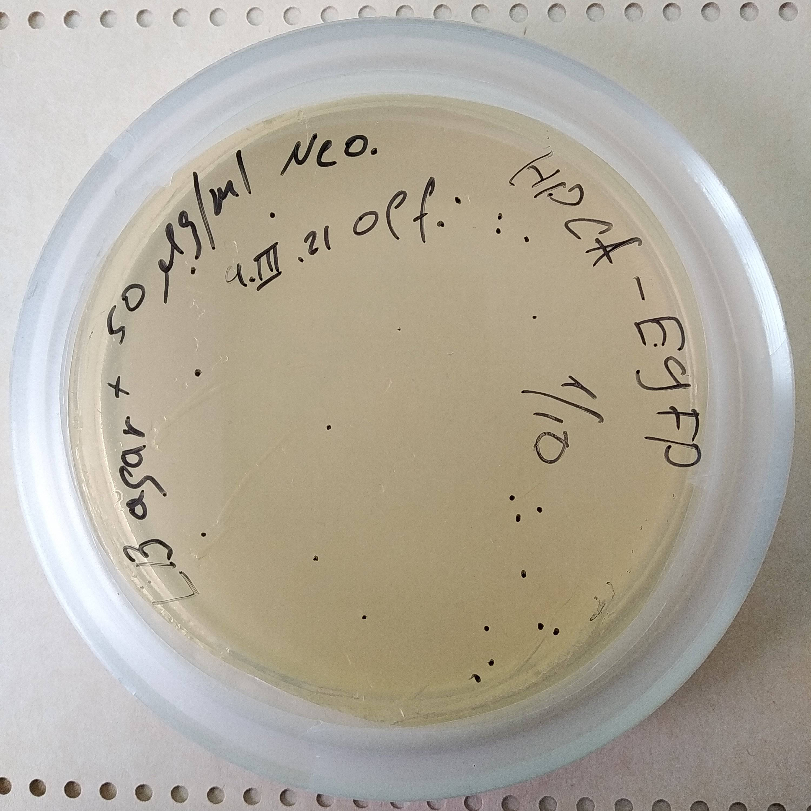

Plasmids cloning
===============
*13.02.2021-??.??.2021*

## Design
Все конструкты в векторе N1, селективный маркер *KanR/NeoR* (неомицин 50 ug/ml).

Использован штамм E. Coli DH5α.

Протокол получения компетентных клеток и трансформации Nishimura et al., 1990 (doi: 10.1093/nar/18.20.6169), масса ДНК для трансформации \~100 pg. Всего наработать необходимо 6 консруктов, для каждого три десятикратных разведения трансформантов (18 чашек).

*Note: по данным файла кельвинатора есть еще x10 аликвот компетентных клеток от 14.07.2017 в box 1.*

Набор для выделения Thermo Fisher GeneJET Plasmid Maxiprep Kit (#K0492).

**Warning: kit expiry date is 09.2016**

## Selected plasmids
Plasmid   |Signed C (ug/ul)|Approx. volume|Rack cell
:--------:|:--------------:|:------------:|:-------:
HPCA-RFP  |0.2             |10 ul         |1
HPCA-CFP  |0.75            |15 ul         |10 
HPCA-EYFP |0.7             |2 ul          |19
HPCA-EYFP |0.7             |10 ul         |20
HPCA-EYFP |?               |2             |21
EYFP-Mem  |0.45            |-             |28
EYFP-Mem  |0.45            |-             |29
EYFP-Mem  |0.45            |2 ul          |30
EYFP-Mem  |0.45?           |20 ul         |31
CFP-YFP   |0.9             |2 ul          |37
CFP-YFP   |?               |150 ul        |38
NCALD-EYFP|1               |10 ul         |46        

**Warning: 31 не подписан, судя по всему это последняя аликвота 20 ul EYFP-Mem.**

## Wish list
- Колба коническая 500 ml-1l x2-5
- Чашка Петри x20
- Пробирка x15
- Пипетка 10 ml x5
- Мерный цилиндр 250 ml x2
- Мерный цилиндр 100 ml
- 10 ul tips box x1
- 200 ul tips box x2
- 1000 ul tips box x2
- epp. 1.5 ml
- epp. 0.2 ml
- LB medium 500 ml x3
- LB agar (1.5%) 500 ml
- Neomycin 50 mg/ml 0.5ml x5
- ddH20 1.5 ml x10
- EtOH 96% 100 ml
- Falcon 50 ml x6

*Note: суммарно на приготовление среды LB уйдет 20 г пептона и NaCl и 10 г дрожжевого экстракта.*

## Plasmids preparing
Для измерения концентрации и трансформации плазмиды центрифугированы \~3000 RPM 2', аликвотированы и объем доведен до 20 ul автоклавированной ddH2O.

Plasmid    |Rack cell|Volume|C (ng/ul)
:---------:|:-------:|:----:|:-------:
HPCA-TagRFP|1        |4 ul  |35.4
HPCA-CFP   |10       |2 ul  |70.4
HPCA-EYFP  |20       |2 ul  |50.2
EYFP-Mem   |31       |4 ul  |59.4
CFP-YFP    |38       |1.5 ul|26.7
NCALD-EYFP |46       |1 ul  |67.5

*Note: объемы подобраны с тем, чтобы итоговый объем для трансформации (100 ng) составлял 2-5 ul чтобы избежать ошибок дозирования и иметь несколько попыток трансформации.*

Измерения концентрации NanoDrop проведено на объеме 1.5 ul, трижды на одной капле (результаты измерений в *init_conc.csv*).

## Cloning
Измерения концентрации NanoDrop проведено на объеме 1.5 ul, трижды на одной капле (результаты измерений в *final_conc.csv*).
### HPCA-TagRFP
*2.03-6.03.2021*
Объем для трансформации - 3 ul (\~105 ng).

**Cfin = 330 ng/ul**

|
:-:|:-:
x1 (384 colonies)|x1/10 (47 colonies)

### HPCA-EYFP
*2.03-6.03.2021*
Объем для трансформации - 2 ul (\~100 ng).

**Cfin = 280 ng/ul**

|
:-:|:-:
x1 (52 colonies)|x1/10 (23 colonies)

