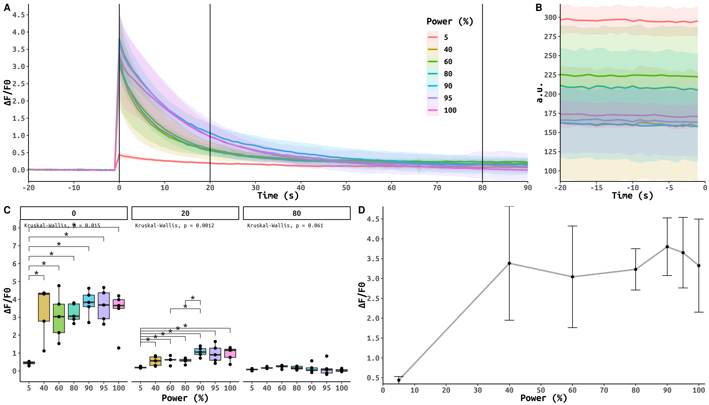

Calcium transient calibration with Fluo-4
=========================================
*29.09.2021-4.10.2021*

Построение калибровочных кривых кальциевых транзиентов с совместной загрузкой Fluo-4 и NP-EGTA

## Results

**A. Кальциевые транзиенты в течении всей регистрации**
**B. Абсолютная интенсивность до стимуляции**
**C. Интенсивность в выбранные моменты времени**
**D. Кривая P-ΔF/F0**

**Кол-во наблюдений**
P (%)|N
-|-
5|6
40|5
60|5
80|5
90|5
95|5
100|5

Наблюдается явная тенденция к повышению базовой линии по мере ухудшения состояния клеток. Это может обуславливать и высокую дисперсию результатов.

*Note: значит съемка вразброс лишь увеличивает дисперсию данных?*

Все клетки на мощности более 5% сняты более чем через 3h после перевода клеток и одна за другой, при этом обладают едва ли не наименьшей дисперсией базовой линии однако высокой начальной интенсивностью.

Наблюдаема тенденция может указывать, что точка перегиба находиться где-то в области 50-70%.

Необходимо менять подход к порядку регистрации для снижения дисперсии данных и набирать более значительную статистику.

## Points
- Замена внешнего раствора каждые 30'
- Увеличить скорость регистрации, все измерения проводить в первые 1.5-2h после загрузки клеток
- Для проверки роста дисперсии за счет цикличного порядка смены мощности стимуляции попробовать снимать клетки на одной мощности по 2-3
- Если настройки с прошлого эксперимента не дают необходимой интенсивности базовой линии (\~400 a.u.), варьировать HV и мощность 488
- Необходима дополнительная статистика на 40%, 60%, 100% (минимум по 3 клетки)
- Статистика на 20%
- Итоговое количество валидных клеток на каждой мощности >8