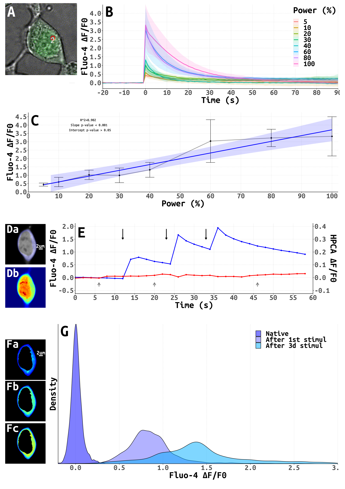
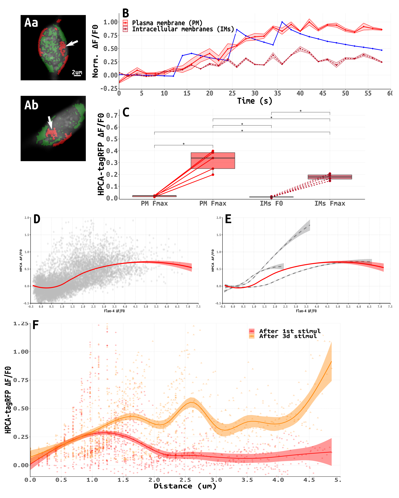
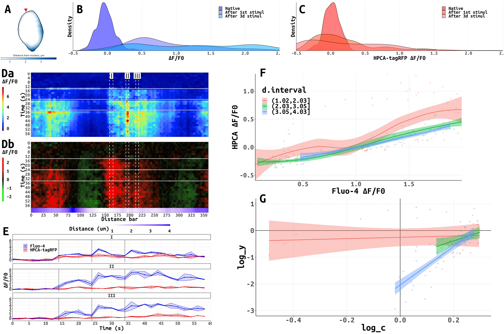

Panels description
-------------------

**Fig  1. Spatio-temporal properties of cytoplasmic [Ca2+]I transients induced in HEK cells by uncaging of NP-EGTA** 

**Fig. 2. Difference in HPCA translocation to plasma and intracellular membranes** 

**Fig. 3. **