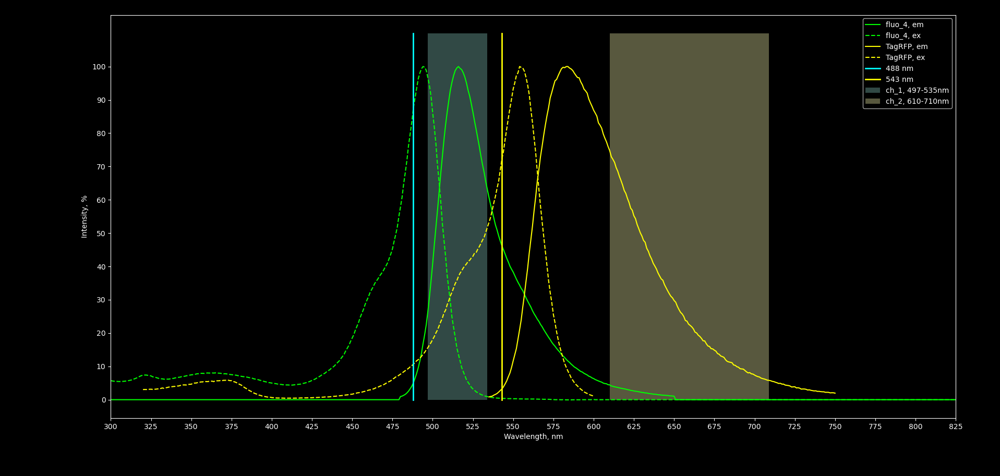
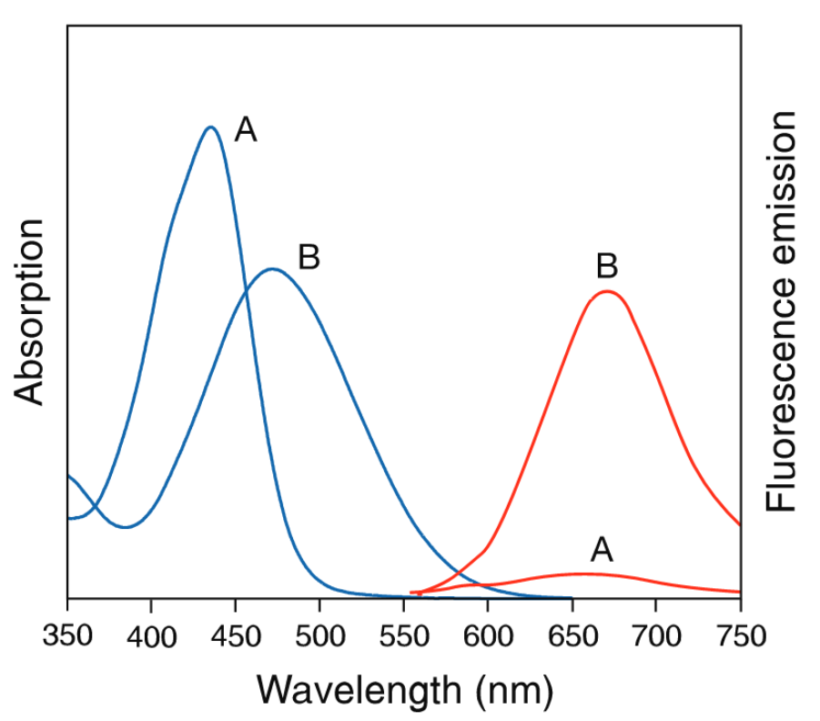
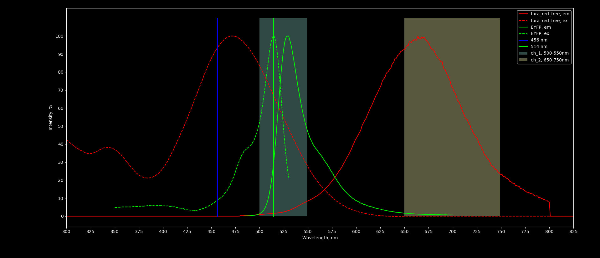
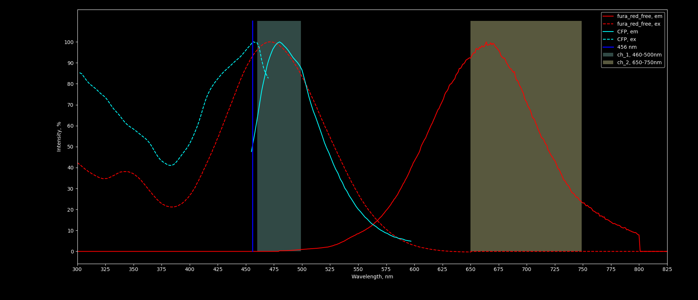
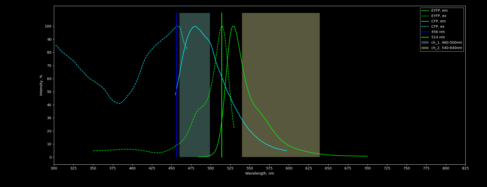
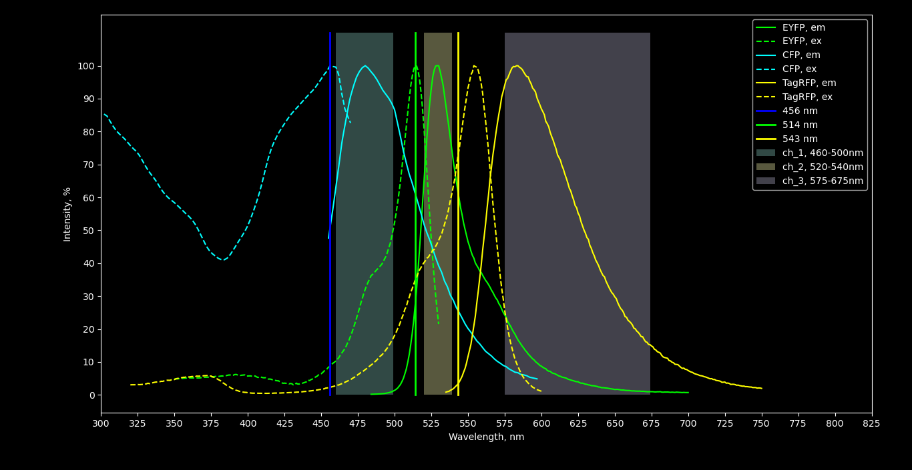
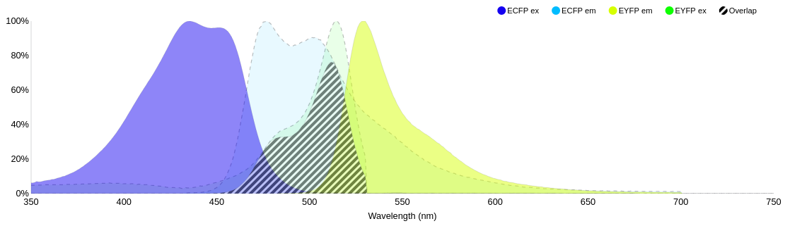
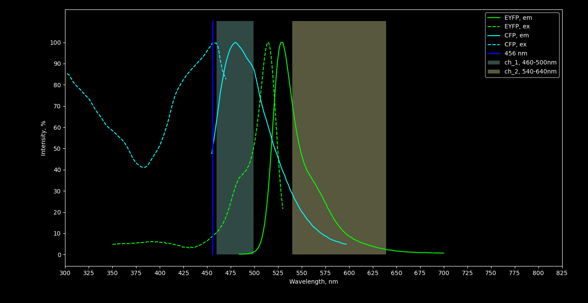

Experiments plan
================

*Sonia Nevelchuk, Borys Olifirov, 7.01.2022*

# Оценка распределения PIP2 в мембране НЕК293 
## 0. Построение кривой дозо-зависимости встраивания HPCA
### Description
Для подбора оптиммальной мощности стимуляции всей клетки необходимо построение кривой дозо-зависимости. Поскольку дизайн прошедших экспериментов предусматривал разделение отладочной серию для подбора параметров стимуляции с использованием кальциевого красителя и дальнейшую регистрацию транслокации HPCA без одновременной кальциметрии наблюдался большой разброс данных и необходимые мощности стимуляции доходили до 100%.

Решено отказаться от такого подхода и перейти на одновременную кальциметрию (Fluo-4) регистрацию транслокации HPCA-TgRFP. Площадь стимуляции также не нормирована, по всей площади клетки в кадре. Для снижения влияния стимулирующего лазера также будут применены повторные стимуляции (3-5) на малой мощности.

Полученные данные позволят оценивать дозо-зависимость в каждой отдельной клетке что позволит снизить влияние неоднородности свойств отдельных клеток и воспроизведения точных параметров стимуляции. 

### Recording design
**Fluo-4 & TagRFP spectra**

Fluorescent agent|Ex. laser|Pass band
-----------------|---------|----------
Fluo-4           |488 nm   |497-535 nm
HPCA-TagRFP      |543 nm   |610-710 nm

**Fluo-4 & TagRFP crosstalsk**
- fluo_4|488 nm = 87
fluo_4|543 nm = 0
fluo_4 integral int.|[497, 535]nm = 2980
fluo_4 integral int.|[610, 710]nm = 97
- TagRFP|488 nm = 10
TagRFP|543 nm = 72
TagRFP integral int.|[497, 535]nm = 0
TagRFP integral int.|[610, 710]nm = 2908
- TagRFP intensity in ch_1 is zero!
Ch. [497, 535] at 488nm corrected ratio = 0.0 (A=8.7)
Ch. [497, 535] at 543nm corrected ratio = 0.0 (A=0.0)
- Ch. [610, 710] fluo_4 em./TagRFP em. ratio = 0.033
Ch. [610, 710] at 488nm corrected ratio = 0.287 (A=8.7)
Ch. [610, 710] at 543nm corrected ratio = 0.0 (A=0.0)

**NB: отсутствие перекрытия по эмиссии между каналами позволяет вести прямую регистрацию, однако сигнал TagRFP очень шумный, необходимо сдвигать второй канал левее или разводить флуорофоры по возбуждению.**

**Fura Red forms spectra**

*Molecular Probes Handbook, 19.3.35*

В случае неудачи с использованием HPCA-TagRFP возможно перейти на HPCA-EYFP с использованием Fura Red в качестве кальциевого индикатора. Поскольку яркость связанной формы Fura Red значительно ниже свободной регистрация изменения концентрации свободных ионов кальция будет производиться по падению интенсивности свободной формы красителя.

**EYFP & Ca-free Fura Red spectra**

Fluorescent agent|Ex. laser|Pass band
-----------------|---------|----------
HPCA-EYFP        |514 nm   |500-550 nm
Fura Red free    |456 nm   |650-750 nm

**EYFP & Fura Red free crosstalk**
-fura_red_free|456 nm = 93
fura_red_free|514 nm = 67
fura_red_free integral int.|[500, 550]nm = 170
fura_red_free integral int.|[650, 750]nm = 6804
- EYFP|456 nm = 8
EYFP|514 nm = 100
EYFP integral int.|[500, 550]nm = 2759
EYFP integral int.|[650, 750]nm = 52
- Ch. [500, 550] EYFP em./fura_red_free em. ratio = 16.229
Ch. [500, 550] at 456nm corrected ratio = 1.396 (A=0.086)
Ch. [500, 550] at 514nm corrected ratio = 24.23 (A=1.493)
- Ch. [650, 750] EYFP em./fura_red_free em. ratio = 0.008
Ch. [650, 750] at 456nm corrected ratio = 0.001 (A=0.086)
 Ch. [650, 750] at 514nm corrected ratio = 0.012 (A=1.493)

### Tasks
- Регистрация клеток ΗPCA-TagRFP + Fluo-4 (HPCA-EYFP + Fura Red) и NP-EGTA с 3-5 последовательными стимуляциями
- Построение усредненной кривой дозо-зависимости встраивания на основании данных отдельных клеток

## 1. Оценка влияния стимуляции на PHD-CFP
### Description
Возбуждение флуоресценции CFP оптимально проводить лазером длинной волны 456nm, что отвечает 100% его возбуждения, однако при этом стимулирующий лазер длинной волны 405nm возбуждает флуоресценцию CFP на 57%, учитывая высокие значения возбуждения белка необходимо оценить степень выгорания после стимуляции.

Одновременно изменение концентрации кальция может влиять на содержание PIP2 в плазматической мембране. Поскольку это один из факторов, который может негативно влиять на последующую оценку колокализации необходимо провести несколько отладочных опытов, которые помогут оценить поведение PHD-CFP в ответ на изменение цитоплазматической концентрации Ca2+. Для оценки изменения концентрации кальция будет использован кальциевый краситель Fura-Red.

### Recording design
**Fura Red forms crosstalk**
- Fura Red free|456 nm = 93
Fura Red free integral int.|[460, 500]nm = 11
Fura Red free integral int.|[570, 620]nm = 1974
- Fura Red bound|456 nm = 65
Fura Red bound integral int.|[460, 500]nm = 126
Fura Red bound integral int.|[570, 620]nm = 3632
- Ch. [460, 500] Fura Red free em./Fura Red bound em. ratio = 0.087
Ch. [460, 500] at 456nm corrected ratio = 0.124 (A=1.431)
- Ch. [570, 620] Fura Red free em./Fura Red bound em. ratio = 0.544
Ch. [570, 620] at 456nm corrected ratio = 0.778 (A=1.431)

**CFP & Ca-free Fura Red spectra**

Fluorescent agent|Ex. laser|Pass band
-----------------|---------|----------
PHD-CFP          |456 nm   |460-500 nm
Fura Red free    |456 nm   |650-750 nm

**CFP & Fura Red free crosstalk**
- Fura Red free|456 nm = 93
Fura Red bound integral int.|[460, 500]nm = 126
Fura Red bound integral int.|[570, 620]nm = 363
- CFP|456 nm = 99
CFP integral int.|[460, 500]nm = 3703
CFP integral int.|[570, 620]nm = 196
- Ch. [460, 500] CFP em./fura_red_free em. ratio = 336.636
Ch. [460, 500] at 456nm corrected ratio = 358.517 (A=1.065)
- Ch. [650, 750] CFP em./fura_red_free em. ratio = 0.0
Ch. [650, 750] at 456nm corrected ratio = 0.0 (A=1.065)

### Tasks
- Предварительно оценить диапазон изменения интенсивности Fura Red при заданной длине волны возбуждения и ширине канала
- Отладка трансценкции  клеток HEK293 PHD-CFP, оценка уровня трансфекции и подбор параметров совместной регистрации с Fura Red
- Оценка распределения PHD-CFP в клетке в состоянии покоя

*Note - известно, что PIP2 в основном локализован в плазматической мембране, однако его содержание низкое - 2-5%. В результате могут возникнуть сложности с нахождением мембранных регионов на снимках.*

- Регистрация в динамике поведения PHD-CFP c одновременным изменения концентрации кальция 

*Note: остается открытым вопрос необходимо ли использовать дизайн стимуляции из экспериментов по измерению доза-зависимости. Возможно следует остановится на единичной фотостимуляции поскольку нас не интересуют динамические процессы, а взаимное распределение PIP2 и HPCA при максимальных значениях встраивания HPCA.*

## 2. Оценка зависимости распределения PIP2 от морфологических особенностей плазматической мембраны
### Description
Заранее неизвестно, сконцентрирован ли пул PIP2 в плазматической мембране равномерно или в составе компактных рафтов. Распределение  PIP2 необходимо точно знать чтобы понять, возможно ли оценить свящь встраивания HPCA c PIP2 поскольку в случае равнмерного распределения минорного фосфолипида прямое наблюдение за взаимным распределением PHD-CFP и HPCA-TagRFP в мембране не даст каких-либо однозначных результатов.

Кроме этого чрезвычайно низкое содержание PIP2 в сембране скорее всего не позволит непосредсвенно выделить мембранный регион на снимках по сигналу PHD-CFP поскольку его цитозольная фракция будет значительно превышать мембранную.

Использование дополнительной мембранной метки EYFP-Mem позволит одновременно и отделить исключительно мембранную область на снимках, и оценить распределение PHD-CFP относительно равномерного распределения EYFP-Mem в плазматической мембране.

### Recording design
**CFP & EYFP spectra**

Fluorescent agent|Ex. laser|Pass band
-----------------|---------|----------
PHD-CFP          |456 nm   |460-500 nm
EYFP-Mem         |514 nm   |540-640 nm

**CFP & EYFP crosstalk**
- EYFP|456 nm = 8
EYFP|514 nm = 100
EYFP integral int.|[460, 500]nm = 8
EYFP integral int.|[540, 640]nm = 2049
- CFP|456 nm = 99
CFP|514 nm = 0
CFP integral int.|[460, 500]nm = 3703
CFP integral int.|[540, 640]nm = 740
- Ch. [460, 500] EYFP em./CFP em. ratio = 0.002
Ch. [460, 500] at 456nm corrected ratio = 0.0 (A=0.081)
514nm A factor (EYFP ex./CFP ex.) DOESN't exist, CFP ex. is zero!
- Ch. [540, 640] EYFP em./CFP em. ratio = 2.769
Ch. [540, 640] at 456nm corrected ratio = 0.224 (A=0.081)
514nm A factor (EYFP ex./CFP ex.) DOESN't exist, CFP ex. is zero!

### Tasks
- Отладочные регистрации с индивидуальной трансфекцией PHD-CFP и EYFP-Mem для проведения unmixing'а совместных регистраций 
- Cовместная регистрация PHD-CFP и EYFP-Mem в состоянии покоя

*Note: если будет обнаружено кальций-зависимое перемещение PHD-CFP, то необходимо выполнить и следующий пункт*

- Регистрация в динамике поведения PHD-CFP в присутсвии EYFP-Mem c одновременным изменения концентрации кальция 

# Ко-локализация HPCA и PIP2
## 1. Одновременная оценка ко-локализации PHD-CFP, EYFP-Mem и ΗPCA-TagRFP

Поскольку ожидается, что прямое наблюдение за распределением PIP2 в мембране с применением PHD-CFP даже при условии его компактной локализации будет затруднено значительной цитозольной фракцией PHD-CFP оценка колокализации PIP2 и мембранной формы HPCA кажется возможной только в присутсвии опорной мембранной метки.

Наличие трех флуорофоров потребует процедуры unmixing'а и серии отладочных опытов. Однако при равномерном распределении PHD-CFP прямая оценка колокализации будет непоказательна, даже при введении оценки площади мембраны в отдельных пикселях по сигналу EYFP-Mem.

*Note: если же PHD-CFP на мембране будет находиться в компактных скоплениях можно ли принебречь мембранной меткой и проводить оценку просто разделив изображение канала PHD-CFP на канал HPCA-TagRFP (маска по регионам повышения интенсивности)?*

### Recording design
**CFP & EYFP & TagRFP spectra**

Fluorescent agent|Ex. laser|Pass band
-----------------|---------|----------
PHD-CFP          |456 nm   |460-500 nm
EYFP-Mem         |514 nm   |520-540 nm
HPCA-TagRFP      |543 nm   |575-675 nm

**CFP, EYFP & TagRFP excitation**
- EYFP|456 nm = 8
EYFP|514 nm = 100
EYFP|543 nm = 0
- CFP|456 nm = 99
CFP|514 nm = 0
CFP|543 nm = 0
- TagRFP|456 nm = 2
TagRFP|514 nm = 34
TagRFP|543 nm = 72

### Tasks
- Отладочные регистрации с индивидуальной трансфекцией PHD-CFP, EYFP-Mem и HPCA-TagRFP для проведения unmixing'а совместных регистраций 
- Отдадка трансфекции тремя конструктами, оценка эфективности трансфекции.
- Регистрация клеток ко-трансфецированых PHD-CFP, EYFP-Mem HPCA-TagRFP загруженных NP-EGTA с последующей стимуляцией

*Note: из-за предположительно низкой эфективности трансфекции сразу тремя конструктами вероятно прийдется изменить дизайн эксперимента. Рассмотрение зависимости областей инсерций гиппокальцина относительно морфологических особенностей мембраны можно вынести отдельным пунктом.*

*Note: остается открытым вопрос необходимо ли использовать дизайн стимуляции из экспериментов по измерению доза-зависимости. Возможно следует остановится на единичной фотостимуляции поскольку нас не интересуют динамические процессы, а взаимное распределение PIP2 и HPCA при максимальных значениях встраивания HPCA.*

- Оценить соответвие областей повышения флуоресценции PHdomain - CFP и HPCA-TagRFP относительно морфологии мембраны клетки, меченой MemYFP с помощью процедуры unmixing'а с предварительно полученными коефициентами эмиссии для каждого флуорофора.

## 2.Оценка ко-локализации PHD-CFP и HPCA-YFP с использованием FRET
### Description
Подход с одновременным использование PHD и мембранной метки сопряжен с трудностями в дальнейшем анализе данных и учитывая низкую интенсивность TagRFP возможно не удастся зарегистрировать транслокацию.

Помимо этого низкий уровень PIP2 в плазматической мембране и если будет обнаружено, что его распределение равномерно наблюдение колокализации может служить слабым подтверждением специфичности посадки HPCA в области мембраны богатые PIP2. 

### Recording design
*Известно, что CFP является донором YFP для возниконовения FRET, что позволит наблюдение ко-локализаци. Так же, по мере снижения концентрации кальция и ухода гиппкальцина с мембраны, интенсивность флуоресценции YFP, вызваная FRET будет падать. Характер уменьшения интенсивности флуоресценции вероятно будет соответвовать кривым, полученным ранее в экспериментах по оценке уровня транслокаций гиппокальцина. Данный метод является коственным доказательством того, что мы действительно наблюдаем ко-локализацию HPCA и PIP2*

Поскольку возбуждение EYFP лазером 456 nm незначительное и сигналы пары донор-акцептор можно полностью развести по каналам возможно даже нет необходимости регистрировать изображения с возбуждением 514 nm для получение чистого сигнала акцептора. Уровень FRET возможно зарегистрировать исключительно по повышению интенсивности в канале EYFP которое будет свидетельствовать либо о посадке HPCA-EYFP в рафты богатые PIP2 и, соответсвенно, с большим количеством PHD-CFP, либо о сближении PHD-CFP и HPCA-EYFP в примембранном регионе при конкуренции за равномерно распределенный в плазматической мембране PIP2. Это позволит полностью исключить проблему оценки взаимной локализации флуорофоров и детекции мембранной области на изображениях.

**FRET pair characteristics**

QY don.|ε acc. |QY acc.|J(λ)|κ2  |n   |R0     |R0 x QY acc.
-------|-------|-------|----|----|----|-------|------------
0.4    |67000  |0.67   |1.53|0.67|1.33|47.51 Å|31.83

*QY = Quantum Yield, ε = extinction coefficient, J(λ) = Overlap Integral, R0 = Förster Radius, n = refractive index, κ2 = orientation factor*

**CFP & EYFP**

Fluorescent agent|Ex. laser|Pass band
-----------------|---------|----------
PHD-CFP          |456 nm   |460-500 nm
HPCA-EYFP        |-        |540-640 nm

**CFP & EYFP bound crosstalk**

- EYFP|456 nm = 8
EYFP integral int.|[460, 500]nm = 8
EYFP integral int.|[540, 640]nm = 2049
- CFP|456 nm = 99
CFP integral int.|[460, 500]nm = 3703
CFP integral int.|[540, 640]nm = 740
- Ch. [460, 500] CFP em./EYFP em. ratio = 462.875
Ch. [460, 500] at 456nm corrected ratio = 5728.078 (A=12.375)
- Ch. [540, 640] CFP em./EYFP em. ratio = 0.361
Ch. [540, 640] at 456nm corrected ratio = 4.467 (A=12.375)

### Tasks
- Регистрация клеток ко-трансфецированых PHD-CFP и HPCA-YFP загруженных NP-EGTA с последующей стимуляцией
- Построить кривые изменения флуоресценции для всего кадра или для мест компактной локализации PIP2 при их наличии

