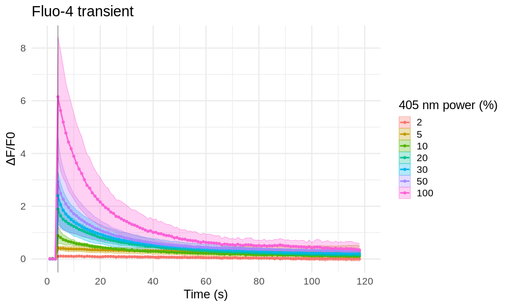

Experiments plan
================
*Borys Olifirov, 10.09.2021*

## Подбор параметров фотоиндуцированного повышение уровня Ca2+ и получение калибровочных кальциевых транзиентов
Поскольку в прошлом дизайне стимуляции достигались значения ΔF/F0 до ~ 6, но не наблюдалось насыщение надо рассчитывать на то, что пиковые значения ΔF/F0 могут достигать 8-10 что накладывает ограничения на яркость клеток до стимуляции, стараясь при этом все же избегать очень низкого соотношения сигнал/шум.

*Note: начать с интенсивности 500-800 и спуститься ниже если будет зашкал?*

**Ca2+ transient with 48 ms Tornado stimulation area**

Поскольку насыщения Fluo-4 так и не наблюдалась подбор параметров следует продолжать пока не удастся выйти на полочку, не может же быть недостаточно NP-EGTA для этого. Однако по достижению насыщения надо удостовериться, что это именно насыщение красителя. На параметрах стимуляции которые отвечают полочке следует провести повторные стимуляции, пиковые ΔF/F0 не должны значимо отличаться (с поправкой на выгорание и т.д.).

*Note: при наличии лишнего свободного времени можно построить зависимость между количеством стимуляций до наступления истощения NP-EGTA и мощности стимуляции. Позволит ли это оценить пулл NP-EGTA?*

**Max ΔF/F0 ~ 405 nm stimulation laser power**

## Pipeline
### Стимуляция Tornado
- Увеличить область стимуляции в режиме Tornado до ~ 1/3 площади клетки и стараться захватывать в стимуляции область свободной от ядра цитоплазмы
- Начина от мощности 1% пройти с инкрементом в 2-3 % до 10-15%
- Если изменение слишком незначительно пройти от 1% c инкрементом 10%

*Note: если последние 2-3 мощности не показывают насыщение и достигнуто 100% 405 nm, увеличить площадь*

- Подобрав площадь и инкремент набрать статистику

*Note: мощности стимуляции выбирать произвольно, не по возрастающей чтобы нивелировать влияние физиологического состояния клеток*

### Стимуляция whole-cell
- Стимулировать всю клетку, провести регистрацию нескольких клеток на 1-5% чтобы сравнить, будут ли сопоставимы пиковые значения

*Note: но площадь стимуляции не будет нормирована между клетками, интересно, отразиться ли это на SD полученных транзиентов по сравнению с Tornado?*

- Если вариативность пиковых ΔF/F0 не ужасающая, повторить алгоритм подбора диапазона мощностей из Tornado

**NB: кол-во адекватных клеток при каждой конфигурации 3-5**

### Оценка истощения NP-EGTA
- Используя выбранный способ стимуляции провести 3-5 повторных стимуляций на максимальной подобранной мощности
- Снижая мощность с установленным ранее инкрементом проводить повторные стимуляции

*Note: необходимо оценить кол-во повторных стимуляций, ведь со снижением мощности их будет становиться больше*

### Анализ
- Оценить морфологические изменения клеток при Tornado и whole-cell стимуляциях
- Построение транзиентов
- Построение дозо-зависимости от мощности
- Построение кривой истощения (Max ΔF/F0 / Nsat)

*Note: Nsat - кол-во стимуляция до истощения (снижения Max ΔF/F0)*
