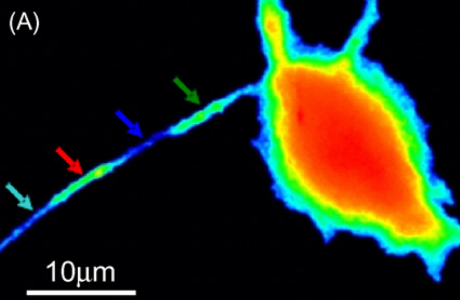

HPCA insertions pattern: are rafts pre-exist or calcium increase promotes rafts formation and specifies HPCA distribution?
==============
*Borys Olifirov, 2.05.2021*

Повышение кальция в апикальных дендритах нейронов приводит к кальций-зависимой транлокации HPCA, однако паттерн транлокации неравномерный вдоль дендрита (*Markova et al., 2008, doi:10.1016/j.neulet.2008.06.089*).  Места предпочтительных мест транлокаций устойчивы во времени (*Dovgan, unpublished*). Как *in vitro*, так и *in vivo* показано, что HPCA обладает высоким сродством с минорным фосфолипидным компонентом цитоплазматической мембраны - фосфатидилинозитол 4,5-дифосфатом (PIP2), результаты измерений на липидных везикулах показали Kd \~ 50 nM (*O'Callaghan et al., 2005, doi:10.1042/BJ20051001*).

**HPCA Ca-dependent translocations pattern**

*Markova et al., 2008*

В состоянии покоя лишь незначительная доля HPCA встроена в мембрану, 0-8% (*Sheremet et al., 2020, DOI 10.1007/s11062-020-09845-6*; *Cherkas, unpublished*), а при повышении концентрации кальция в отдельных регионах мембраны концентрация белка может повышаться на 50-100% (*Olifirov, unpublished*; *Dovgan, unpublished*).
Эти наблюдения позволяют выдвинуть гипотезу, что встраивание такого огромного количества кальциевого сенсора в небольшие по площади регионы мембраны может приводь к изменения ее биофизических свойств. Стоит подчеркнуть, потенциальные мишени подобного воздействия HPCA также демонстрируют высокое сродство к PIP2 или же их активность непосредственно им модулируется (*Hansen, 2015, dx.doi.org/10.1016/j.bbalip.2015.01.011*; *Rodríguez-Menchaca et al., 2012, doi: 10.3389/fphar.2012.00170*; *Dickson et al., 2014, doi/10.1073/pnas.1407133111*).

Учитывая, неясные механизмы взаимодействия HPCA с мишенями на мембране и тот факт, 
на локальные биофизические свойства мембраны остается открытым вопрос, чье влияние более выражено, Ca-зависимого образование рафтов из PIP2 и PIP3 или встраивание кальциевого сенсора.

## Research tasks
- Предсуществуют ли места повышенной концентрации PIP2 до повышения кальция и как меняется их размер во время кальциевого транзиента?
- Как влияет удаление холестерина на распределение PIP2 в цитоплазматической мембране?
- Действительно ли места предпочтительной транслокации HPCA связаны с местами повышенной концентрации PIP2?
- Влияет ли удаление холестерина из цитоплазматической мембраны на паттерн встраивания HPCA и его стабильность?
- Коррелируют ли места кальций-зависимого образования PIP2-богатых рафтов и встраивания HPCA?
- **Как на физиологическом уровне различить неспецифическое влияние изменения биофизических характеристик мембраны вызванное кальций-зависимым формированием рафтов и встраиванием HPCA?**

## Technical aspects
Для точной оценки последовательности событий *in vivo* в культуре нейронов необходимыми условиями и подходами являются:
- Специфичная и мобильная метка к PIP2, которая сама не влияла бы на свойства мембраны, мобильность минорных фосфолипидов (хотя этот фактор не столь критичен, производились оценки мобильности PIP2 с использованием антител, *Wang et al., 2012*) и встраивание HPCA (подойдет ли PH-домен?).
- Метка для регистрации локальных изменений биофизических характеристик мембраны (дипольный момент, распределение зарядов, текучесть et al.).
- Достижимы ли достаточные пространственное и временное разрешения для того, чтобы проследить Ca-зависимое формирование рафтов и последующее встраивание в них HPCA (или же предсуществование рафтов и последующие за встраиванием HPCA изменения биофизических свойств мембраны)?

## Experimental plan
- Регистрация влияния инкубации клеток с метил-β-циклодекстрином (MβCD) на распределения PH-FP в культуре нейронов гиппокампа и HEK 293, отладка продолжительности инкубации и концентрации
- Экспрессия в HEK 293 потенциальных каналов-мишеней (KCNQ, Kv1.2 et al.) + PH-FP, наблюдение за поведением каналов при одновременной обработке клеток MβCD (влияние PIP2 и рафтов на мишени)
- Экспрессия в HEK 293 HPCA-FP + PH-FP, наблюдение за характеристиками транслокаций при одновременной обработке клеток MβCD (влияние PIP2 на HPCA)
- Экспрессия в HEK 293 каналов-мишеней + HPCA-FP, наблюдение за поведением каналов при одновременном повышении кальция (влияние HPCA на мишени)

**An available membrane probes list is necessary** 