Hippocalcin involvement in NMDAR-dependent long-term postsynaptic plasticity
==============
*Borys Olifirov, 21.06.2021*

## AMPA traffic and plasticity 
Процесс развития NMDAR-зависимой долговременной депрессии (long-term depression/LTD) непосредственно связан со входом ионов кальция через NMDA каналы и уменьшением количества AMPAR на постсинаптической мембране (*Lusher et al., DOI: 10.1109/MTS.2009.931859*), причем если первоначальное снижение проводимости может происходить в следствии увеличения эндоцитоза AMPAR, низкая плотность рецепторов после развития LTD может поддерживаться путем уменьшения экзоцитоза (*Fujii et al., DOI:10.1523/JNEUROSCI.3210-17.2018*).

Обнаружено, что кальций-зависимая транслокация гипокальцина (HPCA) в следствии входа ионов кальция через NMDAR каналы в процессе LFS-протокола индукции LTD неравномерна не только по максимальным амплитудам, но и по профилю встраивания в течении протокола (*Dovgan, unpub*).

Также наблюдаемая кинетика ухода HPCA с мембраны после индукции LTD значительно медленнее кинетики ухода при высокочастотной стимуляции или единичном кальциевом спайке (*Dovgan, unpub.*, обе ли кривые построены по LTD-чувствительных регионов?)

Единственное исследование связи HPCA с траффиком AMPAR в процессе развития LTD показало прямое взаимодействие HPCA с β2-субъединицей адаптерного протеина 2 (AP2β2), одним из ключевых белков клатрин-опосредованного эндоцитоза. Однако выводы опирались двугибридный анализ взаимодействия N-концевого домена HPCA (2-72) c AP2β2 (*Palmer et al., 2005*). Новых работ посвященных взаимосвязи HPCA с трафиком AMPAR, а тем более в физиологических условиях, найдено не было.

Интересен тот факт, что посадка AP2 в мембрану и дальнейшее формирование клатрин-связанных деформаций мембраны (clathrin-coatef pit) связанно с PIP2 (*Kadlekova et al., 2017*), а для HPCA также показана высокая аффинность к PIP2 (*O'Callaghan et al., 2005*).

Также лизатах гипокампальных нейронов показано кальций-зависимое взаимодействие HPCA с мажорным белком постсинаптической плотности PSD95 и субъединицей GluN1 NMDAR, причем взаимодействует с ними свободная от кальция форма HPCA, а повышение концентрации ионов кальция снижает степень взаимодействия вплоть до полного отсутствия при концентрациях ионов кальция более 1 uM (*Jo et al., 2010*). Однако остается неясным имеет ли место подобное взаимодействие в физиологических условиях а также участвует ли в дальнейшей сигнализации связанная форма HPCA. Учитывая высокую аффинность, кинетику связывания и значительную цитоплазматическую концентрацию кальциевого сенсора вполне возможно, что в ответ на вход кальция связанная форма HPCA которому предварительно необходимо диссоциировать от PSD95 просто не в состоянии конкурировать с цитоплазматическим пулом белка и таким образом она исключается из регуляторного каскада.

**Variability of HPCA spatio-temporal translocation profiles during LFS-induced LTD protocol**
HPCA-FP|Insertions ROI|Insertions
:-:|:-:|:-:
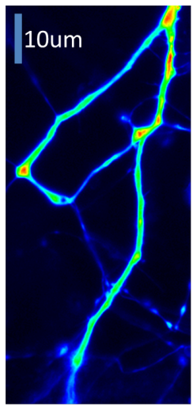|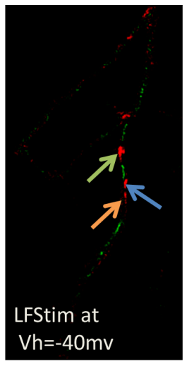|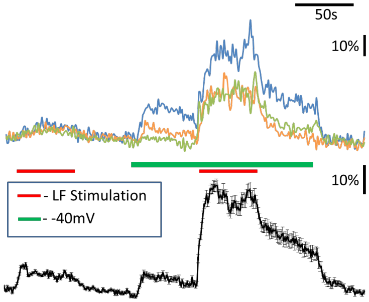

*Dovgan et al. unpub.*

В представленной экспериментальной модели LTD в культуре нейронов HPCA выступает не только как объект исследования, но и как удобный зонд, отображающий различия в количестве входящих ионов кальция в окрестностях отдельных синапсов в ответ на одинаковый паттерн внеклеточной стимуляции.

### Questions
- Связан ли паттерн транслокации HPCA в окрестностях отдельного синапса с паттерном снижения количества AMPAR в постсинапческой мембране?
- Транслокация HPCA в процессе индукции LTD связана с усилением эндоцитоза AMPAR?
- Как меняется трафик AMPAR после окончание протокола индукции LTD, в процессе постепенного ухода HPCA c мембраны?
- Имеет ли место непосредственное взаимодействие HPCA и AP2β2 в процессе индукции LTD?
- Потенциальное взаимодействие HPCA и AP2β2 происходит в цитоплазме или в мембране пересинаптических регионов богатых PIP2; выступает ли HPCA "челночным" транспортером AP2β2 к регионам клатрин-опосредованного эндоцитоза?
- Имеет ли место связывание кальций-свободной формы HPCA с PSD95 и снижается ли количество PSD95-связанной формы HPCA в ответ на вход кальция через NMDAR?
- Имеет ли место непосредственное буферизация клатрина HPCA и его кальций-зависимое высвобождение?
- Влияют ли мутации в мембран-связывающем регионе HPCA на трафик AMPAR  в процессе индукции LTD?
- Замедленная кинетика ухода HPCA с мембраны после протокола индукции LTD связана с его ассоциацией с мембранными мишенями или является артефактом FDP протокола индукции LTD (удержание мембранного потенциала на уровне -40 mV приводит к частичной активации L-каналов и входу кальция)?

## Hippocalcin behavior in FDP-type LTD and STDP-type LTD
Биофизические свойства HPCA позволяют кальциевому сенсору накапливаться в незначительных по площади областях в окрестности источников входа ионов кальция, что позволяет ему активно реагировать на самые кратковременные и локальные сигналы исключительно поблизости активных синапсов и интегрировать их (*Dovgan et al., doi:10.1111/j.1460-9568.2010.07303.x*).

**FDP-type LTD-induced local HPCA translocation**

*Dovgan et al. unpub.*

Ранее использованный протокол индукции LTD опирается на феномен частотно-зависимой пластичности (frequency-depend plasticity) - низкочастотную продолжительную стимуляцию (low frequency stimulation/LFS) пресинаптических входов (1 Hz 5-15') (*Stanton,  DOI: 10.1002/(SICI)1098-1063(1996)6:1<35::AID-HIPO7>3.0.CO;2-6*). В таком случае основным источником входа ионов кальция выступают NMDAR. Незначительный вклад могут вносить AMPAR не содержащие GluA2-субъединицу, которые чрезвычайно малочислены в зрелых пирамидных нейронах области CA1 гиппокампа (*Burnashev et al., DOI:10.1016/0896-6273(92)90120-3*, *Isaac et al., DOI:10.1016/j.neuron.2007.06.001*).

Продолжительность одного кальциевого спайка вызванного внеклеточной стимуляцией составляет 80-100 ms и моделирование демонстрирует, что при низкочастной стимуляции уровень кальция успевает снижаться до исходных значений (*Markram et al., DOI:10.1023/A:1008891229546*, *Melanie et al., doi:10.1371/journal.pone.0043810*). Однако экспериментальные данные показывают, что в течении всего FDP протокола индукции LTD концентрация ионов кальция в дендритных шипиках поднимается равномерно не спадая до окончания стимуляции (*Dovgan, unpub.*).

**Postsynaptic calcium dynamics evoked FDP protocol (simulation)**
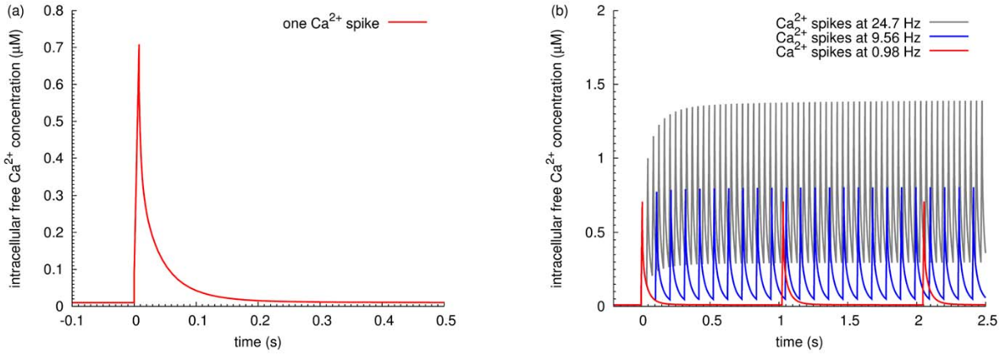
*Melanie et al. 2012*

**Experimental postsynaptic calcium dynamics evoked LDT protocol, 1 Hz 300'**

*Dovgan et al. unpub.*

В основе пластичности, зависящей от интервала между спайками (Spike-timing dependent plasticity/STDP) лежат парная стимуляция пре- и постсинапса с незначительной временной задержкой (50-100 пар импульсов с частотой 100 Hz и задержкой +/- 100 ms). Показано, что стимуляция сперва пресинаптических окончаний с последующей стимуляцией постсинаптической (pre-post)клетки приводит к развитию LTP и одновременно предварительная стимуляция постсинаптическая стимуляция с последующей пресинаптической (post-pre) приводит к развитию LTD (*Bi, 1998, doi.org/10.1523/JNEUROSCI.18-24-10464.1998*). Амплитуда постсинаптической пластичности непосредственно зависит от временной задержки, так максимальная индукция LTP и максимальная амплитуда EPSP наблюдалась в результате pre-post стимуляции со сдвигом +10 ms, а индукция LTD c минимальные значения EPSP наблюдалась в результате post-pre стимуляции со сдвигом -50 ms (*Nevian, 2006, DOI:10.1523/JNEUROSCI.1749-06.2006*). Результаты моделирования демонстрирую прямую зависимость амплитуды постсинаптического кальциевого спайка от взаимного временной ориентации пре- и постсинаптических стимулов (*Graupner, 2007, DOI:10.1371/journal.pcbi.0030221*) что обусловлено ассоциативным вкладом двух источников кальция, синаптическим входом через NMDAR в результате пресинаптической активности и входом через потенциал-зависимые кальциевые каналы в результате пресинаптической активности.

**Postsynaptic calcium dynamics evoked STDP protocol (simulation)**

*Graupner et al. 2007*

**Somaticvoltage recordings (toptraces) and the corresponding Ca2+ transients(bottomtraces)**
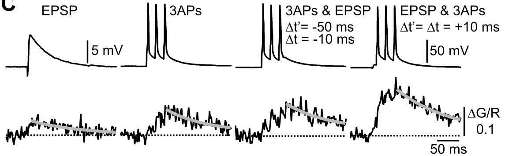
*Nevian, 2006*

В отличии от NMDAR и AMPAR потенциал-зависимые кальциевые каналы находятся не только в окрестностях синапсов и вход кальция в процессе STDP-протокола может быть более равномерным нежели в случае FDP-протокола. Для HPCA обнаружено, что предварительная стимуляция пресинаптических терминалей за которой следует серия из нескольких потенциалов действия (back-propagation action potentials/AP) в постсинаптической клетке приводит к диффузной транслокацией во многих регионах дендритного дерева (*Dovgan, unpub.*).

**Associativity of HPCA translocation in dendritic shaft**
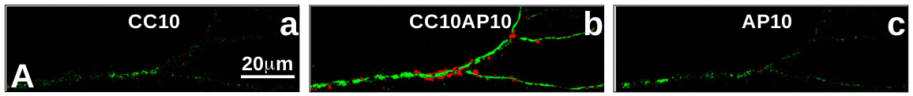
*Dovgan et al. unpub.*

Как следствие, транслокацию HPCA не только в областях активных синапсов и снижать максимальную амплитуду транслокаций. Роль гипокальцина в развитии NMDAR-зависимой LTD при таком протоколе индукции пока неизвестна. И потенциально за столь различными паттернами входа ионов кальция могут скрываться два разных механизма индукции LTD.

### Questions
- Связан ли пространственный паттерн транслокации (площадь, расположение относительно дендритных шипиков) HPCA с временным лагом STDP-протокола?
- Какой вклад различных типов потенциал-зависимых кальциевых каналов на паттерн транслокации в процессе STDP-протокола?
- Будут ли совпадать области транслокации после непродолжительной LFS и полноценного STDP-протокола, консервативны ли регионы встраивания HPCA в окрестностях активных синапсов при различных способах индукции LTD?
- Можно ли провести продолжительную регистрацию с тем, чтобы пронаблюдать один и тот же регион клетки и в процессе FDP-индуцированного, и в STDP-индуцированного LTD?
- + вопросы касательно трафика AMPAR

## Unspecific influence of HPCA biophysical properties to presynaptic plasticity
До сих пор нет консенсуса относительно регуляции, которая определяет какой тип пластичности разовьется в ответ на тот или иной паттерн входа ионов кальция, LTP или LTD. Для классических механизмов индукции долговременной пластичности возбудительных глутаматергических нейронов ключевой является конкуренция между фосфорилированием, которое обусловлено активностью кальций-кальмодулин зависимой киназы II (CaMKII) и дефосфорилированием, обусловленным активностью кальций-кальмодулин зависимой фосфатазы кальцинейрина (CaN) и протеин фосфатазы 1 (PP1) а также ингибитор PPI. Именно на конкуренции этих противоборствующих кальций-зависимых процессов основывается большая гипотез о функционировании "переключателя" между LTP, в которой большую роль играют киназы, и LTD, где в игру вступают фосфатазы (*Lusher, 2012, DOI: 10.1109/MTS.2009.931859*).

Результаты моделирования демонстрируют, что активность ферментов непосредственно взаимосвязана с паттерном входа ионов кальция, как для FDP, так и STDP протоколов индукции долговременной пластичности: паттерн активности приводящий к развитию LTP связан с ростом фосфорилирования CaMKII и незначительной фосфотазной активностью, а паттерн приводящий к развитию LTD сопровождается большей активацией PP1 и CaN (*Graupner, 2007*, *Li, 2012*).

**Effects of a train of calcium inputs on activation of calcineurin, CaMKII and PP1.
100x at 0.98 Hz (a), 100x at 52.8 Hz (b)**
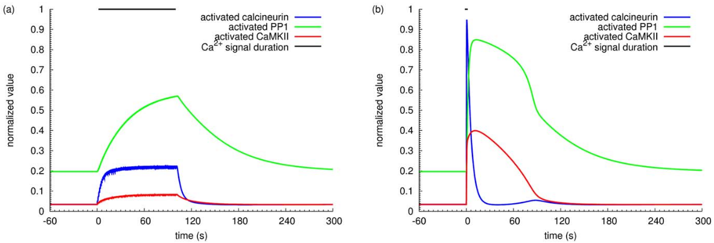
*Li et al., 2012*

**Dynamics during STDP stimulation protocols**
Phosphorylated CaMKII | PP1 activity
:-:|:-:
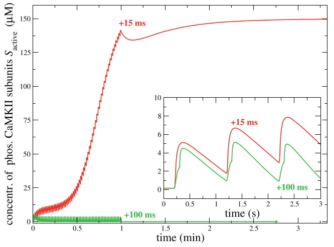|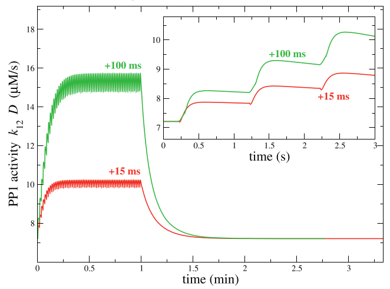

*Graupner and Brunel, 2007*

Активация CaMKII включает автофосфорилирование и кальций-зависимость этого процесса имеет область нестабильности в пределах цитоплазматических концентраций ионов кальция ([Ca2+]i) от 0.094 uM, что ниже концентрации в состоянии покоя, до 0.67 uM (*Zhabotinsky, 2000*). Это обуславливает значительное влияние даже незначительных колебаний [Ca2+]i на итоговый исход, полное дефосфорилирование и дезактивацию киназы или же резкое усиление автофосфорилирования и лавинообразное увеличение активности фермента. *Graupner and Brunel* дополнили модель введя в нее параметры активности PP1 и ингибитора этого фермента, активности которых также кальций зависимы и продемонстрировали, что итоговая зависимость количества автофосфорилированной формы CaMKII от [Ca2+]i более сложным характером. В окне низких значений [Ca2+]i, от значений ниже концентрации покоя и до ~ 220 nM находиться область нестабильности, где ни один из процессов не превалирует. Затем в окне [Ca2+]i  ~ 220-350 nM превалирует активность PP1, что обуславливает снижение уровня фосфорилирования CaMKII и открытия "окна" LTD. В областях [Ca2+]i > 350 nM резко возрастает активность ингибитора PP1 и количество кальций-связанной формы кальмодулина что повышает темпы автофосфорилирования CaMKII и открывает "окно" LTP (*Graupner, 2007*, *Graupner, 2010*).

Столь тонкая биофизическая регуляция делает систему кальциевой регуляции чувствительной к изменению свойств ее компонентов. HPCA является одним из ведущих кальциевых буферов в нейронах области CA1 гиппокампа, где его концентрация может достигать 36 uM (*Furuta, 1999, DOI:10.1023/A:1021000425070*) в связи с чем даже незначительные изменения его биофизических свойств может иметь значительное влияние на всю кальциевую регуляцию в данном типе клеток.

**Steady-states of the phosphorylated CaMKII subunit concentration
and the autophosphorylation–dephosphorylation balance as functions of calcium**
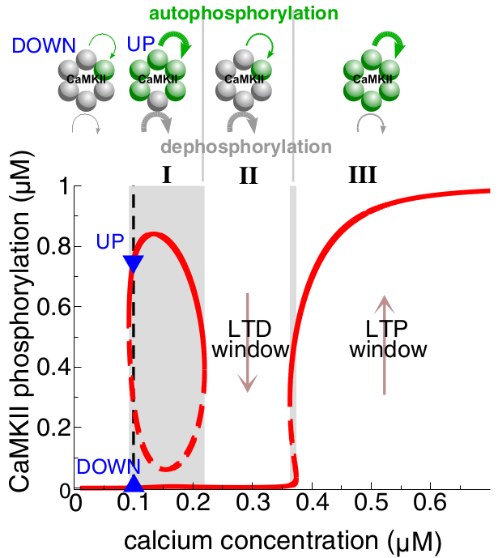
*Graupner and Brunel, 2010*

Мутация в позиции N75K находиться в сайте связывания иона кальция и показано, что она одновременно снижает буферную емкость HPCA, снижается его аффиность к ионам кальция при малых [Ca2+]i и  повышается при высоких значениях [Ca2+]i (*Osypenko et al., doi.org/10.1016/j.nbd.2019.104529*). Поскольку HPCA является ведущим кальциевым буфером в нейронах гиппокампа  даже незначительное изменение его биофизических свойств может значительно повлиять на всю внутреннюю кальциевую регуляцию, в том числе на CaMKII-зависимый механизм индукции LTP.

**Dynamics during STDP stimulation protocols**
Phosphorylated CaMKII | PP1 activity
:-:|:-:
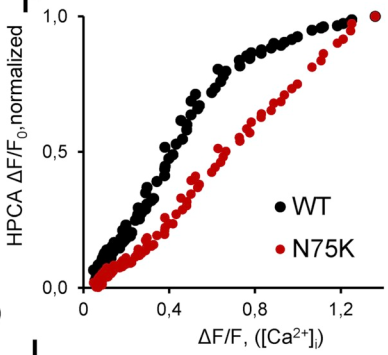|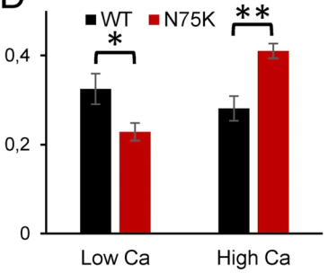

*Osypenko et al., 2019*

Одновременно зарегистрированно, что мутант N75K имел меньшую площадь транслокации в процессе FDP-протокола индукции LTD (*Dovgan, unpub.*).

**Loss of function of N75K mutant during LTD induction protocol**
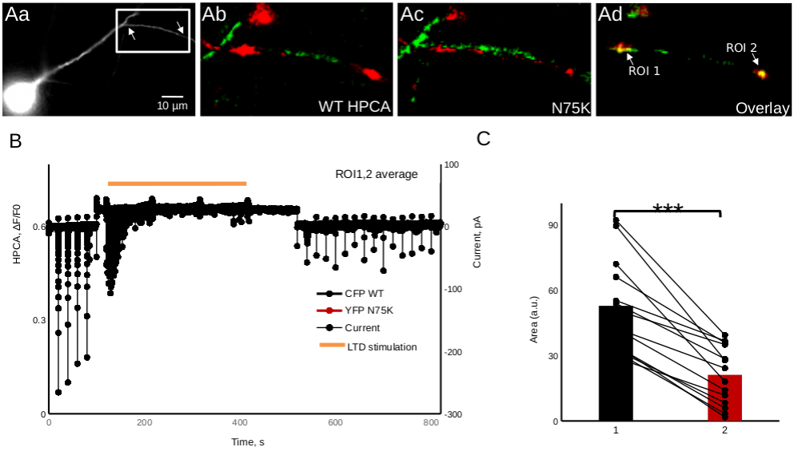
*Dovgan et al. unpub.*

### Questions
- Оказывает ли наличие мутанта N75K влияние на максимальную амплитуду EPSP и площадь транслокаций при LTP после FDP/STDP протокола индукции?
- Оказывает ли наличие мутанта N75K влияние на максимальную амплитуду EPSP при LTD после FDP/STDP протокола индукции?
- Меняется ли кальций-зависимость процесса автофосфорелирования CaMKII в присутствии N75K (моделирование)?

## Presynapse characteristics influence to HPCA translocation pattern and amplitude
Интересно, что встраивание HPCA в ответ на протокол индукции LTD происходило не во всех наблюдаемых в процессе эксперимента синапсах. Более того, наблюдается кластеризация значений максимальных амплитуд встраивания на группы которые отвечали на высокочастотную стимуляцию (HFSs/high frequency stimulation - sensitive) и протокол индукции LTD (LTDs/long term depression protocol stimulation - sensitive).

Опираясь на наблюдаемую кластеризацию максимальных амплитуд встраивания HPCA в синапсах можно выдвинуть предположения о минимальных условиях, необходимых для разделение на кластеры которые были бы связаны с пресинаптическими характеристиками: пулом готовых к высвобождению везикул (readily releasable pool, $RRP$) и вероятностью высвобождения везикул (release propability, $RP$).

**Two groups of insertions region depending on their answer to the stimulation pattern**
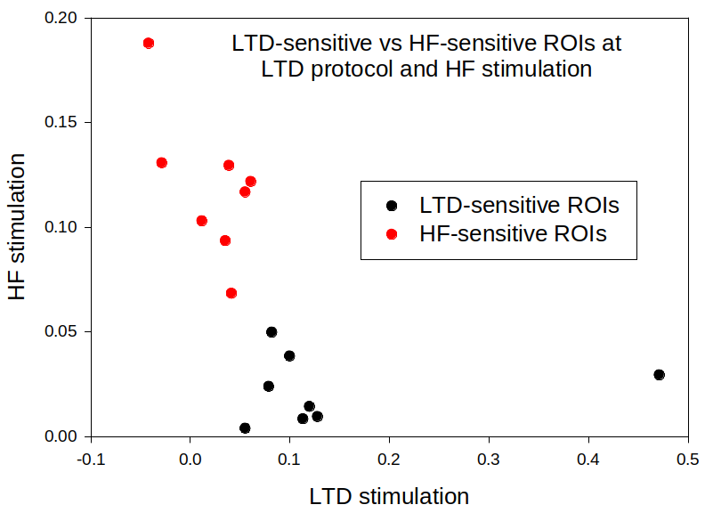
*Dovgan et al. unpub.*

Можно предположить, что HFSs способны эффективно отвечать на стимуляцию высвобождением медиатора, но быстро истощающих свои запасы. В то же время LTDs до протокола индукции LTD обладал незначительной силой однако способны высвобождать медиатор в течении всего протокола. Исходя из этого условия разделения на группы:

$RRP_{HFSs} \ll RRP_{LTDs}$
$RP_{HFSs} > RP_{LTDs}$