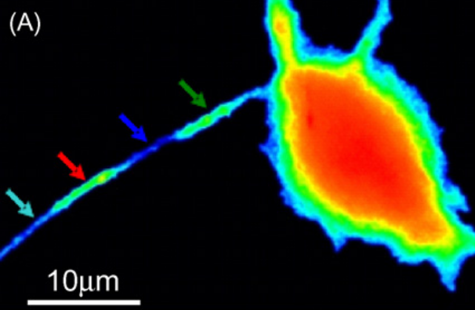

Inhomogeneity in HPCA insertions pattern  and translocation amplitudes in compact cells: morphological properties vs PIP2 distribution
======================================================================================================================================
*Borys Olifirov, 21.06.2021*

Повышение кальция в дендритах нейронов приводит к кальций-зависимой транлокации HPCA, однако паттерн транлокации неравномерный вдоль дендрита (*Markova et al., 2008, doi:10.1016/j.neulet.2008.06.089*).  Места предпочтительных мест транлокаций устойчивы во времени (*Dovgan, unpublished*). Как *in vitro*, так и *in vivo* показано, что HPCA обладает высоким сродством с минорным фосфолипидным компонентом цитоплазматической мембраны - фосфатидилинозитол 4,5-дифосфатом (PIP2), результаты измерений на липидных везикулах показали Kd \~ 50 nM (*O'Callaghan et al., 2005, doi:10.1042/BJ20051001*).

**HPCA Ca2+-dependent translocations pattern in dendrite**

*Markova et al., 2008*

В состоянии покоя лишь незначительная доля HPCA встроена в мембрану, 0-8% (*Sheremet et al., 2020, DOI 10.1007/s11062-020-09845-6*; *Cherkas, unpublished*), а при повышении концентрации кальция в отдельных регионах мембраны концентрация белка может повышаться на 50-100% (*Olifirov, unpublished*; *Dovgan, unpublished*).
Эти наблюдения позволяют выдвинуть гипотезу, что встраивание такого огромного количества кальциевого сенсора в небольшие по площади регионы мембраны может приводь к изменения ее биофизических свойств, в том числе и буферизировать PIP2. Стоит подчеркнуть, потенциальные мишени подобного воздействия HPCA также демонстрируют высокое сродство к PIP2 или же их активность непосредственно им модулируется (*Hansen, 2015, dx.doi.org/10.1016/j.bbalip.2015.01.011*; *Rodríguez-Menchaca et al., 2012, doi: 10.3389/fphar.2012.00170*; *Dickson et al., 2014, doi/10.1073/pnas.1407133111*).

Однако до сих пор не существует прямых наблюдений связи неравномерностей встраивания HPCA с распределением PIP2 в плазматической мембране а также то, насколько сильно изменение PIP2 может влиять на амплитуды встраивания HPCA в плазматическую мембрану, что критически важно для понимая механизмов взаимодействия HPCA с потенциальными мишенями. Необходимо ли для влияния на них прямое взаимодействие с HPCA или же неспецифическое влияние нейронного кальциевого сенсора на локальное мембранное окружение каналов способно изменять их поведение.

## Main points
- **Связан ли паттерн встраивания с морфологическими особенностями?**
Если в модельном объекте HEK 293 в котором отсутствуют предполагаемые эндогенные мишени HPCA паттерн транслокации равномерный по всей площади мембраны и уменьшение количества PIP2 не приводит к изменению амплитуды транслокации и ее паттерна, значит наблюдаемая в нейронах картина встраивания обусловлена не гетерогенностью липидного состава внутренней поверхности плазматической мембраны. Открытым вопросом остается роль в формировании наблюдаемой картины встраивания взаимодействия HPCA с мишенями в составе мембраны: различными компонентами каналов в случае sAHP, AP2 в случае LTD (для AP2 показана аффинность по отношению к PIP2).
- **Неравномерности паттерна встраивания обусловлена сродством с PIP2 локализованном в компактных рафтах**
Неизвестно локализован ли пул PIP2 в HEK 293 в составе рафтов или же равномерно распределен в плазматической мембране (что возможно установить совместным измерением PH-domain + FP-Mem), однако если удаление PIP2 из мембраны в результате которого будет наблюдаться снижению амплитуды транслокации HPCA будет прямым доказательством роли PIP2 в процессе кальций-зависимого встраивания HPCA в плазматическую мембрану. В таком случае HPCA может играть двоякую роль в регуляторных процессах: потенциальные мишени заведомо локализованы в областях плазматической мембраны с высоким содержанием PIP2 и таем образом локальный состав мембраны обеспечивает колокализацию мишени и мембранной формы HPCA; кальциевый сенсор выступает промежуточным звеном обеспечивающим кальций-зависимую доставку цитоплазматических мишеней в области плазматической мембраны с высоким содержанием PIP2.

## Research plan
- **EYFP-Mem + HPCA-TagRFP**
  Характер распределения сайтов встраивания HPCA
- **EYFP-Mem + PH-CFP**
  Характер распределения PIP2
- **DrVSP-EYFP + PH-CFP**
  Кинетика утилизация мембранного PIP2 за счет активности DRVSP
- **DrVSP-EYFP + PH-CFP + HPCA-TagRFP**
  Влияние утилизация мембранного PIP2 на амплитуды транслокаций HPCA