HPCA-YFP translocation during short 90' FDP LTD protocol
========================================================
*21.10.2021-24.10.2021*

Отладка регистрации транслокаций HPCA-YFP в процессе короткого протокола низкочастотной стимуляции.

## Protocols
### Electric
- **Trigger and baseline registration**
  -80 mV 5 s 
- **EPSC registration**
  -80 mv 2 s x15 sweeps, 1 ms pair pulse with lag 50 ms
- **Holding up**
  -80 mV 2 s | -40 mV 3s
- **Low frequency stimulation**
  -40 mV 1 s x90 sweeps, 1 ms pulse 
- **Holding down**
  -40 mV 3 s | -80 mV 2'
- **EPSC registration**
  -80 mv 2 s x15 sweeps, 1 ms pair pulse with lag 50 ms

### Optic
505 nm | 60 ms | 1 Hz | 135 f

*NB: из-за ошибки в протоколе регистрация оборвалась на этапе завершения стимуляции.*

## Results
*Cell 1 от 23.10.2021*

Область стимуляции происходила у основания левого разветвленного дендрита, однако часть основания дерева оказалась не в фокусе что не дало получить изображения отдельных шипиков.

Дифференциальное изображения получено путем вычитания из усредненных последних 10 f (max) усредненных перых 5 f (baseline). 

**Stimulation pipette position (left)**
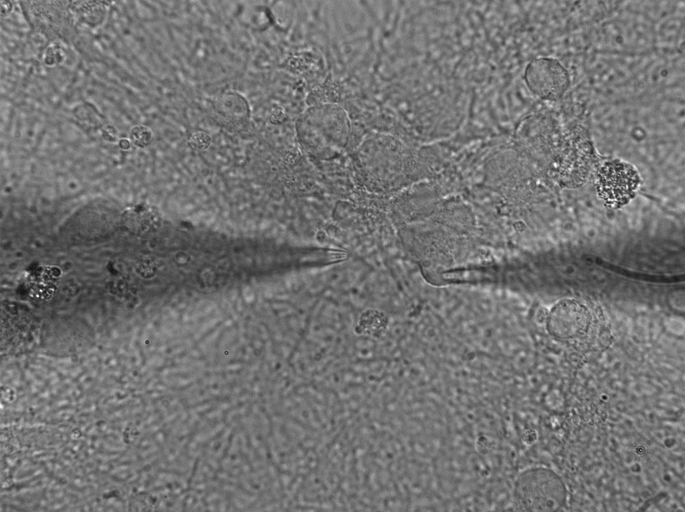

**ROI groups**
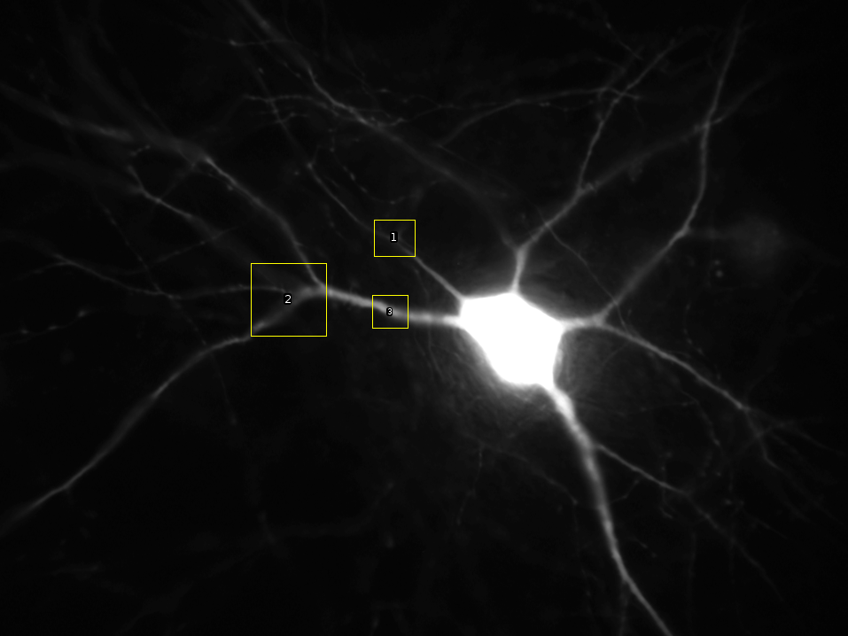

### ROI group 1
**ROI position**
Raw img|Differential img
:-:|:-:
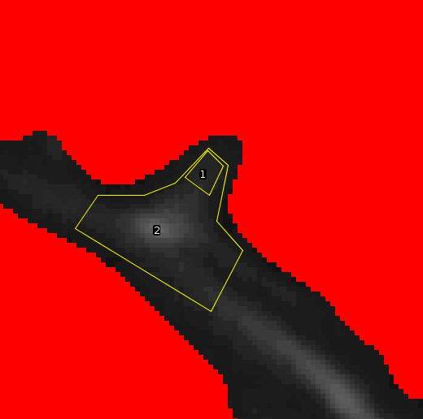|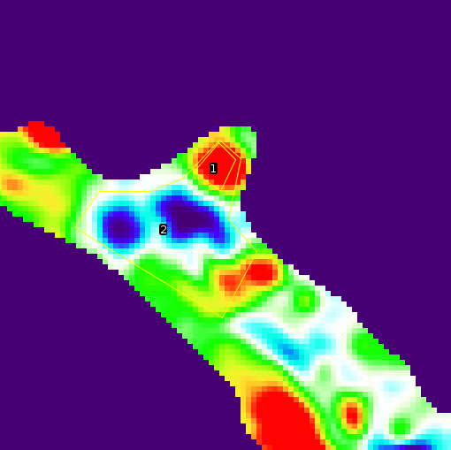

**Average intensity**
ROI 1|ROI 2
:-:|:-:
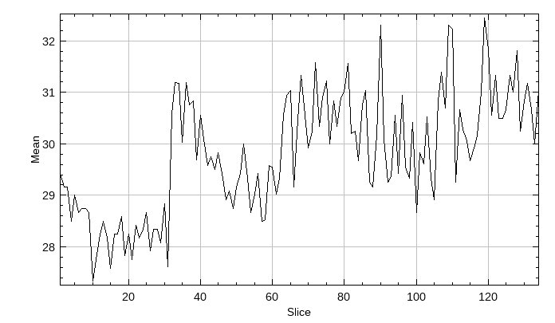|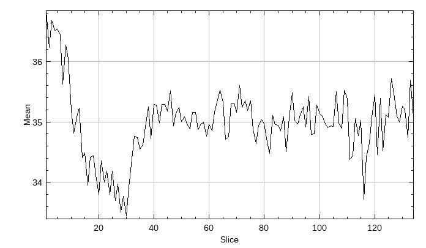

ROI 1 судя по всему расположен в области дедритного шипика, однако повышения интенсивности началось сразу при переходе на -40 mV, судя по всему обусловлено входом через L-VGCC.

### ROI group 2
**ROI position**
Raw img|Differential img
:-:|:-:
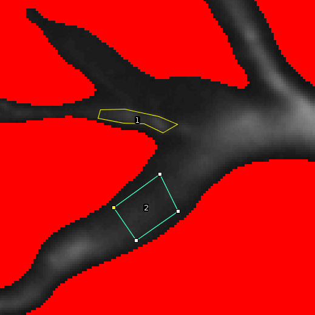|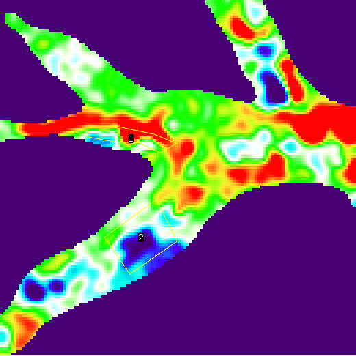

**Average intensity**
ROI 1|ROI 2
:-:|:-:
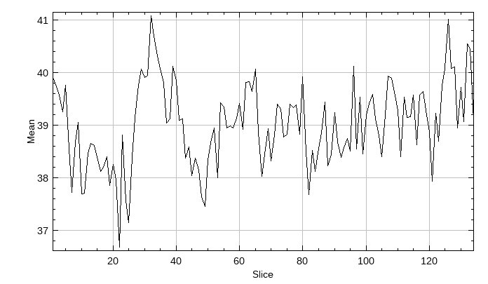|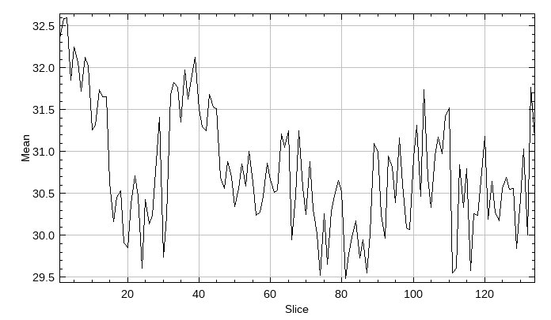

Кажущееся падения в ROI 2 не отражало то, что в нем наблюдалось повышение при переходе на -40 mV (**NB: необходимо поменять метод построения дифференциального изображения!**).

Инересно что в обоих ROI повышения после смены напряжения было временным и в последствии снизилось даже ниже исходных значений.

### ROI group 3
**ROI position**
Raw img|Differential img
:-:|:-:
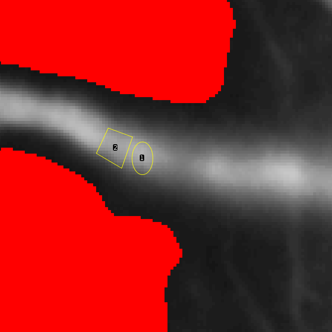|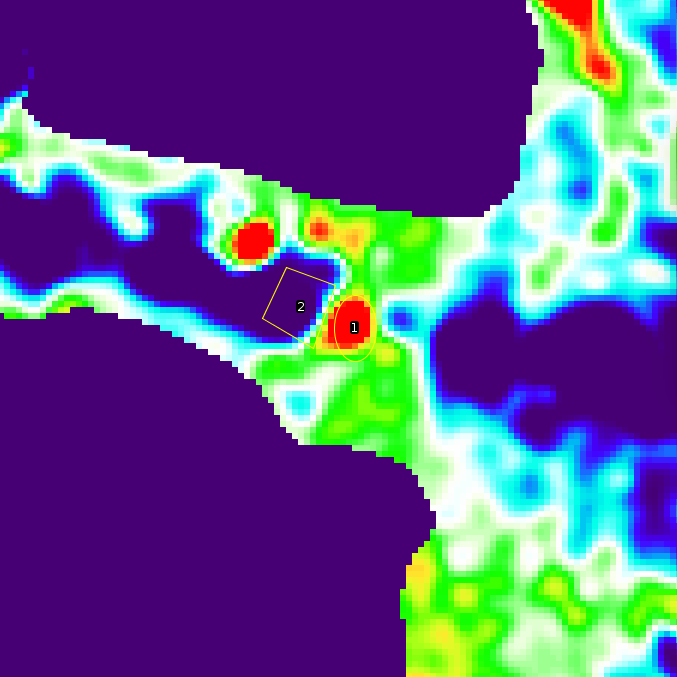

**Average intensity**
ROI 1|ROI 2
:-:|:-:
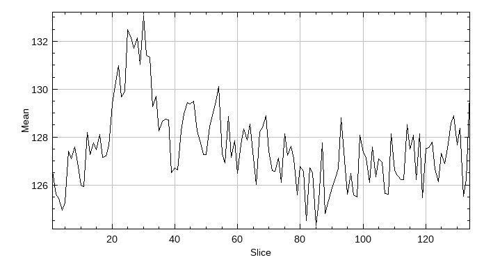|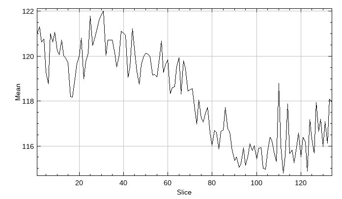

## Points
- Какова причина драматичного снижения интенсивности до начала стимуляции?
- Увеличить количество кадров регистрации до 165 f
- Точнее выставлять стимулирующую пипетку относительно центра кадра
- Делать контрольный снимок с проходящим светом + флуоресценция 
- Добавить Alexa Fluor (100 uM) во внутренний раствор для компенцсации смещения клетки при анализе и передвижению по дендриту без выжигания HPCA-YFP
- Построить кривую заполняемости клетки Alexa Fluor
- Ввести в каждый свип регистрации ступеньку 5 mV
- Контрольная клетка без стимуляции, оценить run down EPSC
- Продлить удержание на -40 mV после стимуляции
- Сегментирования шипика с помощью SK image active_contour
- Стимуляция 300 s