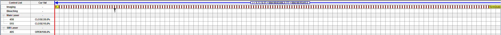
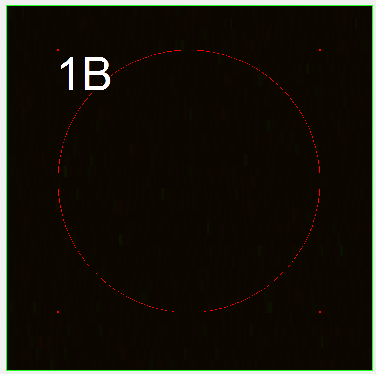
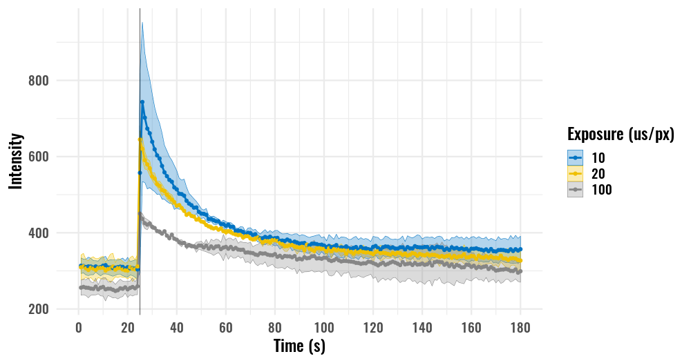
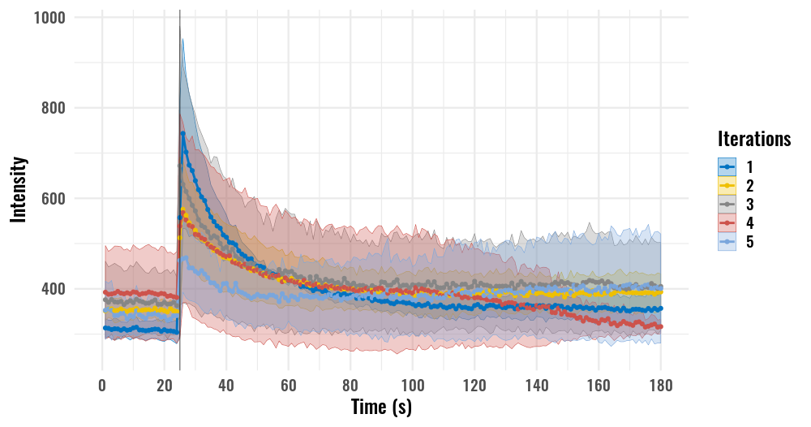
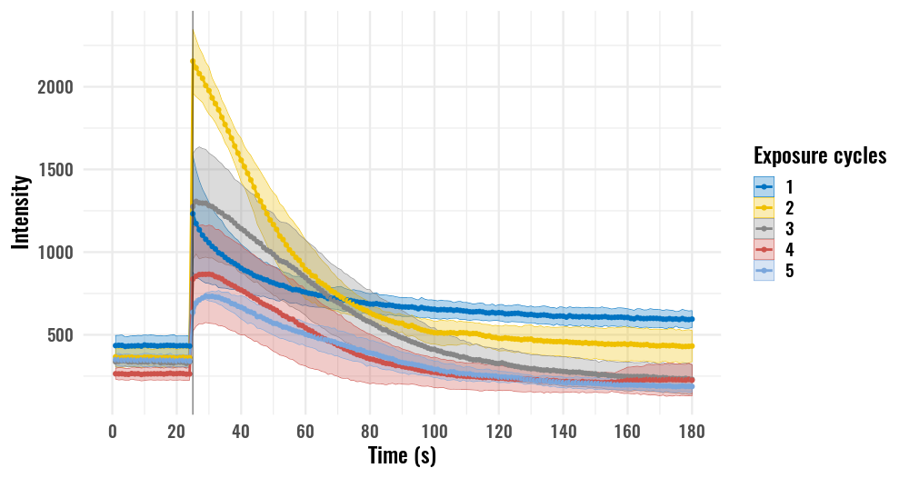

Test uncaging (old HEK)
================
*24.07.2020 - 26.07.2020*

Оценка продолжительности кальциевого транзиента в HEK и подбор оптимальное экспозиции и количества циклов 405 nm.
Клетки одновременно загружены AM NP-EGTA и AM Fluo-4.

## Experiment design
### Time Controller protocol
**Протокол регистрации**

Протокол сканирования состоит из 180 фреймов с интервалом 1 s, экспозиция 405 nm непосредственно перед 25 фремом  (время регистрации 179.8 s). Цикл повторен 5 раз для оценки скорости истощения NP-EGTA. Размер области сканирования выбран максимально возможный (D = 100 px), допустимые значения экспозиции в режиме Tornado 10, 20 и 100 us/px (*регистрации 24.07.2020*). Отдельно проведена серия с различным количеством циклов стимуляции при экспозиции 100 us/px, количество циклов 1-5 (*регистрации 25.07.2020*).

**Зона сканирования в режиме Tornado**
**относительно размера кадра**

**Продолжительность сканирования для различных экспозиций**
|Exposure (us/px)|Scaning time (s)|
|-|-|
|10|0.527|
|20|0.523|
|100|0.506|

### Microscope setup
**Excitation and registration**
488 nm: 2%
CHS1 HV: 700 V
CHS1 pass band: 505-540 nm

**Optical system**
C.A.: 250 um
Exposure: 2 us/px
Image size: 128x128 px
Zoom: 6
Size: 0.276 um/px

Step size: 1.35 um
Slices: 1
Scaning speed: L 1.360 ms, F 0.188 s

**Uncaging**
Laser power (405 nm): 100%
Region size: tornado mode
Slices: 1
Cycles: 1-5

Exposure: 10, 20, 100 us/px
Exposure time: 0.527, 0.523, 0.506 s

## Results
Для каждой комбинации параметров отснято 2-3 клетки, область вокруг графика представляет +/- sd.
### Different exposure

### Photo-bleaching
**Five consecutive stimulations with exposure 10 us/px**

### Different number of stimulation cycles

**1-5 stimulation cycles with exposure 100 us/px**
