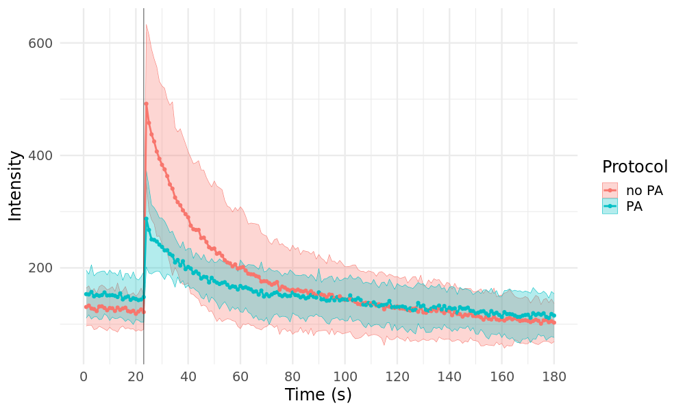

Test uncaging (new HEK)
================
*16.09.2020-18.09.2020*

Оценка продолжительности кальциевого транзиента в туц HEK и тест протокола загрузки с pluronic acid.
Клетки одновременно загружены AM NP-EGTA и AM Fluo-4.

Регистрации произведены 16.09.2020, исходные изображения и протокол TC  в дирректории 16_09_2020 на NextCloud.

## Experiment design
Протоколы загрузки *hek_np_egta_pa.md* и *hek_fluo_4.md* объединены для совместной загрузки.

## Time Controller protocol
Серия из 120 фреймов с возбуждением 488 nm (полное время регистрации 120 s), экспозиция 405 nm происходит в одной фокальной плоскости сразу после 23 фрейма.

Файл протокола от тестового анкейджинга, новый сохранен в директории 16_09_2020 (*hpca_uncaging_16_09.otp*).

## Microscope setup
#### Fluorescent agents:
|Name|Ex.|Em.|Count|
|-|-|-|-|
|Fluo-4|488 nm|516 nm|2 uM|
|NP-EGTA|405 nm|-|5 uM|

#### Initial parameters
**Optical system**
C.A.: 250 um
Exposure: 2 us/px
Image size: 128x128 px
Zoom: 6
Size: 0.276 um/px

Step size: 1.35 um
Slices: 3
Scaning speed: L 1.360 ms, F 0.188 s, S 1.157 s

**Uncaging**
Laser power (405 nm): 100%
Scaning mode: Tornado
Scaning area diameter: 100 px
Exposure: 10 us/px
Cycles: 1

## Imaging
#### Excitation and registration (no PA)**
488 nm: 15%
CHS1 HV: 740 V
CHS1 pass band: 505-540 nm
TD1 HV: 250 V

- **Cell 3**
- **Cell 4**
- **Cell 5**

#### Excitation and registration (with PA)
488 nm: 15%
CHS1 HV: 740 V
CHS1 pass band: 505-540 nm
TD1 HV: 238 V

- **Cell 6**
- **Cell 7**
- **Cell 8**
- **Cell 9**
- **Cell 10**

## Results
**Кривые измеения интенсивности флуорисценции Fluo-4**

**No PA** - cell 4, cell 5;
**PA** - cell 7, cell 9, cell 10.