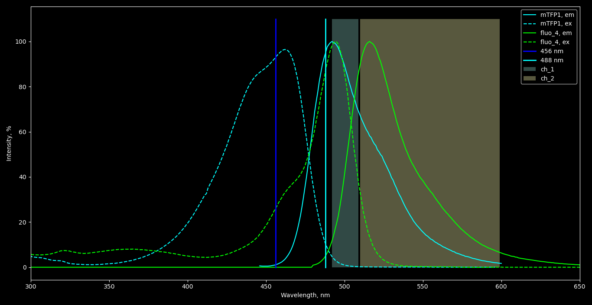

HPCA-TFP transfection and Fluo-4 loading 
========================================
*2.10.2020-???*

## Experiment design
Паралельная загрузка клеток HEK 293 трансфецированных HPCA-TFP AM-формами NP-EGTA и NP-EGTA+Fluo-4.

Для того, чтобы получить хорошее соотношение сигнал/шум возбуждение будет производиться на двух длинах волн (456 nm, 488 nm). На клетках без кальциевого крастеля можно оценить необходимую мощность лазера 456 nm, HV для первого канала и кроссток во второй канал.

Одновременно на нетрансфецированных клетках загруженных Fluo-4 можно оценить мощность 488 nm (возбуждение HPCA-TFP всего 10%) и кроссток в канал HPCA. И прикинуть экспозицию 405 nm для того, чтоб получить хороший максимальный сигнал

Итоговое соотношение пикового сигнала Fluo-4 к сигналу HPCA-TFP должно быть в пределах 1/1 - 1/5.

Возможно отснять нетрансфицированную улетку чтобы узнать уровень автофлуорисценции.

#### Excitation parameters
|Fluo|Laser|Ex|
|-|-|-|
|mTFP1|456 nm|92%|
|mTFP1|488 nm|10%|
|Fluo-4|456 nm|25%|
|Flyo-4|488 nm|87%|

#### Channels parameters

**Initial chennel setup**

Laser setup:
|W|power|
|-|-|
|456 nm|5%|
|488 nm|10 %|

Channels setup:
|Ch.|HV (V)|Pass band|Obj.|
|-|-|-|-|
|**CHS1**|600|492-510 nm|HPCA-mTFP1|
|**CHS2**|600|510-600 nm|Fluo-4|

**Native at initial**
**HPCA-TFP at initial**
**Fluo-4 at initial**
**HPCA-TFP + Fluo-4 at initial**

