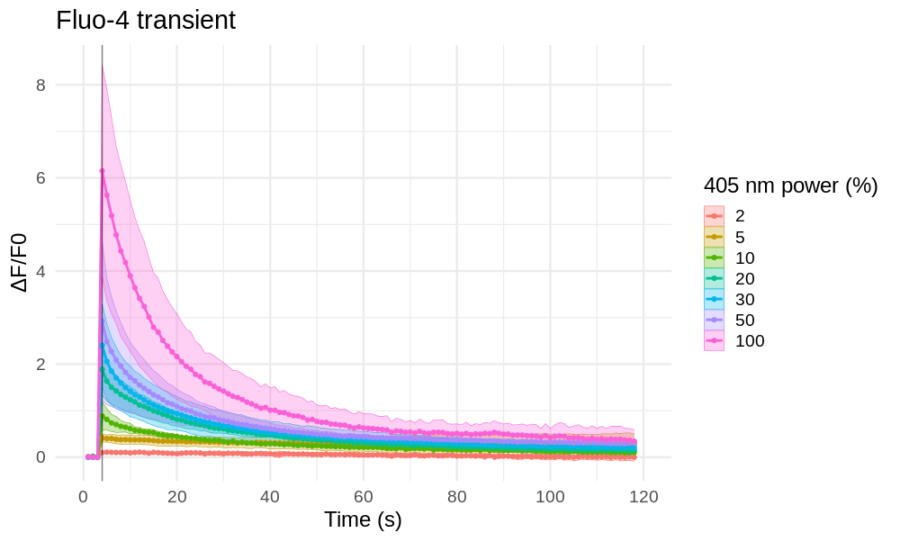
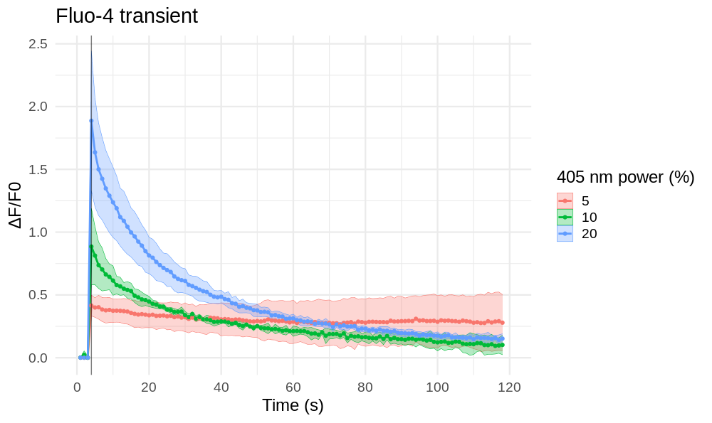
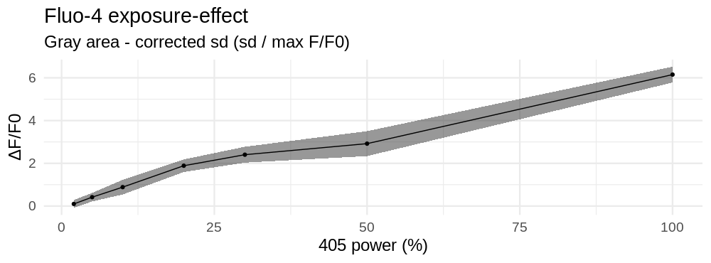

Test uncaging with Fura Red and Fluo-4
================
*30.10.2020 - 3.11.2020*

Подбор экпозиции 405 nm при площади стимуляции 48 ms (Tornado) при которой ΔF/F0 \~1-1.2 (для Fura Red).
На загруженных NP-EGTA + Fluo-4 проверка ΔF/F0 при выбранных на Fura Red экспозициях.

## Experiment design
### Time Controller protocol
Регистрация Fura Red: 10 фреймов с интервалом 1 s, стимуляция сразу после второго фрейма.
Регистрация Fluo-4: 120 фреймов с интервалом 1 s, стимуляция сразу после пятого фрейма.

### Fluorescent agents:
|Name|Ex.|Em.|Count|
|-|-|-|-|
|Fluo-4|488 nm|515 nm|3 uM|
|Fura Red bound|456 nm| ???    |5 uM|
|NP-EGTA|405 nm|-|5 uM|

### Initial parameters
**Optical system**
C.A.: 250 um
Exposure: 2 us/px
Image size: 128x128 px
Zoom: 6
Size: 0.276 um/px

Step size: 1.35 um
Slices: -
Scaning speed: L 1.360 ms, F 0.188 s

**Uncaging**
Laser power (405 nm): 0-100%
Scaning mode: Tornado
Scaning area diameter: 48 ms
Exposure: 10 us/px
Stimulation time: 100-300 ms
Cycles: 1-3

## Results
### Fluo-4 transient
После стимуляций продолжительностью 300 ms и 200 ms мы остановились на минимально возможной продолжительности - 100 ms и варьировали только мощность лазера 405 nm.

**Transients**

Оптимальной оказалась мощность в диапазоне 10-15% (но только по данным Fluo-4).

**Selected transients**

### Fluo-4 exposure-effect curve

Не смотря на то, что мощность варьировалась в широких пределах нет выхода на насыщение даже на 100%, что свидетельствует о том, что мы не производим фотолиз всего NP-EGTA. Одновременно на транзиентах во всем диапазоне мощностей не наблюдается выхода на насыщение Fluo-4, значит ли это что не смотря на ΔF/F0 > 5 мы не вышли за допустимый диапазон концентраций Ca2+ для этого красителя?

Время стимуляции (100 ms) значительно и соизмеримо с оценками времени установления диффузионного равновесия во всей клетке (300-500 ms). За время стимуляции мы повышаем концентрацию Ca2+ не в небольшом объеме, а по сути почти во всей цитоплазме. 

Возможно стоит уменьшить количество загружаемого NP-EGTA, это может ускорить кальциевые тразиент за счет снижения буферной емкости цитоплазмы, а повторные стимуляции нам не очень-то и нужны.