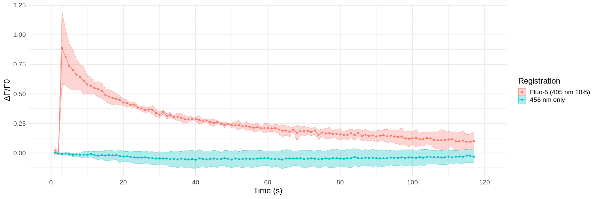
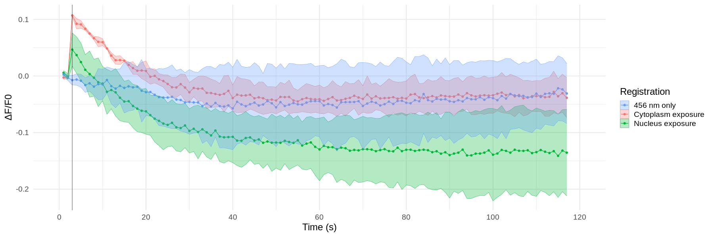

Uncaging in HPCA-TFP transfected cells
================
*11.11.2020 - 18.11.2020*

Регистрация транслокаций HPCA-TFP после повышения Ca2+.
В качестве контроля выгорания проводились серии регистраций такой же продолжительности (120 s), но только с возбуждением TFP или с возбуждением TFP + стимуляцией 405 nm, но без загрузки NP-EGTA.

## Experiment design
### Time Controller protocol
120 фреймов с интервалом 1 s, стимуляция сразу после пятого фрейма.

### Fluorescent agents:
|Name|Ex.|Em.|Count|
|-|-|-|-|
|mTFP1|458 nm|492 nm|-|
|NP-EGTA|405 nm|-|5 uM|

### Initial parameters
**Optical system**
C.A.: 250 um
Exposure: 2 us/px
Image size: 128x128 px
Zoom: 6
Size: 0.276 um/px

Step size: 1.35 um
Slices: -
Scaning speed:F 0.188 s

**Uncaging**
Laser power (405 nm): 15%
Scaning mode: Tornado
Scaning area diameter: 48 ms
Exposure: 10 us/px
Stimulation time: 100 ms
Cycles: 1

## Results
В качестве объекта сравнения использовались транзиенты Fluo-4 при различных мощностях лазера 405 nm (регистрации от 30.10.2020).

### mTFP1 photobleaching
**458 nm excitation only (Fluo-4 at 10% 405 nm for comparison)**

*n=2*

Выгорание незначительное, в пределах 5-8%, однако нет тренда на спад, под конец регистрации кривая даже начала подниматься.

### Stimulation without NP-EGTA loading
**Curve for cytoplasm and nucleus stimulation areas**

*Nucl. n=3*
*Cyto. n=3*

В момент стимуляции происходи не просадка интенсивности, а рост!
При рассмотрении отдельных клеток со стимуляцией в ядро оказалось, что две не дают пика после стимуляции (**cell 35-36**), а сразу спадают и лишь одна клетка давала пик (**cell 34**).

При стимуляции в ядре наблюдается небольшой подъем в цитоплазме и значительное падение в ядре (выгорание?), однака за счет большой площади ядра общая интенсивность клетки падает. Возможно падение в таком случае лишь следствие выгорания ядра. Но какова природа цитоплазматического скачка?

Во всех клетка, где стимуляция производилась в цитоплазме регистрировался скачек общей интенсивности (**cell 37-40**)

**Cell 37**
В клетке 37 в кадр попала соседняя клетка и ее общая интенсивность возросла синхронно с центральной клеткой. Это может быть свидетельством того, что пик является инструментальным артефактом стимуляции, однако скорее всего клетки просто связаны поскольку находились в процессе деления.

**Cell 38**
На первом кадре посли стимуляции яркость ядра возрастает на 15-30% за чем следует монотонный экспоненциальный спад, в то же время цитоплазма достигает максимальной яркости (повышение на \~5%)через 3-4s после стимуляции без выраженного пика за чем следует плавный спад. В то же время наблюдается скачек в фрагменте соседней клетки которая попала в кадр.
Скорость нарастания в ядре и фрагменте соседней клетки может играть в пользу инструментального артефакта, но почему же тогда в цитоплазме нет пика?