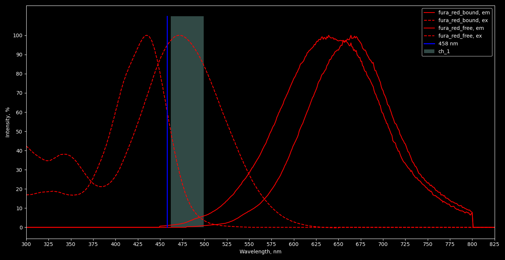
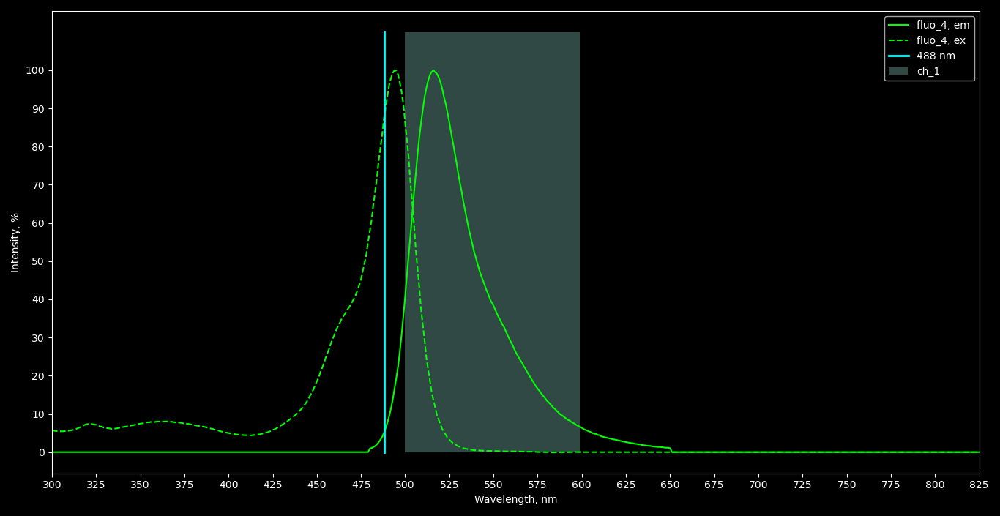
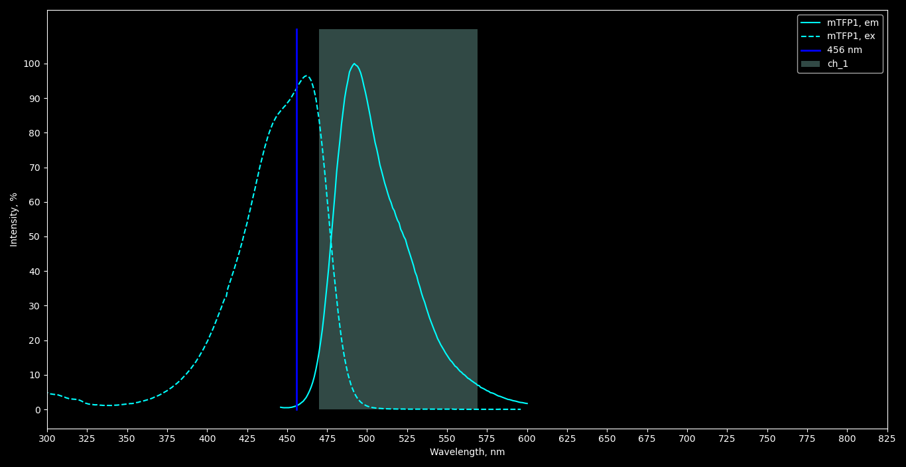
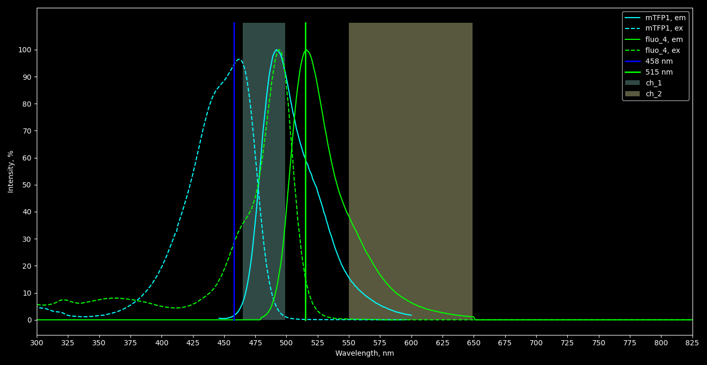

Experiments plan
================
*Borys Olifirov, 26.10.2020*

## Регистрация транслокаций HPCA-mTFP1 с одновременной регистрацией изменения относительной концентрации Ca2+ с применением Fluo-4
Концентрация Ca2+ будет оцениваться как соотношение ΔF/F0 для Fluo-4, для подбора нужной экспозиции и уровня повышения кальция исходим из ΔF/F0 \~ 1.0-1.2 для Fura Red (результаты uncaging в HEK из статьи по дистонии).

Метод сканирования Tornado, область сканирования 48 ms (при разрешении кадра 128x128 px, zoom x6). Экспозиция варьируется только за счет мощности лазера и времени стимуляции (min 100 ms).

Кривые доза-эффект отснять для стимуляции 405 nm и 351 nm. Затем если выцветанние с выбранной экспозицией 405 nm приведет к падению интенсивности HPCA-TFP более чем на 3-5%, то переехать на стимуляцию 351 nm.

**NB: есть вариант, что лазер 351 nm не подключен к стимулирующей сканирующей системе, тогда нужно выкручиваться только с лазером 405 nm**

## 0. Подбор параметров регистрации
0.1. **Регистрации Fura Red**
**NB: возбуждение Fura Red bound на 405 nm (68%) соизмеримо с возбужденим на 456 nm (60%)!**
Может быть тогда стоит оценивать не прирост интенсивности, а падение? Возбуждение на 515 nm позволит регистрировать только свободную форму (**1% bound**/**66% free**), полоса 520-620 nm.

При возбуждении 456 nm будет значительная флуоресценция до стимуляции (**60% bound/94% free**). Соотношение интегральной интенсивности free/bound в полосе регистрации 462-500 nm 0.14.

0.2. **Регистрация Fluo-4**
Возбуждение 488 nm, полоса регистрации 500-600 nm.

0.3. **Регистрация HPCA-mTFP1**
Возбуждение 456 nm, полоса регистрации 470-570 nm.

0.4. **Регистрация Fluo-4 + HPCA-mTFP1**
Возбуждение HPCA-mTFP1 на 456 nm, Fluo-4 - на 515 nm. Полоса регистрации HPCA-mTFP1 465-500 nm (соотношение интегральной интенсивности mTFP1/Fluo-4 с поправкой на возбуждение 456 nm - 29.2). Полоса регистрации Fluo-4 550-650 nm (соотношение интегральной интенсивности mTFP1/Fluo-4 с поправкой на возбуждение 456 nm - 1.0).
*Note: mTFP1 не возбуждется на 515 nm, что позволяет избежать кросстока при регистрации Fluo-4*

## 1. Подбор экспозиции с применением Fura Red
1.1. **Подобрать экспозицию с ΔF/F0 1.0-1.2**
Необходимо найти минимальную экспозицию для двукратного увеличения интенсивности флуоресценции Fura Red.

1.2. **Построение кривой экспозиция-эффект**
Найдя минимально необходимую интенсивность провести съемку с мощностями -10, -20, -30, -40, -50% для оценки зависимости повышения кальция от экспозиции (3-4 клетки на каждую мощность).
*Note: если минимально необходимая мощность будет низкой, то декремент можно снизить до 5%, но необходимо минимум 4-5 значений интенсивности для построения кривой*

1.3. **Оценка истощения NP-EGTA**
Для всех выбранных значений экспозиции провести 3-4 последовательных стимуляции на одной и той же клетке для оценки снижения ΔF/F0 при истощении NP-EGTA (3-4 клетки на каждую мощность).

### Дизайн регистраций
Регистрация 120 фреймов с интервалом 1 s, стимуляция сразу после пятого фрейма. Цикл регистрация+стимуляция для каждой клетки повторить 5 раз, первый цикл пойдет на построение кривой экспозиция-эффект.

## 2. Регистрации транзиентов с Fluo-4
2.1. **Построение кривой экспозиция эффект**
Используя настройки экспозиции, полученные при регистрации с Fura Red повторить регистрации с такими же настройками.
*Note: учитывая большую аффиность Fluo-4 максимальные значения ΔF/F0 будут выше (будет ли влиять на это и выцветание Fura Red под действием 405 nm?)*

2.2. **Оценка истощения NP-EGTA**
*Note: для Fluo-4 возможно сохранение ΔF/F0 при последовательных стимуляциях, если краситель уходит в насыщение*

### Дизайн регистрации
Аналогичен регистрации Fura Red.

## 3. Оценка выцветания HPCA-mTFP1
3.1. **Регистрация с настройками экспозиции Fura Red**
На незагруженных клетках провести стимуляции с настройками, полученными при тестах с Fura Red и оценить падение общей интенсивности HPCA-mTFP1 (3-5 клеток).
*Note: необходимо набрать статистику отдельно по стимуляции в области ядра и цитоплазмы, если падение больше 3-5%, то дело плохо*

### Дизайн регистрации
Регистрация 50 фреймов с интервалом 0.2 s, стимуляция после пятого фрейма. 

**NB: нижестоящие пункты актуальны только если нет выцветания**

## 4. Регистрация транслокаций HPCA-mTFP1
4.1. **Регистрация с загрузкой NP-EGTA и настройками экспозиции Fura Red**
Регистрация 120 фреймов с интервалом в 1 s, стимуляция после пятого фрейма.

4.2. **Регистрация участка мембраны с высокой частотой**
Регистрация небольшого участка мембраны с максимальной частотой регистрации на протяжении 40-60'.
*Note: разрешение выбрать исходя из дифракционного предела, >250 nm/px*

## 5. Регистрация HPCA-mTFP1 + Fluo-4
5.1. **Регистрация транслокаций настройками экспозиции Fura Red и одновременной загрузкой Fluo-4**

### Дизайн регистрации
120 фреймов, после каждого необходимо менять длину волны возбуждения (456/515 nm), интервал 1 s. Стимуляция после шести фреймов (три цикла с каждой длинной волны).
*Note: необходимо проверить, быть может можно регистрировать попарно с разной длинной волны возбуждения (регистрация \~ 350 ms) и зациклить это*