Research notes
==============
*Borys Olifirov, 20.10.2020*

Регистрация Ca2+-зависимых транслокаций HPCA в культуре клеток HEK 293.

---

HEK 293 cells notes
===================
## Cell lines
В работе используются две линии HEK 293, линия из института физиологии (**old HEK**) и полученная от Одина (**new HEK**, источник http://antibodyresearch.com/hek293-cell-line-human-embryonic-kidney/#product-reviews).

## Cultivation

Оптимальные объемы реагентов для разной тары:
|Container|Surface area (cm2)|Seeding density (x10^6)|Cells at confluency (x10^6)|Trypsin/Versene (ml)|Medium (ml)|
|-|-|-|-|-|-|
|Petri dish 35 mm|8.8|0.3|1.2|1|2|
|Petri dish 100 mm|56.7|2.2|8.8|5|10|
|6-well plate|9.6|0.3|1.2|1|1-3|
|12-well plate|2.4|0.1|0.5|0.5-1|1-2|
|24-well plate|1.9|0.05|0.24|0.2-0.3|0.5-1|
|Flask T-25|25|0.7|2.8|3|5|
|Flask T-75|75|2.1|8.4|5|8-15|

### Culture ID
Система ID для культуры **DD.MM_P_C.N**:
- **DD.MM** - дата и месяц пассажа (23.07, 4.12...);
- **P** - номер пассажа (1, 2, 3...)
- **С** - тип культивационного контейнера (12, 25, 35, 100)
- **N** - номер контейнера данного типа

**Типы контейнеров:**

|Контейнер|Обозначение|
|-|-|
|12-well plate|12|
|flask 25 cm2|25|
|Petri dish 35 mm|35|
|Petri dish 100 mm|100|

### Culture status
Описание состояния культуры состоит из уровня покрытия и статуса (50-60% +++, 10% +).

|Sign|Status|
|-|-|
|+++|Прикрепленные клетки с развитыми отростками, незначительное количество (<2-5%) округлых и неприкрепленных клеток|
|++|Встречаются группы округлых вакуолизированных клеток, но преобладают хорошо оформленные клетки, мало неприкрепленных клеток|
|+|Клетки оформленны плохо, много (\~25%) округлых вакуолизированных клеток, значительный процент (>~10%) неприкрепленных клеток|
|0|Подавляющее большинсво нежизнеспособных округлых клеток неправильной морфологии (>50%)|

**Культура "+++"**
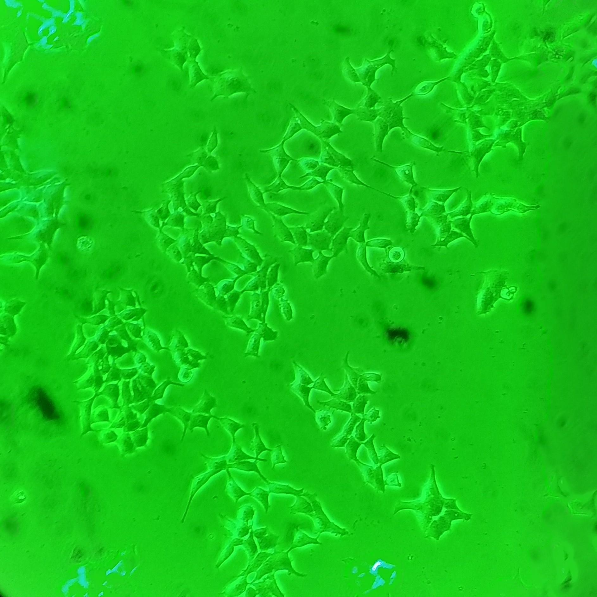

**Культура "++"**
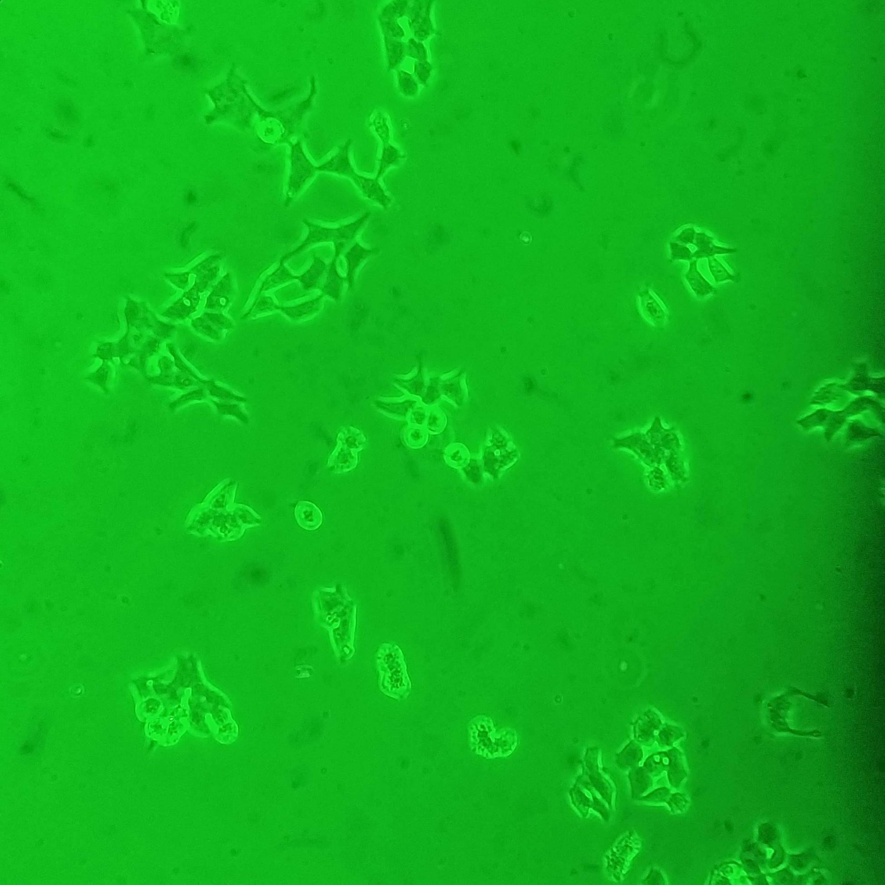

**Культура "+"**
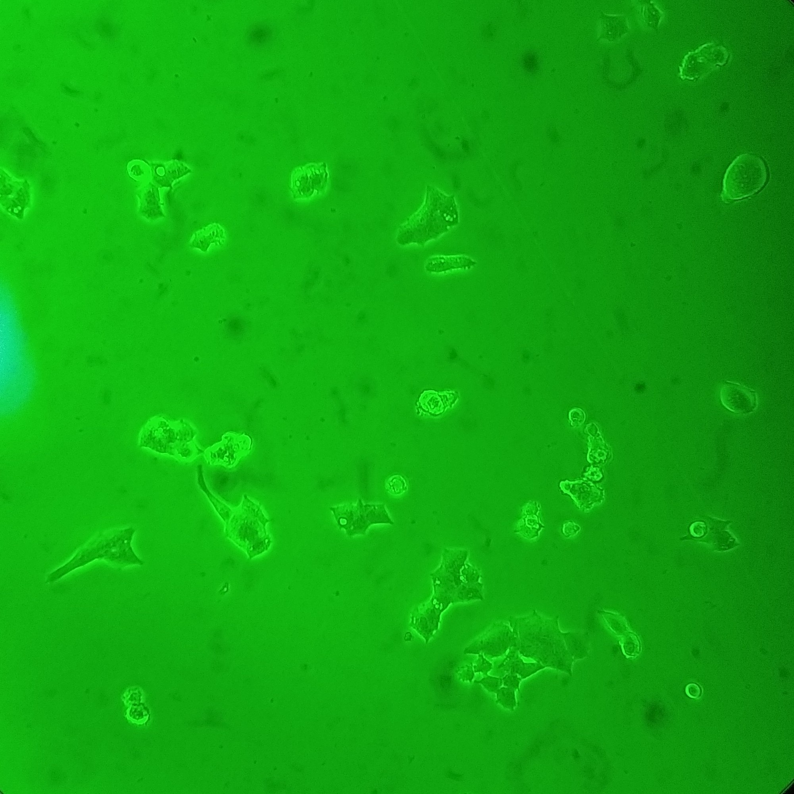

**Культура "0"**
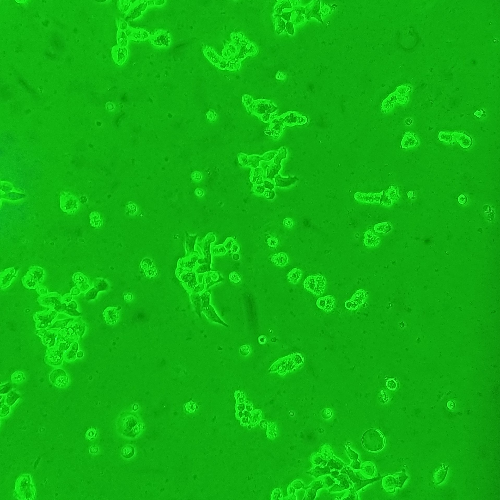

## Transfection

Протокол трансфекции *hek_lipofectamine_transfection.md*. Массы из протокола Евгения Шеремета: 0.5 ug HPCA & 0.25 ug EYFP-Mem на лунку 12-wells plate. В полученных данных интенсивность HPCA неудовлетворительна, решено увеличить массу ДНК.

### Plasmids mass
**Масса плазмид в расчете на одну лунку (12-wells plate):**

|Plasmid|Mass|
|-|-|
|HPCA-mTFP1|1 ug|
|EYFP-Mem|0.4 ug|

**Пример трансфекции HPCA-TFP**
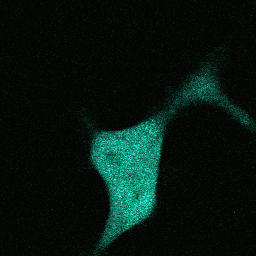

**Пример котрансфекции HPCA-TFP + EYFP-Mem**
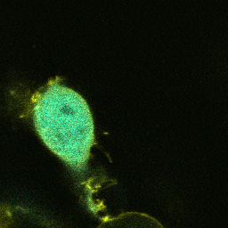

### Experiment pipeline

Базовая культура поддерживается на чашке Петри 35 mm, пассаж при покрытии 85-90%.

|Time|35 mm|wells 1-2|wells 3-4|
|-|-|-|-|
|Day 0|seed 20-30 ul|seed 15 ul|seed 20 ul|
|Day 1|growth|growth|growth|
|Day 2|growth|transfection|growth|
|Day 3|replace medium|glass 1 imaging|growth|
|Day 4|growth|glass 2 imaging|transfection|
|Day 5|growth|-|glass 3 imaging|
|Day 6|passage|-|glass 4 imaging|

## Uncaging
Для контролируемого повышения концентрации Ca2+ клетки перед регистрацией загружены AM NP-EGTA (протокол *hek_np_egta.md*).

## Calcium imaging
Для регистрации динамики Ca2+ в клетки перед регистрацией в различный экспериментах загружали AM Fluo-4 (протокол *hek_fluo_4.md*) или AM Fura Red (протокол *hek_fura_ref.md*).

Uncaging with Fluo-4 calcium imaging
====================================
*12-14.10.2020*

mTFP1 photo-bleaching
=====================
*17-20.10.2020*

## Nucleus bleaching
Для анкейджинга стандартно применялся полупроводниковый лазер 405 nm, однако он провоцирует сильной выцветание меченого белка. Одновременно с этим если стимуляция проводилась в небольшой области (*48 ms в режиме Tornado*), то в случае ее попадания в ядро его яркость падала на все время регистрации.

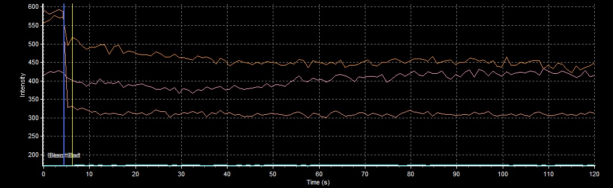

## Cytoplasm bleaching
В то же время если стимуляция попадала на цитоплазму ядро наоборот оставалось ярче на протяжении всей регистрации.

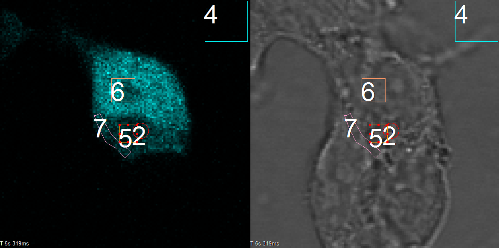

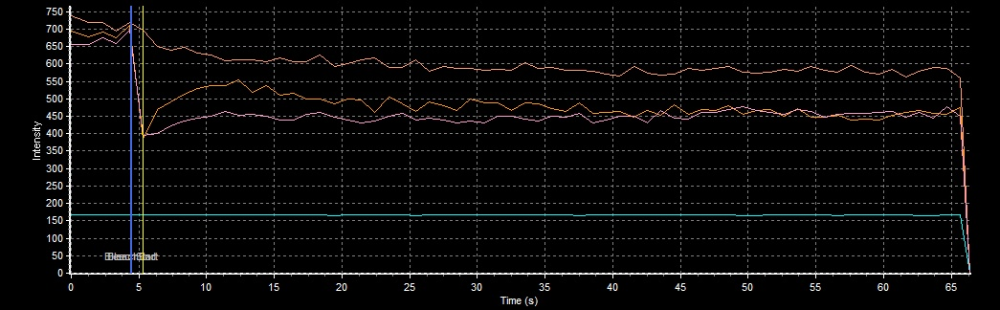

Компартменты с более высокой, чем у цитоплазмы, и стабильной во времени интенсивностью встречались и в клетках, которые стимулировали по всей площади (*18.10.2020, cell 8*), однако чаще встречалось падение интенсивности в компартменте, занимающем \~2/3 площади клетки при стимуляции по всей площади. Подобное наблюдалось как только в трансфецированных(*18.10.2020, cell 1*), так и загруженных NP-EGTA (*18.10.2020, cell 15*) клетках.

## Absorption at 405 nm
**mTFP1 absorption ad diff. wavelength**
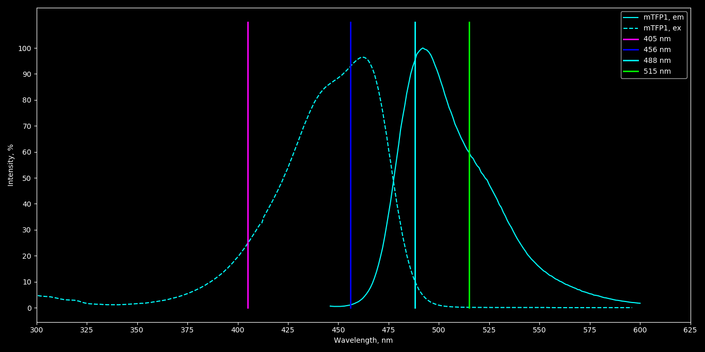

|Laser|Ex.|
|-|-|
|351 nm|1%|
|405 nm|24%|
|456 nm|92%|
|488 nm|10%|
|515 nm|0%|

Такое сильное выцветание может быть связано с очень сильным поглощением на длине волны 405 nm (*для CFP 57%*), при этом по литературным данным поглощение NP-EGTA на это доине волны меньше 10% от максимально возможного.

**NB: необходимо переезжать на 351 nm!**

## Membrane detection problems
Подобные артефакты делает невозможным оценку транслокаций с помощью гистерезисной маски в том дизайне, который отлаживался на снимках EYFP-Mem:
- Заранее невозможно точно предугадать попадет ли область стимуляции на ядро;
- Вокруг ядра остается кайма из цитоплазмы, непонятно как в ней детектировать мембрану;
- Непонятно как автоматический игнорировать область ядра при расчете площади и средней интенсивности цитоплазмы.

Co-transfection + uncaging
==========================
*???*

Регистрации транслокаций HPCA в клетках котрансфицированных HPCA-TFP и EYFP-Mem. Дополнительно регистрируется канал EYFP для оценки положения мембраны и оценки FRET в процессе транслокаций.

**Спектры возбуждения и эмиссии для mTFP1 и Fluo-4 + Ca2+**
*Тонкие линии - возбуждение, жирные - эмиссия*
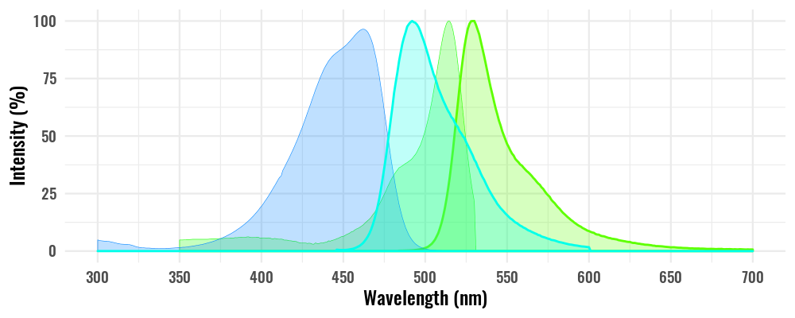

#### Initial parameters
**Excitation and registration**
458 nm: 15%
515 nm: 15%
CHS1 HV: 700 V
CHS2 HV: 700 V

CHS1 pass band: 475-505 nm
CHS2 pass band: 525-570 nm 

**Optical system**
C.A.: 250 um
Exposure: 2 us/px
Image size: 128x128 px
Zoom: 6
Size: 0.276 um/px

Slices: 3
Step size: 1.35 um

Scaning speed: L 1.360 ms, F 0.188 s, S 1.157 s

**Uncaging**
Laser power (405 nm): 100%
Region size: 128x128 px
Slices: 1
Cycles: 1

Exposure: 10-100 us/px (выбор после **Test uncaging**)

#### Time Controller protocol
**Пример окна протокола**
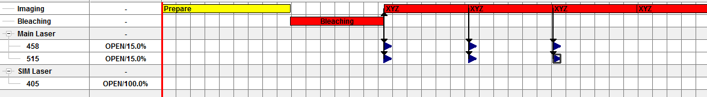

Экспозиция 405 nm происходит в одной фокальной плоскости (верхней или нижней относительно координат сканирования z-stack?) и за ней следует z-stack с возбуждением 458 nm (Ida, Idd), следующий z-stack регистрируется с длинной волны возбуждения 515 nm (Iaa, Iad). Один цикл \~2.3 s, учитывая кинетику кальциевого транзиента в HEK 293 изменения имеет смысл проводить в течении 90-100" (40 циклов регистрации, 92.6 s). 

Перед протоколом **uncaging** для оценки степени фотовыцветания в процессе экспозиции 405 nm и серийной съемки а также оценки распределения HPCA при низком Ca2+ регистрируется один z-stack с теми же настройками системы.

Optical notes
=============
## FRET registration
Для оценки FRET планируется использовать метод оценки опсаный в работе *"Photobleaching-Corrected FRET Efficiency Imaging of Live Cells" (doi: 10.1529/biophysj.103.022087)*.

Результирующая интенсивность флуоресценции, перешедшая из канала донора в канал акцептора может быть оценена путем введения поправок на кроссток интенсивности из каналов возбужденного донора (Idd) и акцептора (Iaa):

Поправочные коэффициенты *a* и *d* оцениваются в калибровочных измерениях на клетках трансфецированных раздельно донором и акцептором:

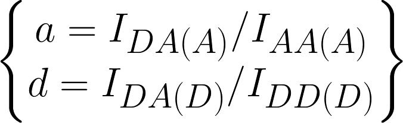

Эффективность FRET:

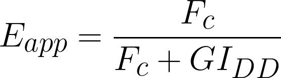

Параметр *G* отражает взаимосвязь между интенсивностью, ушедшей из канала регистрации донора (Idd) и эффективностью FRET. Данный показатель константен для заданой оптической системы и пары флуоресцентных меток и может быть оценен путем выжигания акцеатора в системе с гарантированным FRET в рамках калибровочного эксперимента:

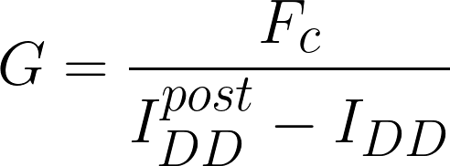

Для калибровочного эксперимента необходим либо коньгат TFP-EYFP, либо TFP-Mem поскольку нужна гарантированная передача энергии.

**Есть конструкт CFP-EYFP, есть ли нужный конструкт для TFP или донор необходимо заменить?**

## Optical system resolution
*Для выбора оптимального разрешения изображения и величины шага сканирования*

Латеральное разрешение системы определяется диаметром дика Эйри (Airy unit/AU), который зависит от длинной волны излучения и числовой апертуры:

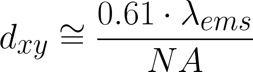

Аксиальное разрешение конфокальной системы определяется полной шириной на середине высоты (full width half maximum/FWHM) аксиальной проекции PSF также зависит от коэффициента преломления среды (*n*) и диаметра конфокальной апертуры (*D*):

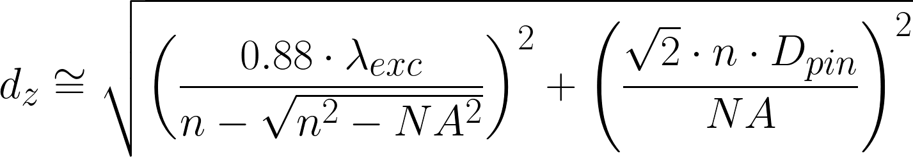

Для использованной оптической системы *n* = 1.33 (вода), *NA* = 0.9.
Латеральное разрешение и аксиальное разрешение для избранных значений *D* для длин волн возбуждение и эмиссии приведены ниже.

##### Fluorescent agents (data from FPbase):
|Name|Exc.|Ems.|
|-|-|-|-|
|HPCA-TFP|456 (453) nm|488 (485) nm|
|EYFP-Mem|513 nm|527 nm|

#### HPCA-TFP
##### 458 nm (exc.)
dxy = 310 nm

|D (um)|dz (um)|
|-|-|
|500|1.553|
|250|1.262|
|100|1.168|

##### 488 nm (ems.)
dxy = 330 nm

|D (um)|dz (um)|
|-|-|
|500|1.610|
|250|1.331|
|100|1.242|

#### EYFP-Mem
##### 515 nm (exc.)
dxy = 349 nm

|D (um)|dz (um)|
|-|-|
|500|1.662|
|250|1.394|
|100|1.309|

##### 527 nm (ems.)
dxy = 357 nm

|D (um)|dz (um)|
|-|-|
|500|1.685|
|250|1.422|
|100|1.339|

#### 405 nm (uncaging)

dxy = 275.5 nm

|D (um)|dz (um)|
|-|-|
|500|1.457|
|250|1.143|
|100|1.037|

*Useful links:*
- http://www.hi.helsinki.fi/amu/AMU%20Cf_tut/Opt_Pinhole.htm
- https://www.leica-microsystems.com/science-lab/confocal-optical-section-thickness/
- https://www.leica-microsystems.com/science-lab/pinhole-effect-in-confocal-microscopes/
- https://www.biodip.de/wiki/Airy_unit

