HEK 293 vesiculation protoсol modifications
================
*9.11.2020 - 10.11.2020*

Отладка протокола везикуляции *Piccolo et. al., 2012, doi:10.1021/ac301776j* на культуре HEK 293 и способа концентрирования везикул.

## Experiment design
### Culture preparing
Протокол описан в *hek_vesicles_production.md* (редакция от 4.11.2020). 

Три вариации протокола:
- **A**: внести 250 ul V. buffer
- **B**: внести 250 ul V. buffer, CF 3000 RPM 1' и ресуспендировать в 50 ul V. buffer
- **C**: внесни 100 ul V. buffer

### Preparing
Перед нанесением раствор ресуспендировался.
10 ul раствора с везикулами помещались на предметное стекло и накрывались покровным стеклом D 25 mm. Возбуждение автофлуоресценции в содержимом везикул лазером 405 nm.

### Imaging

**Settings**
Objective: 20x/0.50
C.A.: 250 um
Exposure: 20 us/px
Image size: 1024x1024 px
Zoom: 5

**Laser parameters**
|Laser|Power|Area|Time|
|-|-|-|-|
|405 nm|100%|-|-|

**Channels parameters**
|Ch.|HV (V)|Pass band|Obj.|
|-|-|-|-|
|**CHS1**|760|500-600 nm|auto|
|**TD1**|130|-|-|

## Results
### Vesiculation buffer loading
**Cells before loading**
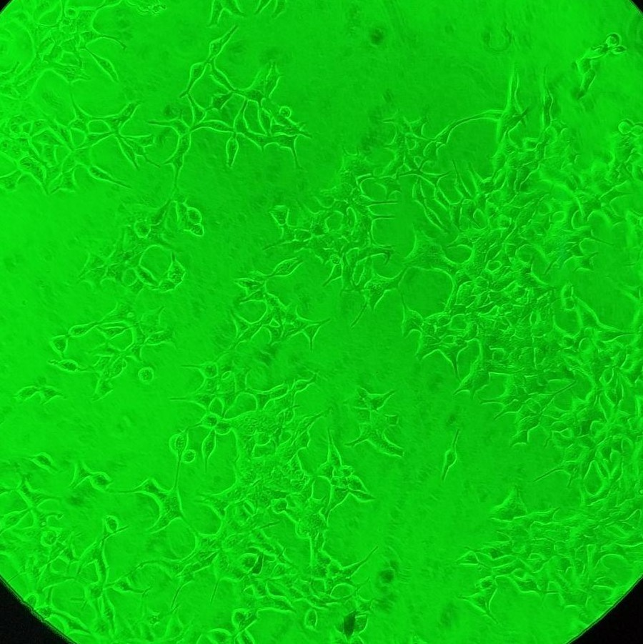|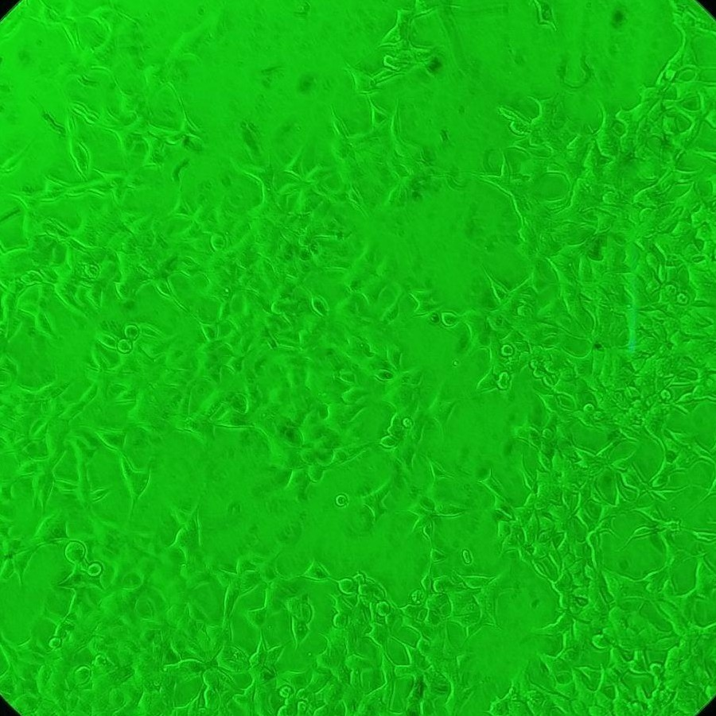|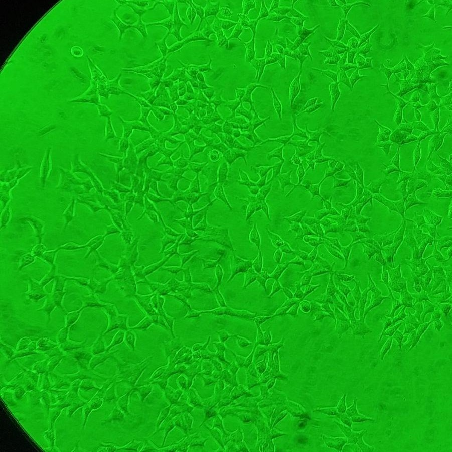
:-:|:-:|:-:
**A**|**B**|**C**

Среда из лунки удалялась медленно, носик упирался в придонный угол лунки. Заливка растворов производилась плавно и по стенке, носик прижимался к стенке на \~2/3 высоты лунки. Во всех трех лунках после двойной промывки 30% PBS и заливкой V. buffer не наблюдалось значительного увеличений неприкрепленных клеток, только морфологические изменения вызванные осмотическим шоком (округление клеток, утончение отростков) и немного групп из 3-5 оторванных клеток.

**Cells directly after loading**
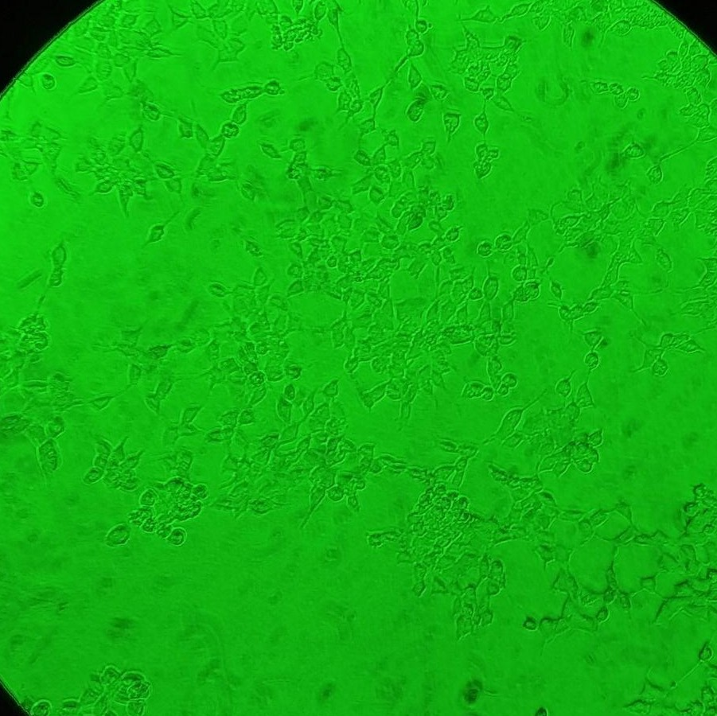|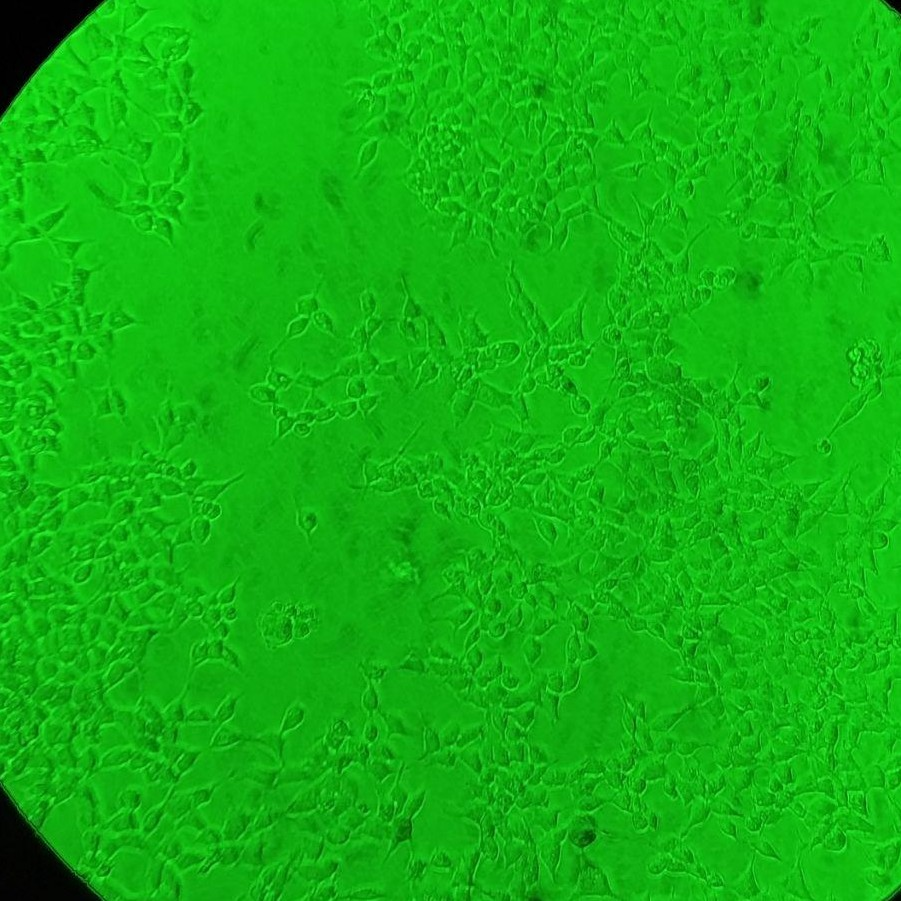|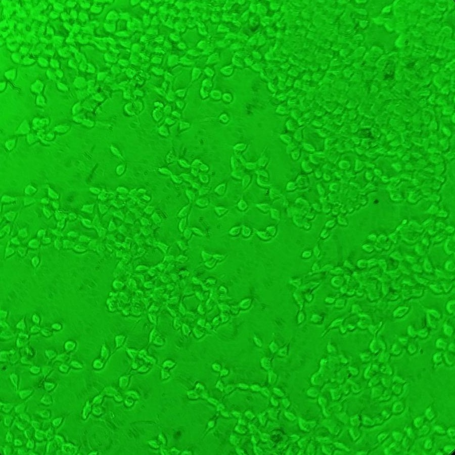
:-:|:-:|:-:
**A**|**B**|**C**
*Note: отличие внешнего вида клеток в лунке C может быть обусловлена тем, что слой буфера был тоньше и мениск жидкости мог влиять на изображение*

### After incubation
После \~ 14.5 h инкубации c V. buffer все клетки стали выглядеть лучше, чем сразу после заливки, не наблюдалось больших конгломератов оторванных ото дна клеток, лишь одиночные.

**Cells after incubation**
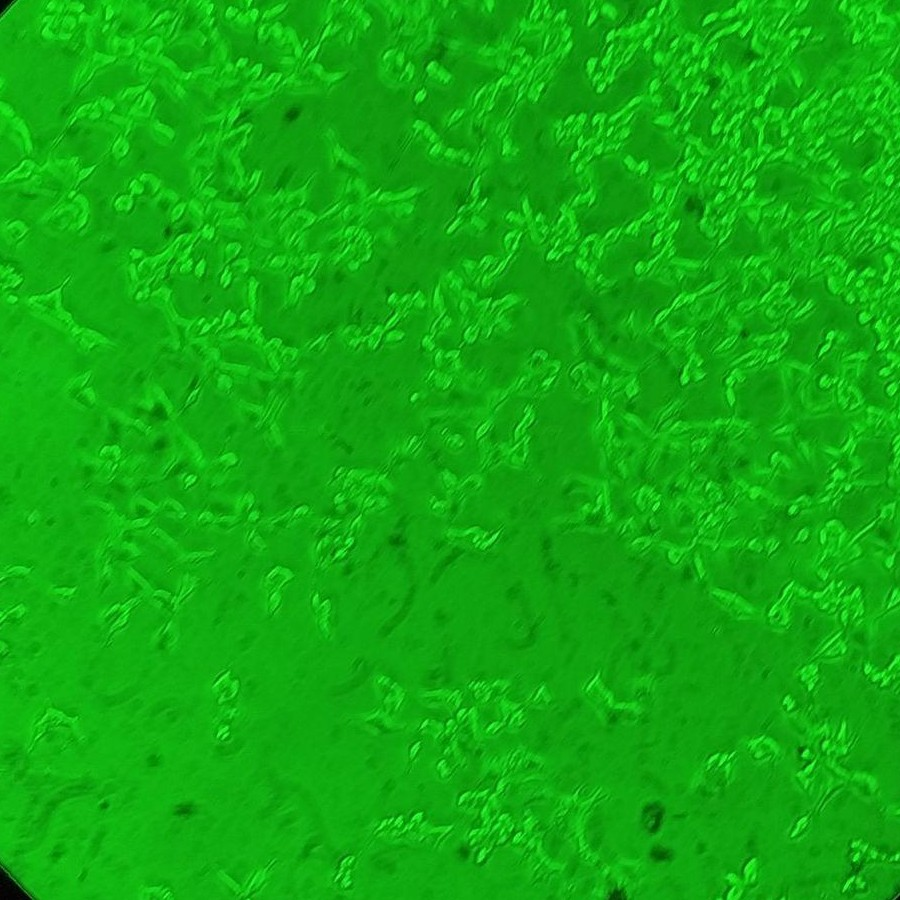|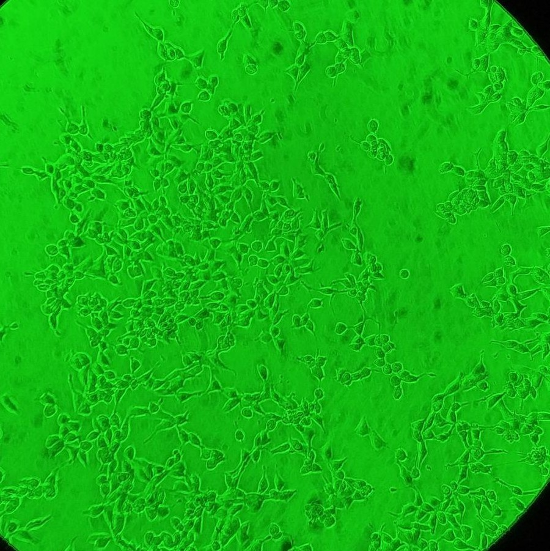|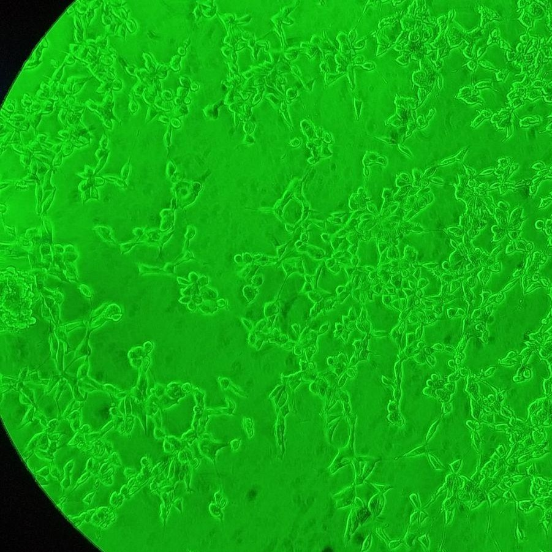
:-:|:-:|:-:
**A**|**B**|**C**

### Imaging
Только в пробе из лунки **C** удалось что-то найти, отдельные группы из везикул диаметром 5-20 um слипшихся с мусором. При этом остатки клеток слабо флуоресцировали, содержимое везикул - нет.

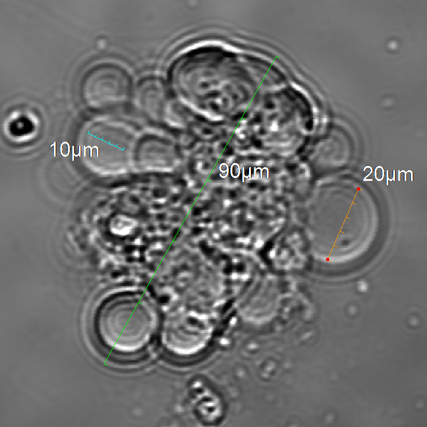|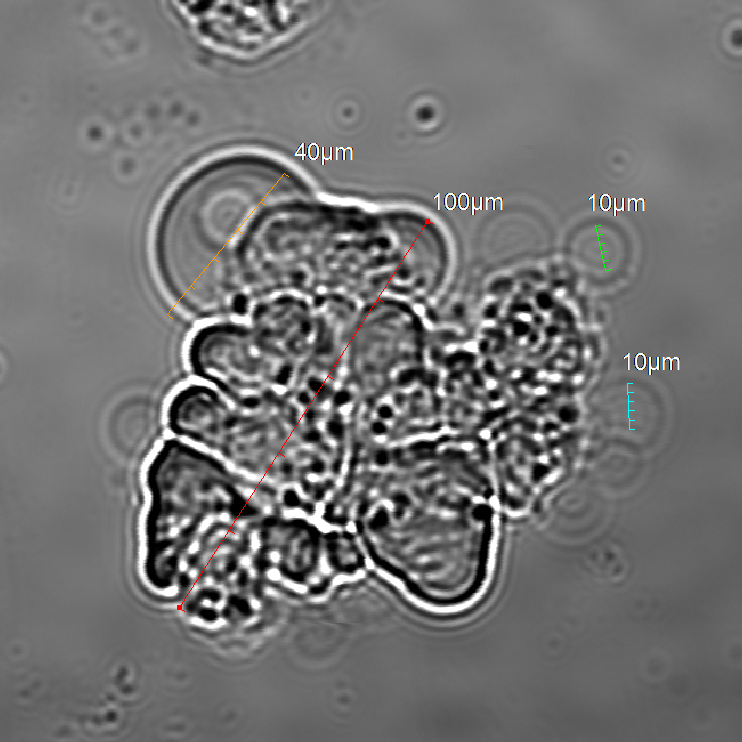
:-:|:-:
**Vesicles group with debris**|**Vesicles group with debris**

## Future modifications
Уменьшение концентрации буфера дало результаты, в пробе **A** не было везикул, хотя в прошлый раз по такому же протоколу они наблюдались. Возможно слишком мягкое обращение с клетками препятствует отсоединению везикул от клеток. 
Снижение объема V. buffer показало себя ожидаемо хорошо, однако не наблюдалось отдельных везикул. Возможно в связи с тем, что пролиферативная активность HEK 293 ниже, чем у CHO следует увеличить время инкубации.
Центрифугирование не показало результатов, так что пока отложим.

Для концентрирования везикул возможно применить простое отставивание на льду в течении \~1 h с дальнейшим отбором \~20% нижнего объема раствора (https://doi.org/10.1073/pnas.0611357104).

- **Увеличить  время инкубации**
Поднять время инкубации с V. buffer до 24 h.
- **Предельно уменьшить объем V. buffer**
Попробовать сократить объем до 50-80 ul, чтобы раствор едва покрывал клетки. Главное чтоб за время инкубации клетки не пересохли вовсе.
- **Стимулировать отрыв везикул при отборе раствора**
Попробовать мягко ресуспендировать раствор во время отбора чтобы все везикулы оторвались и перешли в раствор.
- **Увеличить объем DMEM- во время трансфекции**
Стандартный протокол Lipofrctamine 3000 рекомендует для 24-well plate объем 2x25 ul DMEM-.

## Plan
Следующие три лунки (**3A-3C**) не будут трансфецироваться, время инкубации для всех лунок увеличено до 25 h.

- **3A**: внести 100 ul V. buffer
- **3B**: внести 100 ul V. buffer и при отборе раствора плавно ресуспендировать 2-3 раза
- **3C**: внесни 80 ul V. buffer