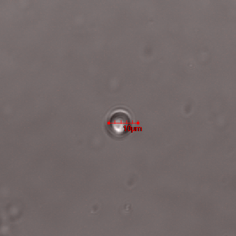

HEK 293 vesiculation
================
*5.11.2020 - 7.11.2020*

Первая проба протокола везикуляции *Piccolo et. al., 2012, doi:10.1021/ac301776j* на культуре HEK 293.

## Experiment design
### Culture preparing
Протокол описан в *hek_vesicles_production.md* (редакция от 4.11.2020). Специально для этого были приготовлены 30% PBS и Vesiculation buffer, растворы стерилизованы фильтрованием.

Для контроля велось три лунки:
- **1A**: предварительно трансфецирована HPCA-mTFP1, везикуляция спустя \~ 30 h после трансфекции
- **1B**: проводилась только везикуляция
- **1C**: контрольная лунка

### Imaging
\~ 5 ul раствора с везикулами помещались на предметное стекло и накрыто CELLocate Coverslip (eppendorf 5245 952.009-00).

Попытка возбудить автофлуоресценцию в содержимом везикул лазером 405 nm.

**Laser parameters**
|Laser|Power|Area|Time|
|-|-|-|-|
|405 nm|10%|-|-|
|458 nm|30%|-|-|

*Note: одновременно возбуждалось только одним лазером*

**Channels parameters**
|Ch.|HV (V)|Pass band|Obj.|
|-|-|-|-|
|**CHS1**|650|520-620 nm|auto|
|**TD1**|195|-|-|

**NB: при возбуждении mTFP1 на 458 nm забыл поменять pass band, регистрации впустую!**

## Results
### Vesiculation buffer loading
Растворы вливались прямо на монослой клеток, это ошибка которая могла спровоцировать снятие клеток с дна, что негативно влияет на результат.

|**1A (30 h after transfection), before vesiculation**
:-:|-
|**1B, before vesiculation**
|**1C, control**

Сразу после двух промывок 30% PBS и заливкой V. buffer трансфецированная культура (**1A**) в значительной степени отвалилась ото дна, остались островки клеток только у стенок лунки (практически как после трипсина), в то время как интактная культура (**1B**) изменила морфологию и осталась прикрепленной.

|
:-:|:-:
**1A, after washing and V. buffer loading**|**1B, after washing and V. buffer loading**

### After incubation
После \~ 14 h инкубации c V. buffer **1A** осталась неприкрепленной, большая часть клеток (возможно мертвых) плавали комками в среде, маленькие островки прикрепленных клеток у стенок лунки по морфологии схожие с **1B**сразу после заливки. **1B** стали выглядеть лучше.

|
:-:|:-:
**1A, after incubation, detached cells group**|**1A, after incubation, cells near well wall**
|
**1B, after incubation, cells in center of the well**|**1С, control cells**

### Imaging
Пробирки пребывали в вертикальном положении, часть мусора и везикул успели осесть.

Забор пробы у дна приводил к тому, что попадало много отдельного мусора и везикулы слипались с мусором.і

|
:-:|:-:
**Vesicle with debris, fluorescent debris**|**Vesicles with debris**

Если отбор пробы производился в \~1.5-2 mm ото дна, то удавалось наблюдать отдельные чистые везикулы диаметром 10-20 um.

|
:-:|:-:
**Small clean vesicle**|**Large clean vesicle**

Также наткнулся на группу из большого количества везикул с чистым краем, но слипшимся с мусором.

**Vesicles group**

В растворе из клеток после трансфекции (**1A**) даже при отборе выше дна не удалась найти ни одной везикулы, только фрагменты клеток с незначительной флуоресценцией (**Warning: забыл адаптировать канал под TFP при возбуждении 458 nm**).

**Transfected cells vesicles**

## Future modifications
- **Уменьшить объем V. buffer и заливать аккуратнее**
Заливать солевые растворы по стенке, избегать повреждения слоя клеток и сократить объем до 200 ul.
- **Увеличить объем DMEM- во время трансфекции**
Стандартный протокол Lipofrctamine 3000 рекомендует для 24-well plate объем 2x25 ul DMEM-.
- **Сократить время культивации после трансфекции**
Опробовать 15-20 h после трансфекции чтобы клетки были в лучшем состоянии.
- **Отбирать раствор после инкубации по стенке**
Отбирать V. buffer после инкубации по стенке, носик погружать в мениск и двигаться вниз вслед за жидкостью, не погружать носик и не тревожить лишний раз раствор.
- **Попробовать концентрировать везикулы центрифушированием**
Центрифугировать 30"-1' 3000 RPM и ресуспендировать в 50-100 ul V. buffer.

## Plan
Следующие три лунки (**2A-2C**) не будут трансфецироваться, отладка получения чистых везикул. Попробую приготовить препарат с обычным покровным теклом и съемка на 60x/0.90 water deeping.

- **2A**: внести 250 ul V. buffer
- **2B**: внести 250 ul V. buffer, CF 3000 RPM 1' и ресуспендировать в 50 ul V. buffer
- **2C**: внесни 100 ul V. buffr