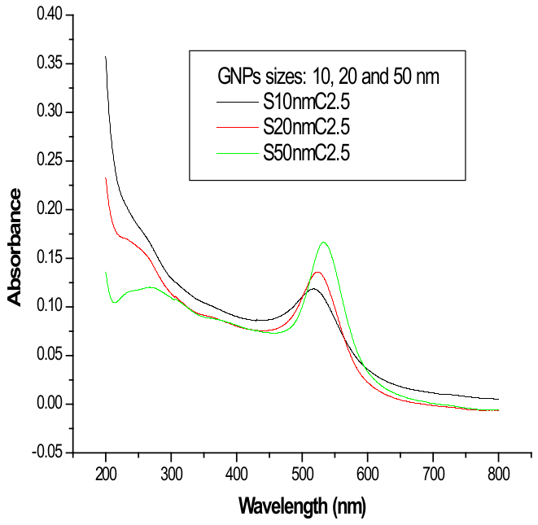
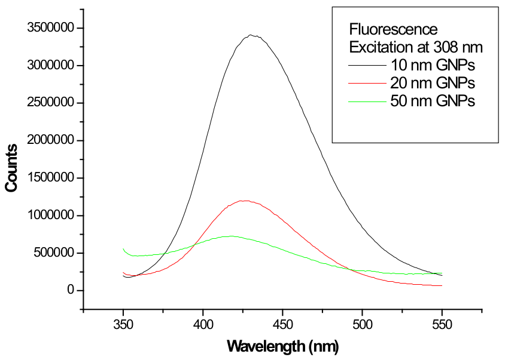
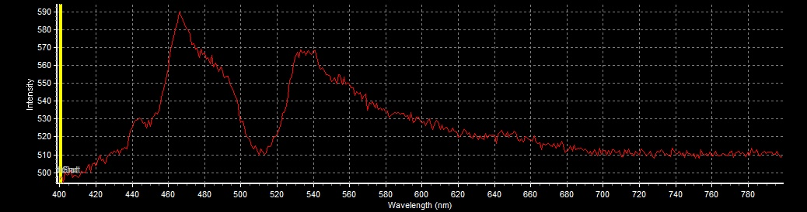
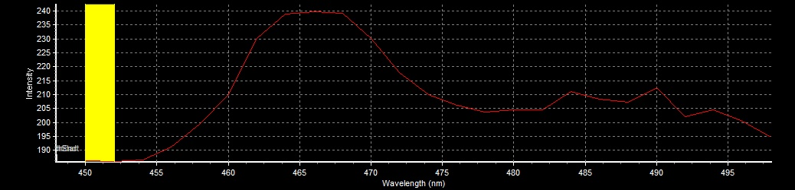
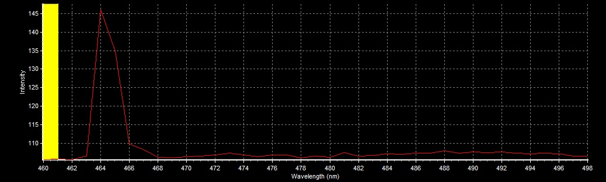
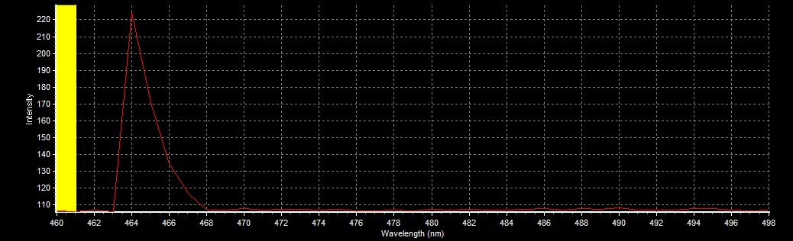
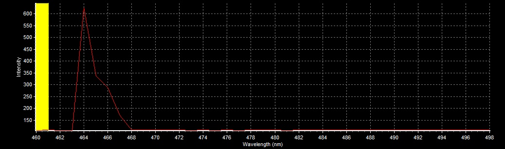
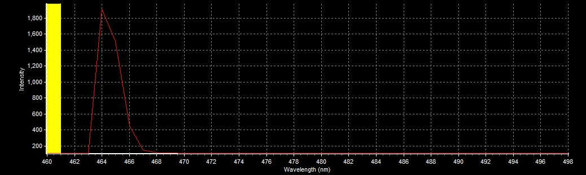
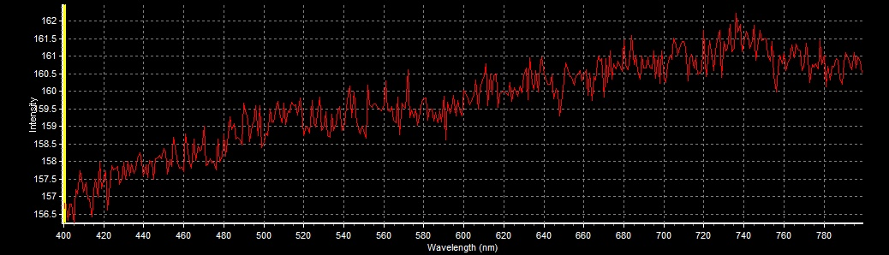

AuM nanoparticles test confocal imaging
======================================
*9.12.2020, Borys Olifirov*

Попытка визуализации наночастиц AuM на конфокальном микроскопе и снятие их спектра излучения при возбуждении лазерами 405 nm и Ar.

## Experiment design
### Particle characteristics
Диаметр частиц \~20 nm, геометрия неизвестна (скорее всего сферическая), сверху металлическое ядро покрыто гидрофильной оболочкой к элементам которой ковалентно привязан мемантин.

*NB: каков состав гидрофильной оболочки?*

Опираясь на работу Abdelhalim et. al. (http://dx.doi.org/10.4172/2157-7439.1000133) максимум поглощения наночастиц золота сферической формы диаметром 10-50 nm лежит в диапазоне 517-532 nm. С возрастанием диаметра коэффициент экстинкции также возрастает.

**UV-vis absorbance spectra**

*(Abdelhalim et. al., 2012)*

В то же время максимум эмиссии при возбуждении 308 nm лежит в диапазоне 410-450 nm и величина эмиссии обратно пропорциональна размеру частиц.

**Emission spectra at 308 nm excitation**

*(Abdelhalim et. al., 2012)*

### Sample preparing
Раствор 20 mM AuM в физиологическом растворе нанесен на предметным стекло и накрыт покровным 18 mm (объем раствора 2 ul).

*NB: как быстро высохнет раствор и как высыхание повлияет на поведение частиц?*

*Answer: за более чем 1 h работы раствор полностью не высох.*

### Imaging design
Будет опробовано пять длин волн (405 nm, 458 nm, 488 nm), для каждой длинны волны возбуждение будет снят λ-scan окном 1 nm и шагом 1 nm. Диапазон длинн волн зависит от длинны возбуждения (ограничения вносят доступные дихроики).

**Warning: ограничение системы не позволяют снимать спектр с длинной волны меньше 450 nm при возбуждении 405 nm**

Необходимо подобрать оптимальную мощность лазеров и оценить, возможно ли получить достаточный уровень сигнала чтобы выявить сигнал частиц в биологических образцах со значительной аутофлуорисценцией.

### Microscope setup for λ-scan 
**Optical system**
Objective: 60x NA 0.9 (water dipping)
C.A.: 500 um
Exposure: 2-200 us/px
Image size: 64x64 px
Zoom: 4
Size: 0.828 um/px

**Registration system**
HV: 750 V

## Results
### 405 nm
|Power|Exposure/px|Dichroic|Scaning λ|
|-|-|-|-|
|100%|200 us/px|ADM 450|400-800 nm|

Максимально широкое сканирование в диапазоне 400-800 um с использованием фильтра Кальмана (5x по строкам) показало пик флуоресценции в области \~465 nm (ΔF/F 400 nm \~0.2). Провал в диапазоне 500-530 nm является аппаратным артефактом.

**Ext. 405 nm 100%, 200 us/px**

|Power|Exposure/px|Dichroic|Scaning λ|
|-|-|-|-|
|100%|40 us/px|ADM 450 **or** ADM 450 + DM 458/515|450-500 nm|

Для проверки влияния дихроика необходимо для регистрации с возбуждением 458 nm (DM 458/515) были проведены регистрации с и без него с меньшей экспозицией на пиксель и диапазоне около найденного ранее пика.

На обоих регистрациях пик находился в области 465 nm, а разница в интенсивности относительно интенсивности на длине волны 455 nm отличалась незначительно (ΔF/F 455 nm \~0.26 без DM 458/515, \~0.28 c DM 458/515).

**Ext. 405 nm 100%, 40 us/px**

**Ext. 405 nm 100%, 40 us/px, + DM 458/515**

### 456 nm
|Power|Exposure/px|Dichroic|Scaning λ|
|-|-|-|-|
|2%, 5%, 20%, 50%|2 us/px|DM 458/515|460-500 nm|

Во всех регистрациях пик наблюдался на длине волны 464 nm, что совпадает с результатами возбуждения 405 nm.

ΔF/F относительно интенсивности на участке 480-490 nm при различных мощностях 458 nm:
- 2%: \~0.4
- 5%: \~1
- 20%: \~4.6
- 50%: \~10.3

**Ext. 458 nm 2%, 2 us/px**

**Ext. 458 nm 5%, 2 us/px**

**Ext. 458 nm 20%, 2 us/px**

**Ext. 458 nm 50%, 2 us/px**

### 488 nm
|Power|Exposure/px|Dichroic|Scaning λ|
|-|-|-|-|
|100%|2 us/px|DM 351/488|400-800 nm|

Регистрация в диапазоне 400-800 nm не показала значений выше уровня шума детектора.

**Ext. 488 nm 100%, 2 us/px**
