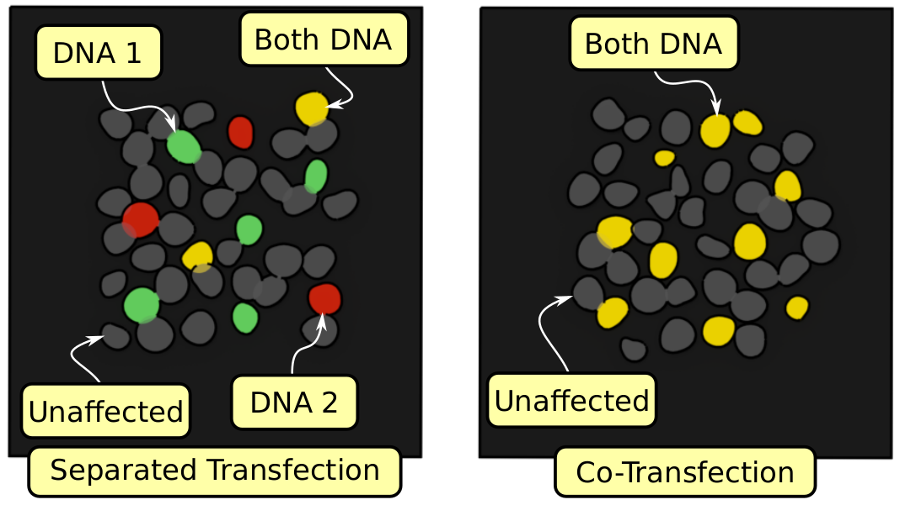

Lipofectamine 3000 transfection of HEK 293 cells
================================================
*Borys Olifirov, 20.09.2020*

Protocol for **Lipofectamine 3000** transfection of the HEK 293 cells culture in 12-well culture plate with confluence 70-80%.
*Note: reaction mix volume for ONE well of the 12-wells culture plate*

Transfection can be done differently depending of wanted result – separated transfection (some cells infected with first construct, others with second, some with both, and some not affected at all) and co- transfection (cells transfected with both constructs or not affected). This is shown at figure below.

## Protocol
### 1. Preparation

1.1. Clean the Biological Safety Cabinet (BSC) work surface using 70% ethanol in sprayer

1.2. Check for required equipment and reagents (tables below):

| **Equipment**       | Description                  | Note                             |
|---------------------|------------------------------|----------------------------------|
| Pipette             | 1 ml, 200 ul, 20 ul          |                                  |
| Tips                | 1 ml (blue), 200 ul (yellow) |                                  |
| Eppendorf tubes     | 0.5 ml                       | DNA-free sterile tubes           |
| Racks for tubes     |                              | for eppendorf tubes              |
| Gloves              |                              |                                  |
| Waste glass         | 50-100 ml chemical glass     | for waste                        |

| **Reagent**          | Description                      | Note                                         |
|----------------------|----------------------------------|----------------------------------------------|
| DMEM-                | DMEM without serum & antibiotics | take aliquot from a fridge                   |
| Lipofectamine 3000   | L3000 & P3000                    | take tube with aliquot from a fridge         |
| Plasmid DNA          | DNA aliquot for transfection     | check DNA concentration before transfection! |

1.3. Take DMEM- aliquot from a fridge and put it into thermostat for ~ 1 h
*Note: culture mediums should be preheated to 37oC*

1.4. Put equipment into the BSC
    
1.5. Start BSC sterilization by 15-20 min UV
**Warning: DO NOT stare at UV light even trough the glass**
**Warning: DO NOT expose DNA and Lipofectamine to UV light**
**Warning: NEVER freeze Lipofectamin, store it only at 4oC**

### 2A. Co-transfection/single plasmid transfection
2.1. Take DMEM- aliquot from a thermostat, Lipofectamine 3000 from a fridge and clean all tubes with 70% ethanol from sprayer, place it into BSC

2.2. In 0.5 ml eppendorf prepare 50 ul aliquote of DMEM- and add 3 ul of L3000
*Note: gently mix solution, resuspend 5-10 times*

2.3. In new 0.5 ml eppendorf prepare 50 ul of DMEM-, add 4 ul of P3000
*Note: gently mix solution, resuspend 5-10 times*

2.4. Add plasmid DNA to final amount 1.5-3 ug to diluted P3000
*Note: gently mix solution, resuspend  5-10 times*

2.5. Add full volume of diluted DNA with P3000 to diluted L3000
*Note: mix on vortex 10"*

2.6. Incubate 5' at RT.

2.6. Take 12-well culture plate from CO2-incubator and DMEM- aliquot from thermostat, place it into the BSC

2.7. Add full volume (\~110 ul) of the reaction mix to selected well and return plate to the CO2-incubator
*Note: add reaction mix to the medium drop by drop and after you should resuspend medium 5-10 times*

2.8. Put all equipments in its place and clean the BSC work surface using 70% ethanol, don't forget turn off the BSC
*Note: you should use cells during 1-2 days after transfection*

### 2B. Separated transfection (for two plasmid)
2.1. Take DMEM- aliquot from a thermostat, Lipofectamine 3000 from a fridge and clean all tubes with 70% ethanol from sprayer, place it into BSC

2.2. In 2x0.5 ml eppendorf prepare two 25 ul aliquot of DMEM- and add 1.5 ul of L3000 to each tube.
*Note: gently mix solution, resuspend 5-10 times*

2.3. In new 2x0.5 ml eppendorf prepare two 25 ul aliquote of DMEM- ans add 2 ul of P3000 to each tube.
*Note: gently mix solution, resuspend 5-10 times*

2.5. Add the first plasmid DNA to one diluted P3000 and the second plasmid DNA to another one diluted P3000.
*Note: gently mix solution, resuspend 5-10 times*
*Note: final amount of plasmid DNA in each P3000 aliquot should't be larger then 0.5-1 ug*

2.6. Add full volume of each diluted DNA with P3000 to respective diluted L3000.
*Note: mix each reaction mix on vortex 10"*

2.6. Incubate 5' at RT.

2.7. Take 12-well culture plate from CO2-incubator and DMEM- aliquot from thermostat, place it into the BSC.

2.8. Add full volume (\~55 ul) of each reaction mix to selected well and return plate to the CO2-incubator.
*Note: add reaction mix to the medium drop by drop and after you should resuspend medium 5-10 times*

2.9. Put all equipments in its place and clean the BSC work surface using 70% ethanol, don't forget turn off the BSC
*Note: you should use cells during 1-3 days after transfection*